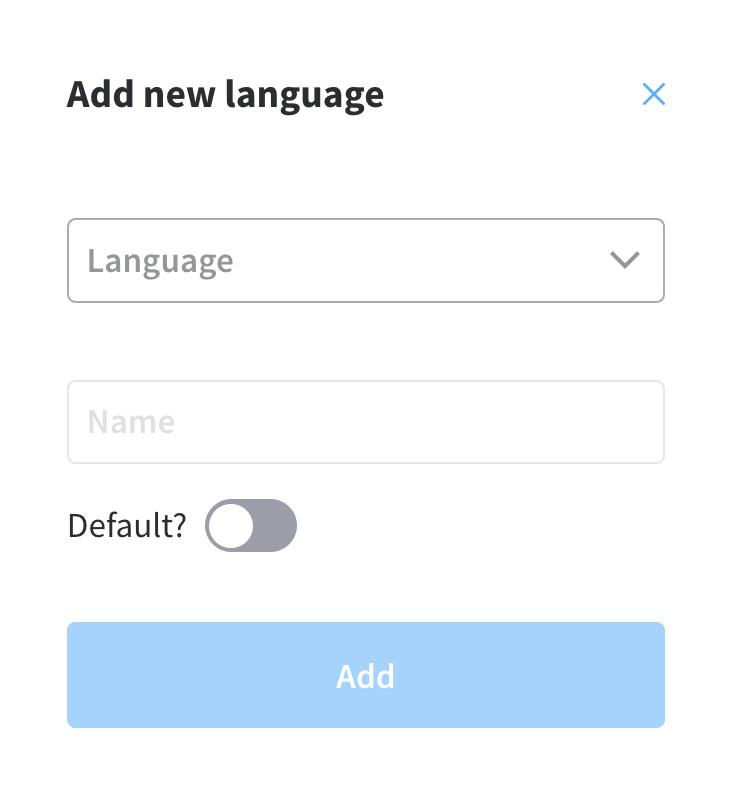

# v2.3.0 - March 2022

## **New features**

📱 **Posibility to set a default language** - It is now possible to set a default language from a preferred list of languages

## **Fixed**

### Web components

* Fixed an issue where Input prefix/suffix was not rendered correctly&#x20;

## **Changed**

### FLOWX Designer

* Moved Hooks, Stages, and Task Manager menu items under Task Management Plugin
* fileUpload action now supports also params form key with json

### FLOWX Engine

* Performance improvement - the numbers of calls to DB was optimized with more then 25%

Additional information regarding the deployment for v2.3.0 are available below:

[Deployment guidelines v2.3](deployment-guidelines-v2.3)
