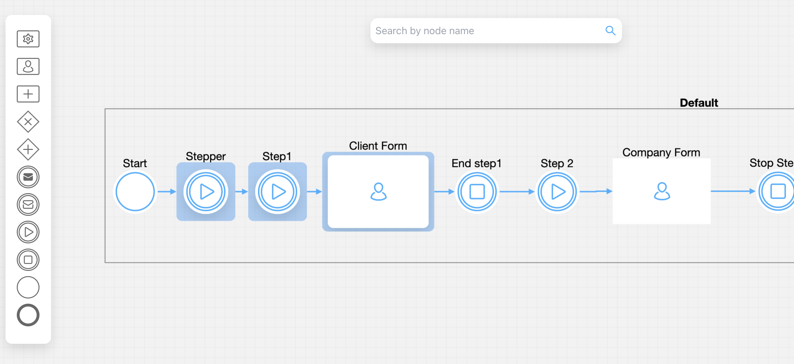
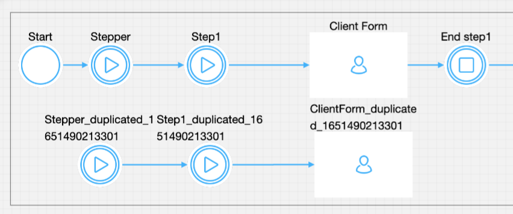

# v2.5.0 - April 2022

## **New features**

🗃  **Copy / Paste nodes** - It is now possible to copy a group of nodes & paste that copied group of nodes in the same process definition or in another process definition inside FLOWX Designer.

To perform a **copy** action, do the following:

1. Select multiple BPMN nodes - use **CMD/Ctrl + Click**. The nodes you select will be highlighted as you can see in the picture below.

2. Trigger the copy action - using the **contextual menu** (right-click menu).&#x20;

:::info
The result (**success** or **error**) is presented with a notification when the request ends. **Success**: _"Nodes copied successfully."_  **Error**: _"There was an error copying the nodes."_
:::

To trigger a **paste** action, access the **contextual menu**. The pasted nodes are displayed with a `duplicated_ID` label.

:::info
The result (**success** or **error**) will be presented with a notification when the request ends. **Success**: _"Nodes pasted successfully."_ **Error**: _"There was an error in pasting the nodes."_
:::

## **Changed**

### :steam_locomotive: FLOWX Engine

* New scripting language: Python
* Removed Kotlin

### :writing_hand: FLOWX Designer

* Process definitions summary performance improvements
* Flattened/unflattened keys in business rules - flattened keys inside business rules are now obsolete. You are notified when you need to delete and recreate a business rule so it contains an unflattened key. For more information, check the [**Business Rule Action**](../../docs/building-blocks/node/task-node/business-rule-action) section.
