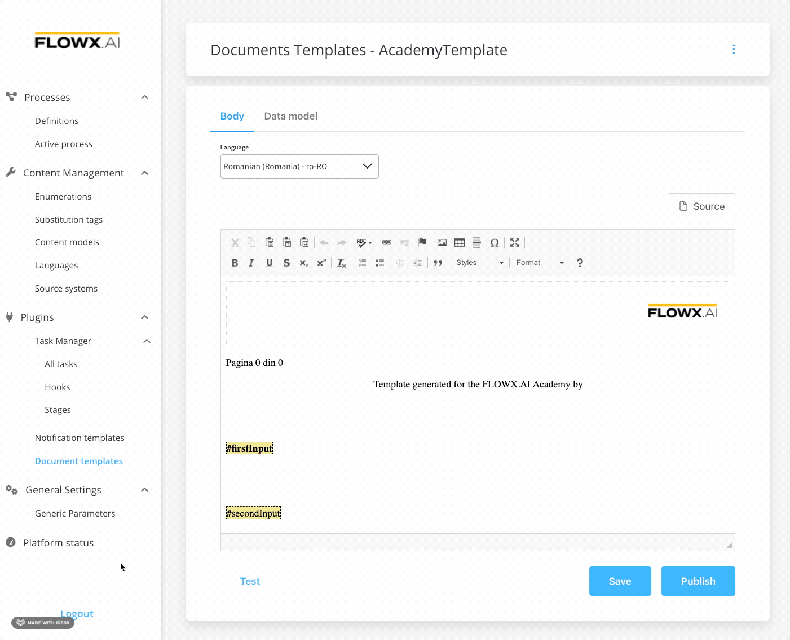

---
sidebar_position: 13
--- 

# v2.6.0 - May 2022

## **New features**

### :writing_hand: FLOWX.AI Designer - WYSIWYG editor

The new WYSIWYG (**"What You See Is What You Get**") editor enables you to create and modify [notification](../../docs/platform-deep-dive/plugins/custom-plugins/notifications-plugin) and [document](../../docs/platform-deep-dive/plugins/custom-plugins/documents-plugin) templates without the need for writing intricate code.

For more information about the WYSIWYG editor, check the following section:

[WYSIWYG](../../docs/platform-deep-dive/plugins/wysiwyg)

### :writing_hand: FLOWX Designer - test document/notification templates

You can now test the document/notification templates before publishing them, using the **Test** function.

* For document templates, you can download the pdf and review it before publishing

:::caution
For notification templates, you must first save the template and enter a valid email to be able to test it. For more information on how to configure a notification, check the [Notification templates plugin setup](../../docs/platform-deep-dive/plugins/plugins-setup-guide/notifications-plugin-setup) section.
:::

[Document Management](../../docs/platform-deep-dive/plugins/custom-plugins/documents-plugin)

[Notifications](../../docs/platform-deep-dive/plugins/custom-plugins/notifications-plugin)

🕵️‍♀️ **FLOWX Admin - test action rule**

The test action function now returns an error message (with a hint) without displaying the entire script. This will enable the user to quickly identify where the script is breaking.

## **Fixed**

#### :writing_hand: Designer

* [Task management](../../docs/platform-deep-dive/plugins/custom-plugins/task-management) plugin - fixed an issue where searching assignable users return the incorrect output for users with roles set on the group

## **Changed**

#### :steam_locomotive: FLOWX Engine - Token instance updates

To improve the debugging process, some additional information is now added to the [token](../../docs/building-blocks/token) structure:

* Callback actions - available only if callback actions were executed
* Save Node/Action name - every node now contains its name, not just the ID
* Save Node arrived date - arrived date marks the server hour
* Save Action last executed - the date when the action attached to the node was executed

New structure:

Old structure:

For more information about tokens, check the following section:

[Token](../../docs/building-blocks/token)

#### CMS Core

* [CMS](../../docs/platform-deep-dive/core-components/core-extensions/content-management) improvement - translate codes into labels, added `contentName`
* [License](../../docs/platform-deep-dive/core-components/core-extensions/license-engine) - when authenticating to FLOWX Designer, `/exists` call verifies if a license model is available - this is applicable for all users (regardless of the role assigned)

#### Process renderer

* [Renderer](../../docs/platform-deep-dive/core-components/renderer-sdks/angular-renderer) - flex gap added to components

#### Admin

* Added Kafka in/updates topics in Platform Status - available for components that communicate through Kafka

## Known issues

#### :steam_locomotive: FLOWX Engine

Get `templateConfig` data returns keys with `null` values if they don't have values on the process instance.

:::caution
This issue will be solved starting with the **2.7.0** FLOWX.AI release.
:::

Additional information regarding the deployment for **v2.6.0** are available below:

[Deployment guidelines v2.6.0](deployment-guidelines-v2.6)

