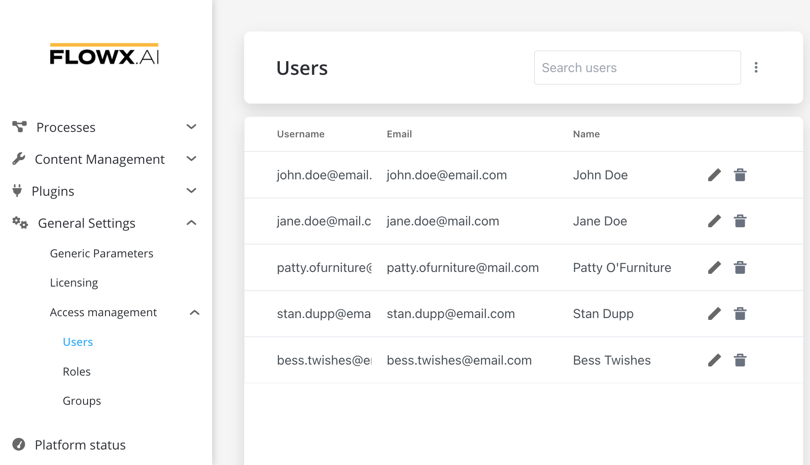
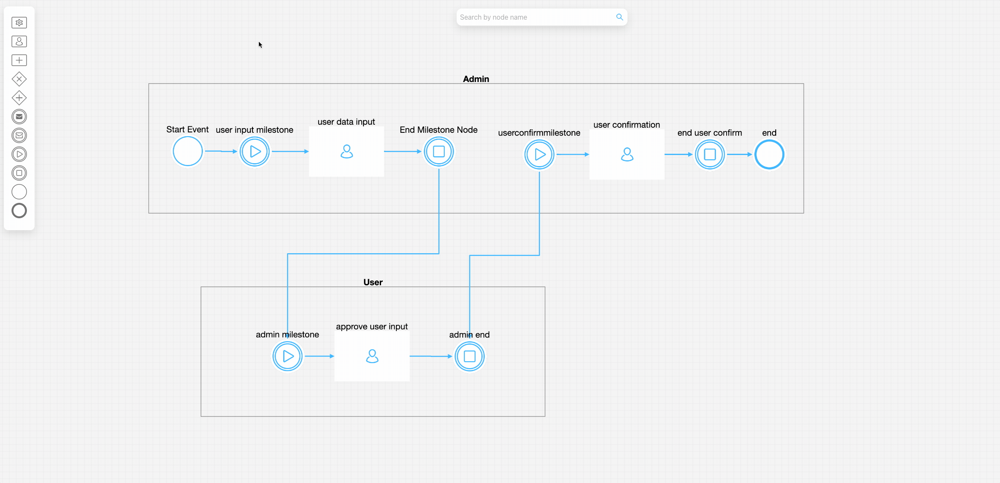
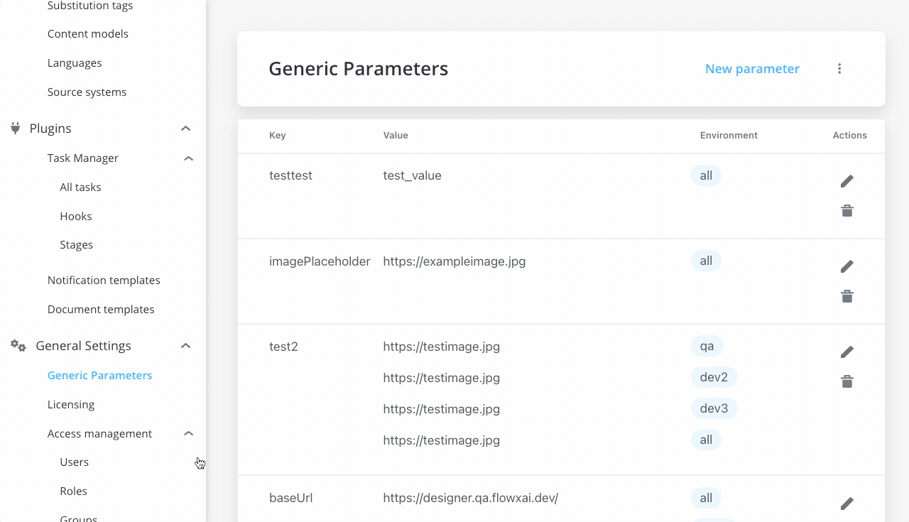

# v2.7.0 - May 2022

## **New Features**

### :writing_hand: FLOWX Designer - Access Management

You can now use Access Management to administrate users, roles and groups, directly in FLOWX Designer. Access Management helps you to access the identity management solution (keycloak/[RH-SSO](https://access.redhat.com/products/red-hat-single-sign-on)) through its API, extracting all the necessary details. Access Management is based on user roles that need to be configured in the identity management solution.

:::danger
The access rights-related configuration needs to be set up for each microservice. Default options are preconfigured. They can be overwritten using environment variables.
:::

### :writing_hand: FLOWX Designer - Swimlane Drag Handle

You can now move a swimlane individually (instead of moving the whole process canvas) to easily navigate through the process and arrange swimlanes.

## **Fixed**

### :writing_hand:  FLOWX Designer

* Fixed an issue where updating a parent action changes all child actions to be duplicates of the first child action
* Add filtering for both fixed filters and searches on polling on [Task Manager](../../docs/platform-deep-dive/plugins/custom-plugins/task-management)

### :steam_locomotive: FLOWX Engine

* Fixed an issue where `templateConfig` data returns keys with `null` values

## **Changed**

### :writing_hand:  FLOWX Designer - generic params refactor

* Generic parameters are now displayed and can be managed in a newly updated, and intuitive UI.

:rice_scene: **Process Renderer**

* Sync designer and renderer versions

## **Known issues**

### :writing_hand: FLOWX Designer - Access Management&#x20;

:::caution
Newly created users are not added in alphabetical order/ they are added alternatively. This will be solved within the next FLOWX.AI Release.
:::

Additional information regarding the deployment for **v2.7.0** are available below:

[Deployment guidelines v 2.7.0](deployment-guidelines-v2.7)

