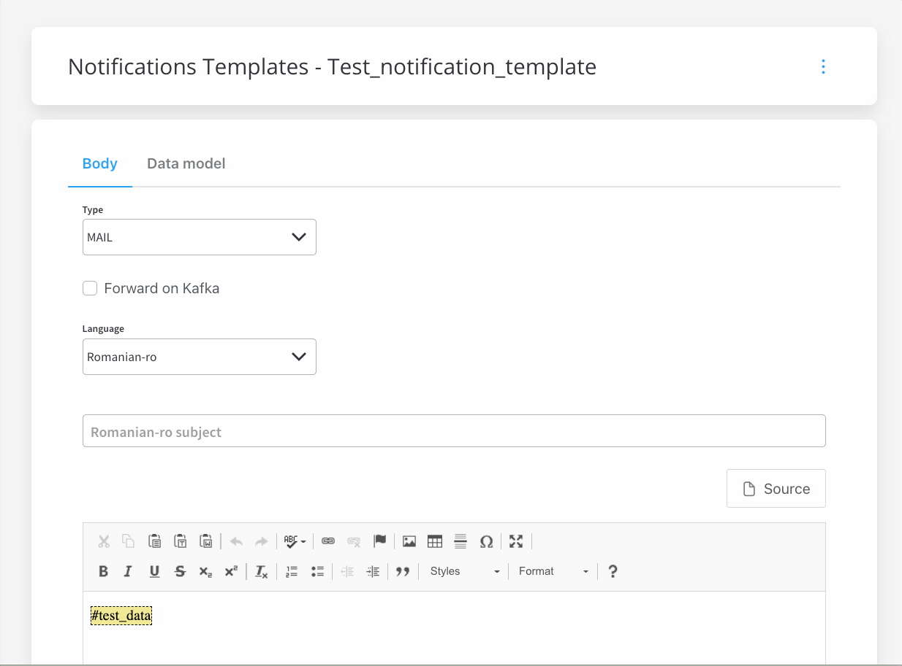

# v2.8.0 - May 2022

## **New features**

### :envelope_with_arrow: Notification plugin

* Added the possibility to configure the email address from which the notification is sent&#x20;
  * added sender details in send email request: `senderName` and `senderEmail`
* [Send a notification](../../docs/platform-deep-dive/plugins/custom-plugins/notifications-plugin/using-notifications-plugin/sending-a-notification) - new Kafka topic added, `KAFKA_TOPIC_NOTIFICATION_INTERNAL_OUT` -  topic used to send replies after sending the notification
* Test notification - it is no longer required to save a notification template before testing it

[Notifications](../../docs/platform-deep-dive/plugins/custom-plugins/notifications-plugin)

## **Fixed**

### 🤹‍♀️ Process renderer

* Fixed an issue where new tasks are removed from the list when pooling (when other tasks start running/ or new filters are applied)

### :page_facing_up: Document plugin

* Fixed error messages by removing the document template body from the error response, displaying a clean error message

### 👩‍🏭 Admin

* Fixed an issue where deleting an action would not also delete its child actions (callback actions)

## **Changed**

### :writing_hand: FLOWX **Designer**&#x20;

#### **UI Designer**

* Root component - users are now allowed to add a [**Container**](../../docs/building-blocks/ui-designer/ui-component-types/root-components/container), a **Form Group** as a root component

[Root components](../../docs/building-blocks/ui-designer/ui-component-types/root-components)

* Collection prototype - when you add a collection component to a node, a default collection prototype is added by default

[Collection](../../docs/building-blocks/ui-designer/ui-component-types/collection)

[Collection Prototype](../../docs/building-blocks/ui-designer/ui-component-types/collection/collection_prototype)

#### Stages / Hooks

* Empty state for stages and hooks list view - a _Nothing found_ message is displayed when the list is not populated

### :books: Content Management

* Default languages cannot be removed, as they are marked as default values

Additional information regarding the deployment for **v2.8.0** is available below:

[Deployment guidelines v2.8](deployment-guidelines-v2.8)
