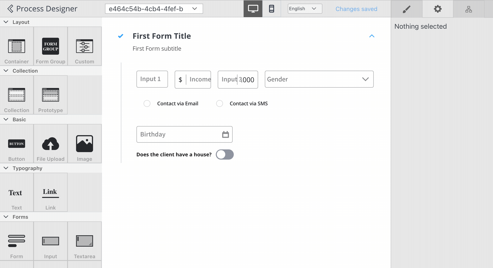
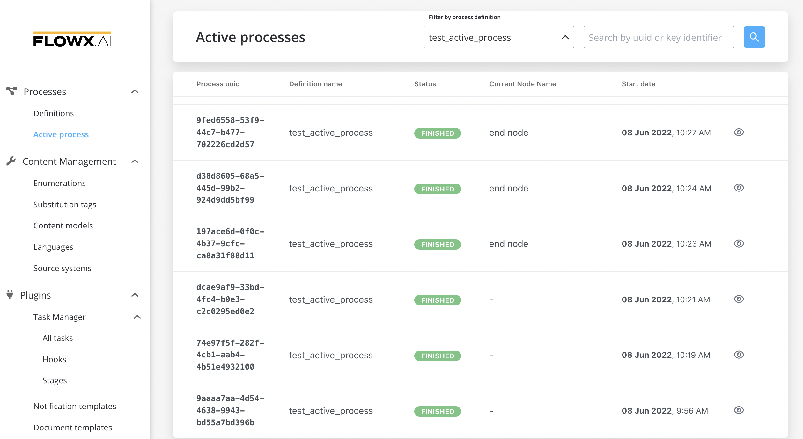
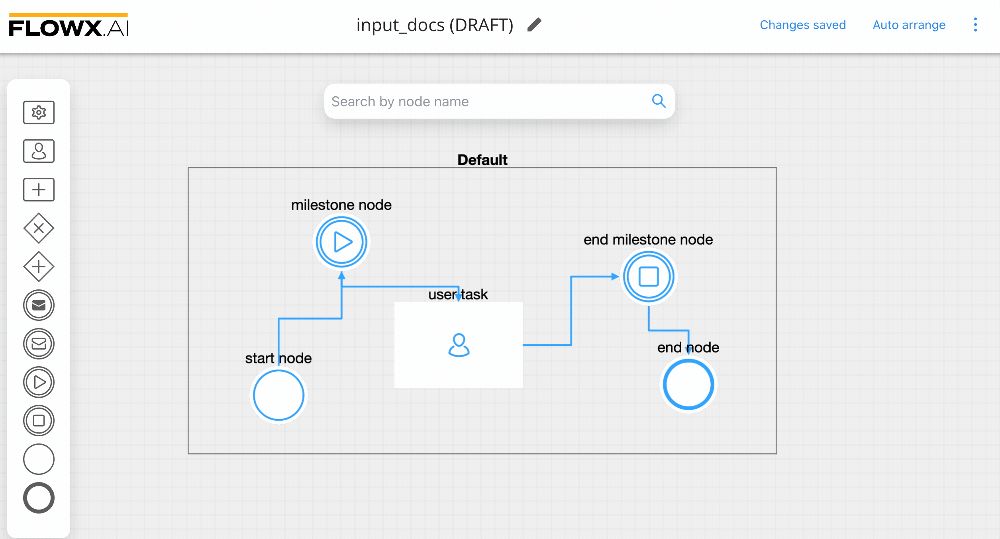
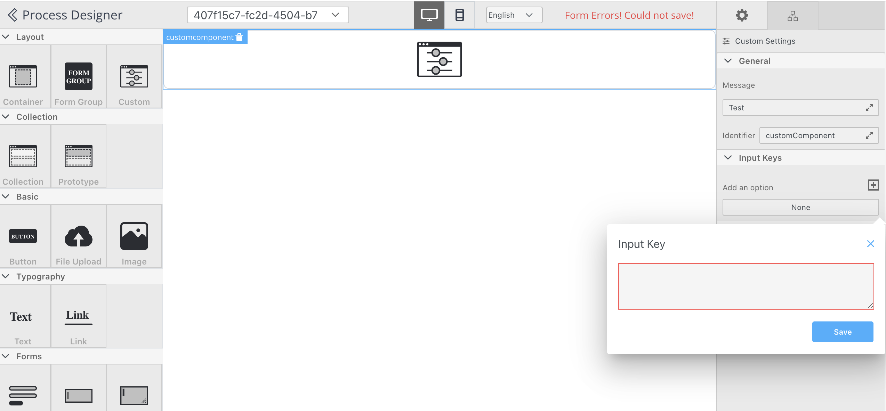

# v2.8.1 - June 2022

Howdy:wave:. Here is what we prepared for you on our latest release:

## **New features**

### 👩‍🏭 ​FLOWX.AI Admin 

#### Import BPMN 

Import BPMN is a feature that helps you edit/create a process starting from an already designed BPMN diagram. You can now import a BPMN process  (**.bpmn** extension) in [FLOWX Designer](../../docs/flowx-designer).

:::caution
**NOTE:** Imported processes do not contain [actions](../../docs/building-blocks/actions). You must define and add actions to the process after the import.
:::

## **Fixed**

### :writing_hand: FLOWX.AI Designer

#### UI Designer

* Now, UI Designer canvas is resized based on the platform you pick so you can easily design an intuitive UI for both web and mobile

#### Active process

* Fixed an issue where filtering an active process by definition was not working

#### Process Designer

* Fixed an issue where nodes were not saved after renaming them

#### Generic Parameters

* Small fixes

### :steam_locomotive: FLOWX.AI Engine

####  **Flatten/unflatten**

* fixed an issue where getting output from [DMN rule](../../docs/building-blocks/node/task-node/business-rule-action/dmn-business-rule-action) would save it as a flatten key
* fixed an issue where token reset values with copy keys would copy the keys as flatten

:::info
More information about flatten/unflatten, [here](../../docs/building-blocks/node/task-node/business-rule-action).
:::

## **Changed**

### :writing_hand: FLOWX.AI Designer

#### Process Designer

* **Auto arrange** - you can now use the auto arrange feature to align the nodes to get a cleaner and simplified view of the process

* **Node select** - when you open Process Designer and edit a node using the UI Designer, and after exiting the editor, the node remains selected and highlighted

#### **UI Designer**

* When you add/edit a custom component, the input key field automatically opens when adding a new input key to that component

