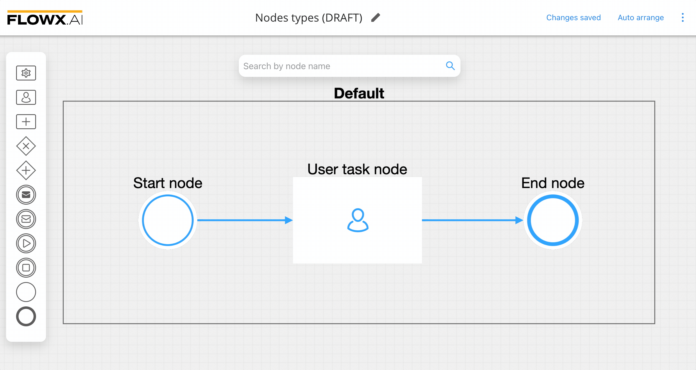
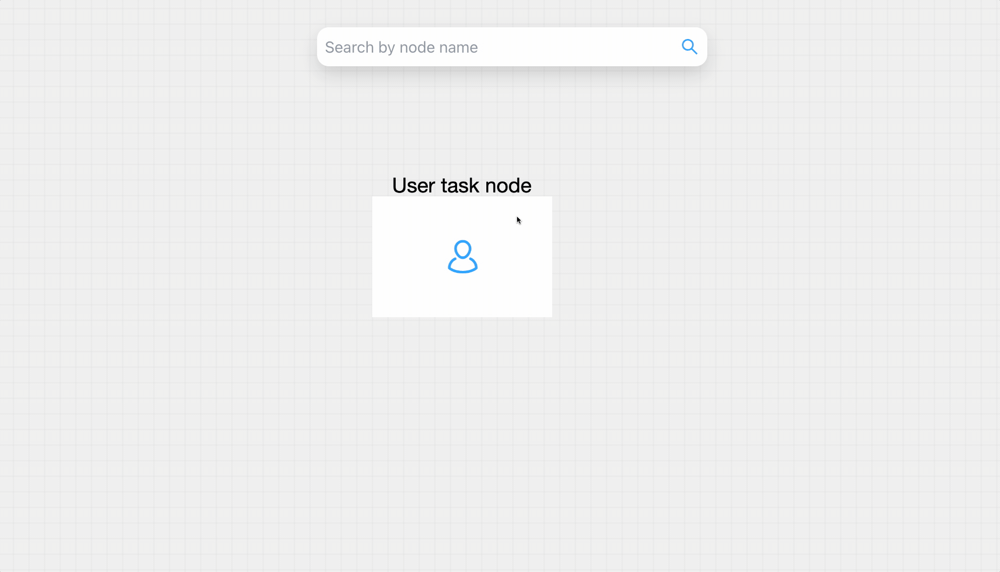
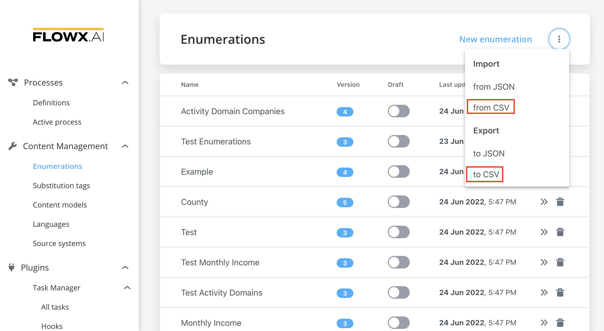
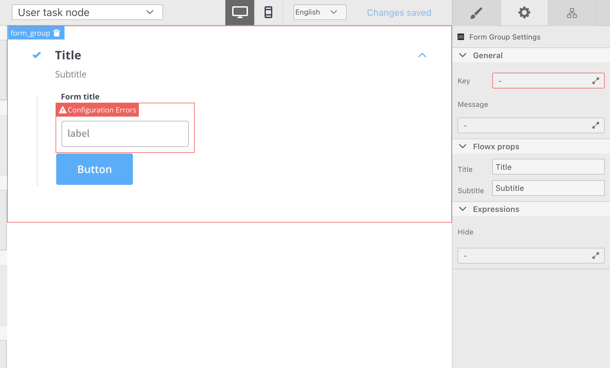
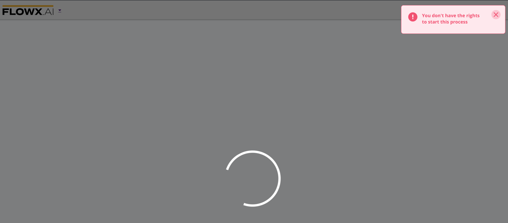

# v2.9.0 - June 2022

Howdy:wave:. Here is what we prepared for you on our latest release:

## **New features**

### :writing_hand: FLOWX.AI Designer 

#### Process Designer

* **Drop node on sequence** - you can now easily add a new node between two existing nodes connected with a sequence, see the example below

* **Rename node on Process Designer** - you can now rename a node added in the Process Designer canvas without opening the Node config panel, by just using the **Edit name** feature (when selecting a node)

#### [Enumerations](./#enumerations)

* **Import/export CSV** - added the ability to import/export Enumerations as CSV (comma-separated values) format using FLOWX Designer

## **Fixed**

### :steam_locomotive: FLOWX.AI Engine

#### [Swimlanes](../../../flowx-elements/user-roles-management/swimlanes.md)

* Fixed an issue where WebSocket notifications were not received for a swimlane where the current user is the owner of the [process instance](../../../flowx-elements/process/active-process/process-instance) but does not have VIEW permission assigned

## **Changed**

### :steam_locomotive: FLOWX.AI Engine

* **Liquibase lock** - added a solution to prevent the [liquibase](https://docs.liquibase.com/home.html) lock from getting stuck, additional configuration is needed, find more information on the [Deployment guidelines v2.9.0](deployment-guidelines-v2.9.0)

:::warning
**This update comes with changes that require an update in the configuration setup for some of the platform microservices. Please make sure to follow the up** [**Deployment guidelines v2.9.0**](deployment-guidelines-v2.9.0)**.**
:::

### :writing_hand: FLOWX.AI Designer

#### [UI Designer](./#ui-designer)

* **Error states** - when working with [UI components](../../../flowx-elements/configure-a-template-config-element/component-types/) (using the [UI Designer](./#ui-designer)), invalid configurations are marked in the preview area

### 🤹‍♀️ Process renderer

#### [Renderer SDK](../../../core-components/renderer-sdks/)

* **Errors occurred for start/execute/status requests** - now the notifications for different error codes (when performing one of the previous requests), come with an intuitive message to help you with debugging

Additional information regarding the deployment for **v2.9.0** is available below:

[Deployment guidelines v2.9.0](deployment-guidelines-v2.9.0)
