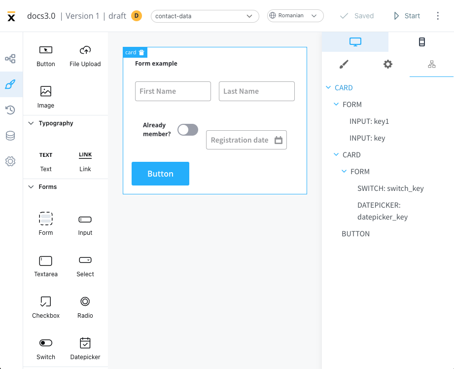
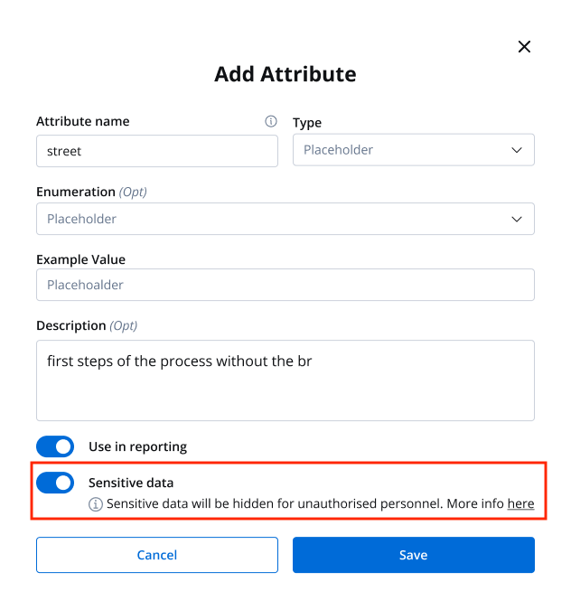
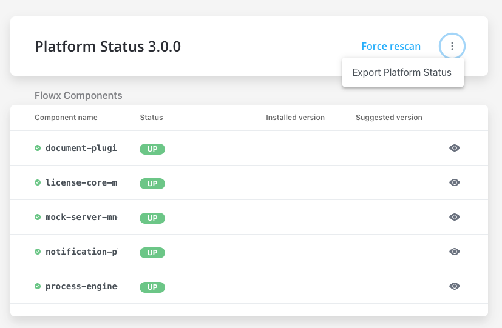
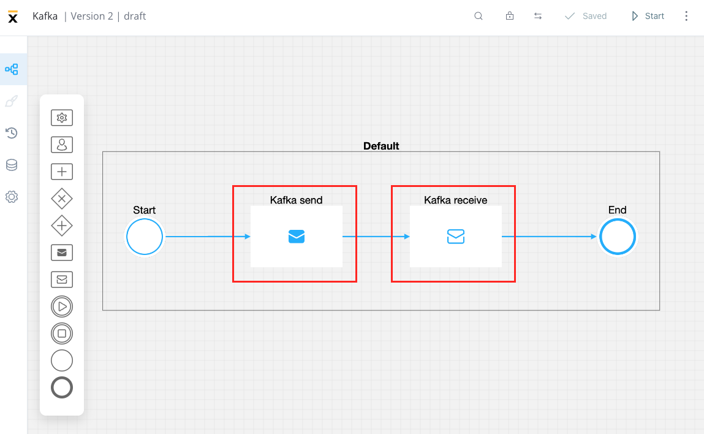

# 🆕 v3.0.0 - January 2023

We are excited to announce the release of FLOWX.AI 3.0 🔥, featuring new and improved features that will elevate your workflow experience. From the new theming options to enhanced functionality, this update will take your productivity to the next level. 🚀 

## **New features**

### Theming

FLOWX.AI 3.0 introduces a new theming feature, allowing users to control and customize all the components to their personal preferences: both on web or mobile. The new theming feature provides an improved user experience and allows for greater flexibility in how the platform is used.

Generic JSONs for components were added.

[Additional configuration](./deployment-guidelines-v3.0.0#theming)

### UI Designer ✏️

A fresh new interface for UI Designer.

#### UI Components redesign

[UI components](../../docs/building-blocks/ui-designer/ui-component-types)

## **Fixed**

* **[DESIGNER]** - a bug where the datepicker component default value overlapped with the field placeholder has been fixed
* **[DESIGNER]** - an issue where users couldn't copy/paste nodes that have UI actions without parameters has been fixed
* **[NOTIFICATIONS_PLUGIN]** - Forwarding external notifications is now possible.
* **[CMS]** - an issue where GET enumerations list displayed an error message about memory exceeding has been fixed

## **Changed**

### Documents plugin

* Updated document plugin file download path to use file UUID (string) instead of a numeric file ID

### FLOWX.AI Designer 👩‍🏭

#### Audit log 

* Now `name` is displayed instead of `identifiers` for process definition, node, action, swimlanes entities

[Audit log](../../docs/platform-deep-dive/core-components/core-extensions/audit)

#### Sensitive data

* Removed Sensitive data tab from process definition settings and added a new Sensitive data switch in the Data model tab
* Sensitive data migration - sensitive data in published processes remains the same (when cloning, sensitive data is deleted as it is not compatible with the new version). You must add the data model and keys for the sensitive data yourself

[Data model](../../docs/building-blocks/process/process-definition#data-model)

#### Platform status report 

* A new option to **Export Platform Status** has been introduced that will download a JSON file containing the state details of all components, enabling users to communicate the state of the instance they are using to the support team
* Added more data to the platform status report

#### Kafka send/receive nodes 

* new icons for Kafka send/ receive nodes

### Process Designer

#### Process Designer keyboard commands

Added new keyboard commands for deleting, copying and renaming nodes:

* `backspace` - delete one or several selected nodes
* `Ctrl/Cmd + C` - copy one or several selected nodes
* `R` - rename a node 

### FLOWX.AI Engine 🚂

#### Kafka

* standardized Kafka topics & naming pattern: configuration only for package name, env name and version, no need for listing all topic names - minimize confusion and errors

#### Performance

* DB improvements - clear cache 

:::info
For stages, integrations, and generic parameters, clear cache is performed globally, when it comes to process definitions, clear cache must be done per process.
:::

### License model

* in the license model, instead of PII, another label/alias can be used now

### Data search

* elasticSearch index in which data search looks can be configurable

## Security

* Redis config - security

[Redis configuration](./deployment-guidelines-v3.0.0#redis-configuration)

## **Known issues**

### Reporting

* Reporting plugin is not compatible with Oracle DBs

## **UX/UI Improvements**

* The process instance search button has been removed, now search is done automatic
* Swimlanes interaction has been improved

Additional information regarding the deployment for v3.0 is available below:

[Deployment guidelines v3.0](./deployment-guidelines-v3.0.0)

:::info
Upgrade now and take advantage of these new features and improvements to elevate your process creation experience.
:::

