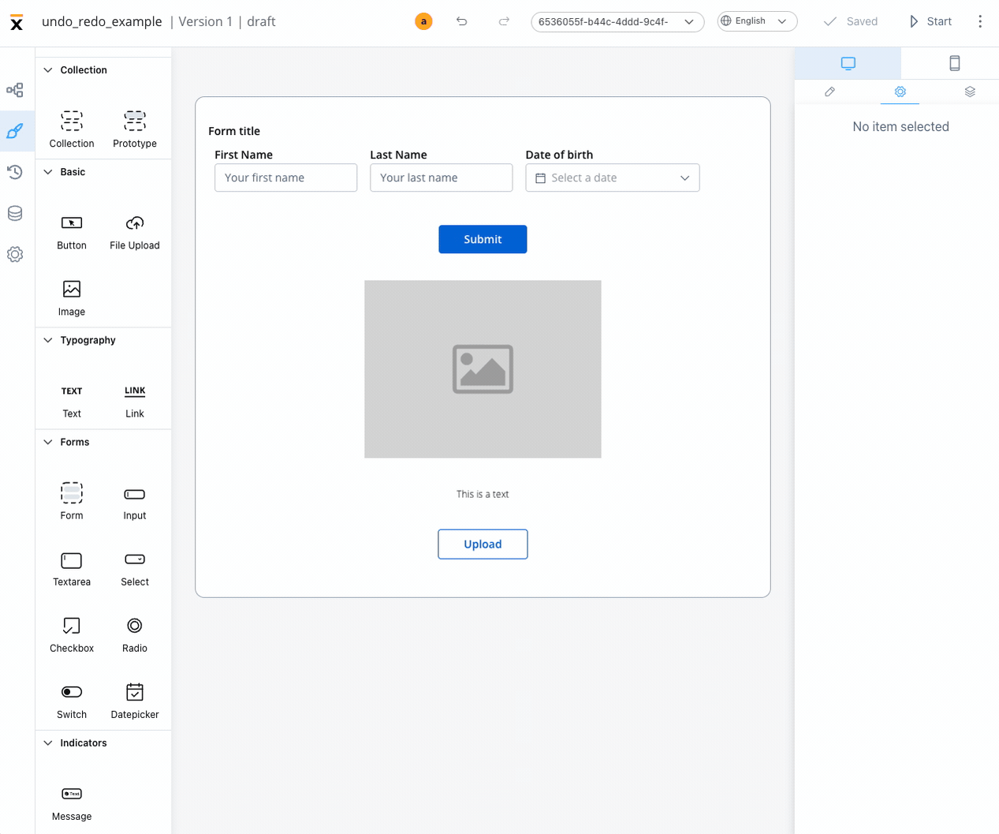
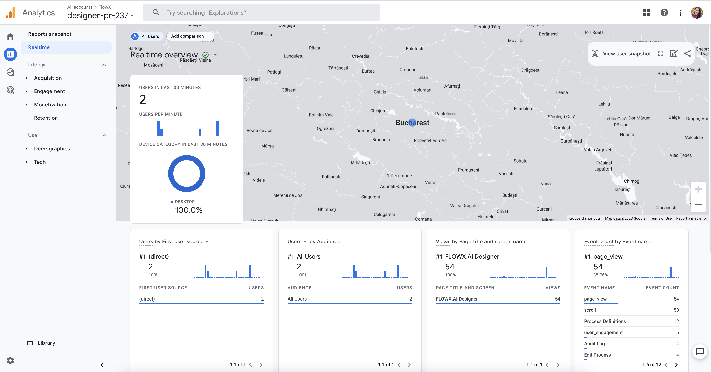
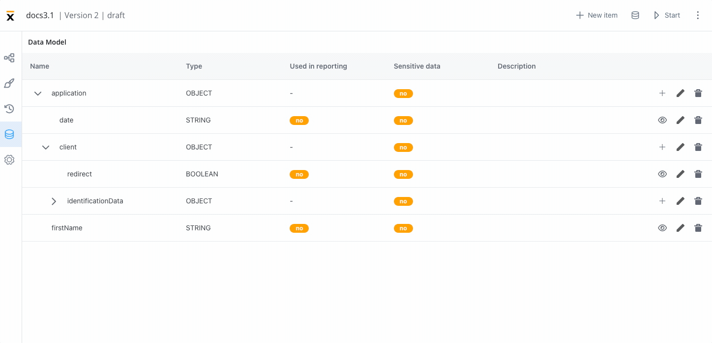

# 🆕 v3.1.0 - March 2023

We are excited to announce the release of FLOWX.AI 3.1 release 🔥.

## **New features**

### UI Designer ✍️

#### Undo/redo actions in UI Designer

* Users are now able to undo/redo actions they performed in UI Designer:
    - drag, drop, delete from preview section
    - any setting in styling & settings panel

#### New UI element: file preview

* A new ready-made mobile/web component that can display the preview of a document (uploaded, generated during the process or a static document) in the UI Designer.

[File preview](../../docs/building-blocks/ui-designer/ui-component-types/file-preview)

#### UI Designer analytics

* Added custom events for UI Designer new analytics feature, below you can find an example of GA4 dashboard created based on the events:

#### Code editor in expression fields

* Added code editor in expression fields

### Process designer

#### View data model reference

* A new data model reference feature was added to see where the attributes defined are used:

#### Generate data model 

* Now is possible to generate a data model using data values from a generated process instance without having to define all the keys again.

## **Fixed**

## **Changed**

### UI Designer

### FLOWX.AI Designer 👩‍🏭

### Process Designer 

### FLOWX.AI Engine 🚂

## **UX/UI Improvements**

## **Security**

## **Known issues**

### Reporting

* Reporting plugin is not compatible with Oracle DBs.

[Deployment guidelines v3.1](./deployment-guidelines-v3.1.0)

