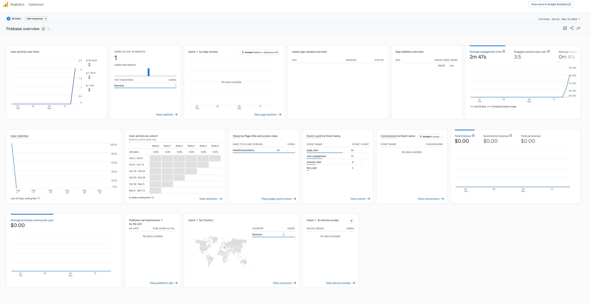
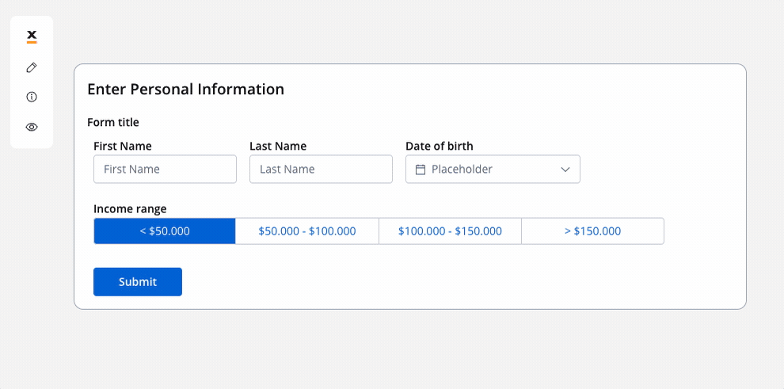
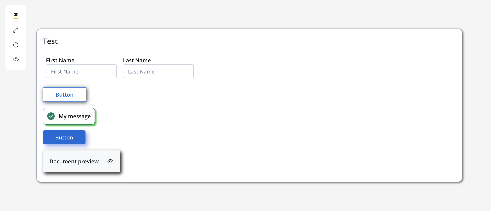

# 🆕 v3.2.0 - April 2023

Drumroll please... 🥁 We are excited to announce **FLOWX.AI 3.2** release 🔥.

So, what are you waiting for? Grab a snack, sit back, and get ready to explore the newest version of **FLOWX.AI**.

## **New features** 🆕

### UI Designer ✍️

New features for the UI Designer:

#### UI Designer analytics

[Additional configuration for analytics](./deployment-guidelines-v3.2.0.md)

#### Segmented button

Added a new type of button called the "segmented button". It allows users to pick only one option from a group of options, and you can choose to have between 2 and 5 options in the group. The segmented button it is easy to use, and can help make your application easier for people to use.

#### Shadows

### Content Management

#### CMS audit log

Added the audit log option for the Content Management elements:

* Audit log for Enumerations
* Audit log for Substitution Tags
* Audit log for Languages
* Audit log for Source Systems
* Audit log for Media Library

[Additional configuration for CMS audit log](deployment-guidelines-v3.2.0.md)

## **Fixed** 🔧

* 
* 

## **Changed** 🛠️

### FLOWX.AI Engine 🚂

### UI Designer ✍️

#### Improved rendering mechanism

#### Disable button - add disable expression 

#### 

### Process designer

## **Known issues** 🙁

### Reporting

* Reporting plugin is not compatible with Oracle DBs.

### UI Designer

[Deployment guidelines v3.2](./deployment-guidelines-v3.2.0)
