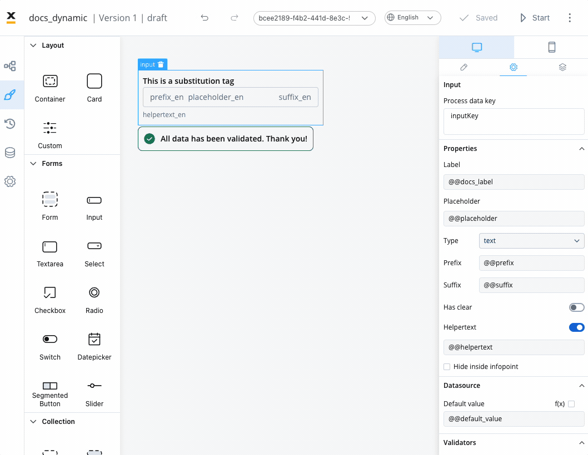
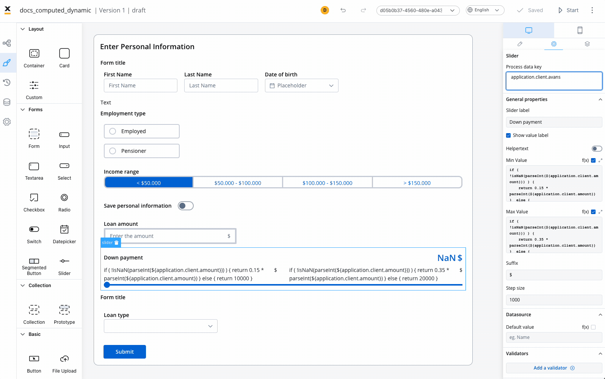
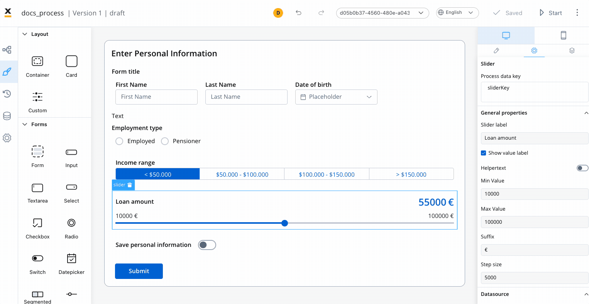
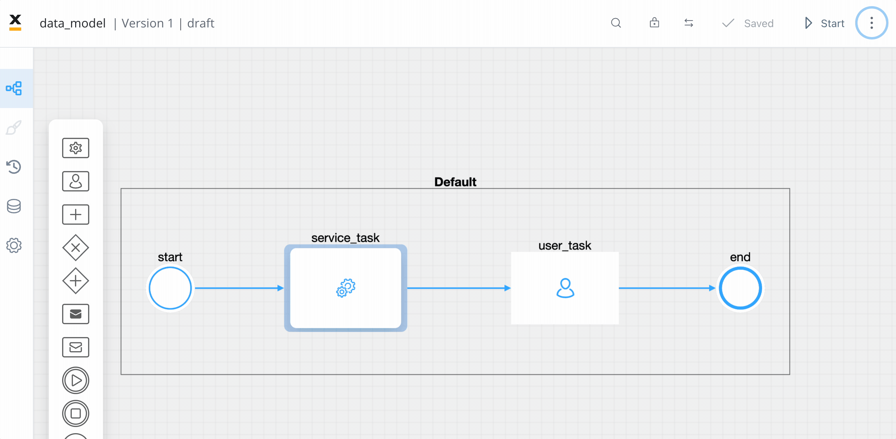
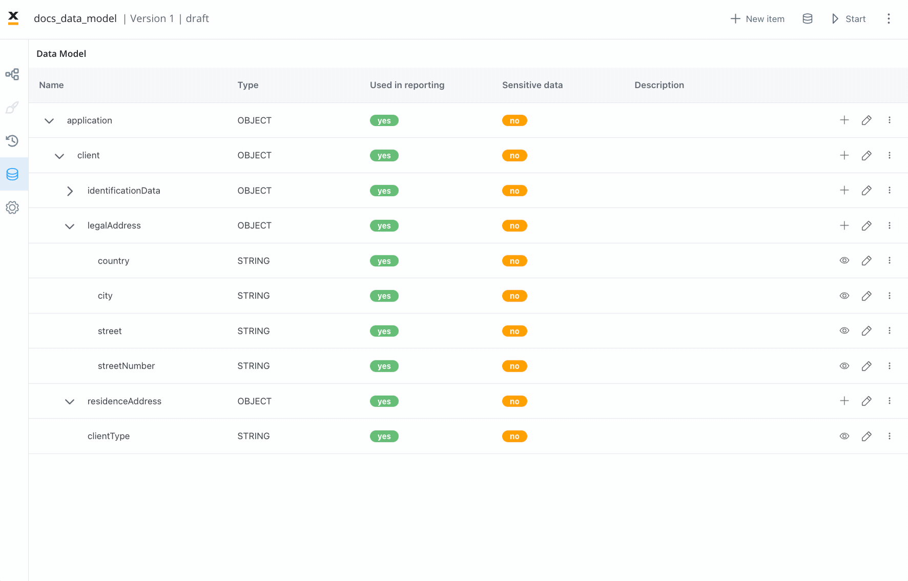

# 🆕 v3.3.0 - May 2023

Drumroll, please! 🥁 **FLOWX.AI 3.3** has arrived, bringing a sensational wave of updates and enhancements. Get ready to embark on an exhilarating journey. 

Buckle up, hold on tight, and prepare for an extraordinary experience! 🚀

## **New features** 🆕

### New nodes: message events

Message events are events that make use of a message reference to pause execution until a suitable message is received.

The new events nodes allow communication between process instances through messages.

* **Message Throw Intermediate Event** - the events can be triggered at any time while the associated task is being performed
    * **Interrupting event** - when the message is received, the user task is finished and the token advances in the process flow
    * **Non-Interrupting event** - when messages are received, the user task to which the catching boundary event is attached is not finished immediately
* **Message Catch Intermediate Event** - waits for a message to catch before continuing with the process flow
* **Message Catch Start Event** - starts an instance after receiving a message

[Message events](../../docs/building-blocks/node/message-events)

### Events gateway

Added a new FLOWX.AI microservice. The Events Gateway is a central communication service that processes and distributes SSE(Server-sent events) messages from Backend to Frontend. It acts as an intermediary between different system components, handling event processing, message distribution, and event publication. By reading messages from a Kafka topic and publishing events to the frontend renderer, it enables real-time updates on the user interface. Additionally, it integrates with Redis to publish events on a stream for other system components to consume. The Events Gateway ensures efficient event handling and facilitates seamless communication within the system.

[Events gateway](../../docs/platform-deep-dive/core-components/events-gateway)

[Events gateway setup guide](../../docs/platform-setup-guides/events-gateway-setup)

### Process engine

#### NEW: process instance indexing through Kafka transport

Sending data through Kafka : Instead of sending data directly from the process engine to ElasticSearch(ES), a new strategy is introduced where the [**process engine**](../../docs/platform-deep-dive/core-components/flowx-engine) sends messages to a Kafka topic whenever there is something to be indexed from a [**process instance**](../../docs/building-blocks/process/active-process/process-instance). [Kafka Connect](https://kafka.apache.org/documentation.html#connect) is configured to read these messages and send them to ElasticSearch for indexing. This approach allows for fire-and-forget communication, eliminating the need for the process engine to wait for indexing requests to complete.

[Process instance indexing](../../docs/platform-setup-guides/flowx-engine-setup-guide/configuring-elasticsearch-indexing)

#### KafkaConnect ElasticSearch sink plugin

A new component, Kafka Connect with configuration, has been added. This component enables Kafka Connect to listen to a specific topic where process instances generate messages and send those messages to Elastic Search indexes. The configuration includes the utilization of a KafkaConnect ElasticSearch sink connector plugin, which is responsible for handling this task. The plugin is configured with a connector.

[Example configuration for applying the solution with Kafka Connect](../../docs/platform-setup-guides/flowx-engine-setup-guide/configuring-elasticsearch-indexing#example-configuration-for-applying-the-solution-with-kafka-connect)

Check the deployment guidelines for more information:

[Kafka transport](deployment-guidelines-v3.3.0.md#process-engine)

### UI Designer ✍️

#### Dynamic values

Added the possibility to add dynamic values in various element settings. You can now utilize process parameters or substitution tags for the following element properties: default value (excluding switch), label, placeholder, helpertext, error message, prefix, and suffix. Additionally, dynamic values are supported for specific elements such as [**Document Preview**](../../docs/building-blocks/ui-designer/ui-component-types/file-preview), [**Card**](../../docs/building-blocks/ui-designer/ui-component-types/root-components/card), [**Form**](../../docs/building-blocks/ui-designer/ui-component-types/form-elements), Message, [**Button**](../../docs/building-blocks/ui-designer/ui-component-types/buttons), [**Upload**](../../docs/building-blocks/ui-designer/ui-component-types/buttons), [**Select**](../../docs/building-blocks/ui-designer/ui-component-types/form-elements/select-form-field), [**Checkbox**](../../docs/building-blocks/ui-designer/ui-component-types/form-elements/checkbox-form-field), [**Radio**](../../docs/building-blocks/ui-designer/ui-component-types/form-elements/radio-form-field), [**Segmented button**](../../docs/building-blocks/ui-designer/ui-component-types/form-elements/segmented-button), Text, Link, Modal, and Step. This enhancement allows for greater flexibility and customization.

#### Computed values

Computed values refer to values that are dynamically generated or calculated based on JavaScript expressions rather than being statically predefined. 

Computed values can be created using the UI Designer by writing JavaScript expressions that operate on process parameters or other variables within the application. These expressions can perform calculations, transformations, or other operations to generate the desired value at runtime. By enabling computed values, the application provides flexibility and the ability to create dynamic and responsive user interfaces.

[Dynamic & computed values](../../docs/building-blocks/ui-designer/dynamic-and-computed-values)

#### New value slider UI element

Introducing a new slider UI element that allows users to select and adjust numerical values within a specified range. The slider element can be added (dropped or pasted) under a form element parent.

## **Bug fixes** 🔧

## **Changed** 🛠️

### Data model

#### Display data model references

This update introduces the ability to view attribute usage within the process. You can now easily see where a specific attribute is being used by accessing the "View References" feature. This feature provides a list of process data keys associated with each attribute and displays possible references, such as UI Elements.

:::info
Please note that the option to view references is not available for object and array attribute types.
:::

[Data model reference](../../docs/building-blocks/process/process-definition#data-model-reference)

#### Reporting

* You can now set "Used in reporting" and “Sensitive data” flags for an object or array of objects (all the child attributes will inherit its value - "true" or "false"), without the need to edit each attribute 

#### Copy-paste objects

* Copy-paste objects structure under data model

## **Known issues** 🙁

### Reporting

* Reporting plugin is not compatible with Oracle DBs.

### UI Designer

* When configuring an [Input UI element](../../docs/building-blocks/ui-designer/ui-component-types/form-elements/input-form-field) with a 'Has clear' (content clear) property, we recommend setting a fixed width value for the element. If the width is set to 'fill', it may cause the UI to break

[Deployment guidelines v3.3](./deployment-guidelines-v3.3.0)

