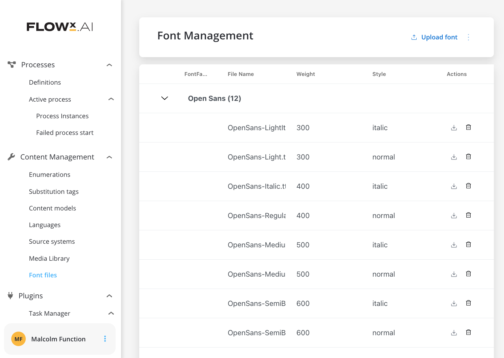

# 🆕 v3.4.0 - August 2023

We can't reinvent the wheel... but we can certainly give it a whole new spin! Drumroll, please! 🥁 **FLOWX.AI 3.4** has arrived, bringing a new wave of exciting new features and enhancements.

Buckle up, hold on tight, and prepare for an extraordinary experience! 🚀

## **New features** 🆕

### New versioning module

We are excited to introduce new features and improvements to the Versioning module.

### UI Designer ✍️

#### Fonts

Users can now upload multiple TTF font files, with the system identifying font family, weight, and style for each file. That can be done using the new menu entry added under **Content Management > Font files**.

[Font files](../../docs/platform-deep-dive/core-components/core-extensions/content-management/font-files)

#### Attributed strings for Markdown support

This new feature empowers users with a more versatile and visually appealing markdown experience, enabling seamless integration of styled text within various UI components. Here's what you can expect:

* Expanded Markdown Support: Some UI elements props now support a wide range of markdown syntax using a markdown editor.
* Enhanced UI Element Compatibility: The attributed strings feature has been integrated with essential UI elements such as text, switch labels, and messages. This ensures consistent rendering of markdown within these components, enriching your users' experience.

## **Bug Fixes** 🔧

## **Changed** 🛠️

### Other

* The autoarrange function has been removed from [**Process Designer**](../../docs/terms/flowx-process-designer).

## **Known issues** 🙁

* **Slider UI element**: Currently, there is an issue where the value thumb of a slider component does not display the correct value when sourced from process data.
* **Business rules**: Presently, there is an issue where changing the language of a [**business rule**](../../docs/terms/business-rules) does not result in its execution using the new language. Despite updating the language value in the database, the business rule continues to be executed with the original language, leading to unexpected behavior.
* **Process Designer**: 
    * In certain cases, deleting a boundary node in the process designer and navigating back to the [**process designer**](../../docs/terms/flowx-process-designer) from the [**UI Designer**](../../docs/terms/flowx-ai-ui-designer) does not remove the associated sequence from the boundary event. This issue specifically occurs when the sequence is linked to the deleted boundary node.
    * Select Sequence buttons in the nodes UI interface may overlap.
    * There is a known issue where users are unable to select the node name with the mouse in the user interface.
* **Plugins**: Reporting plugin is not compatible with Oracle DBs.

[Deployment guidelines v3.4.0](./deployment-guidelines-v3.4.0.md)

