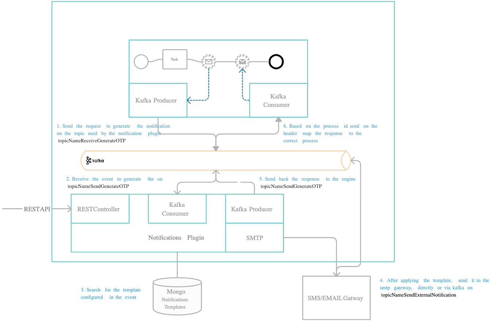
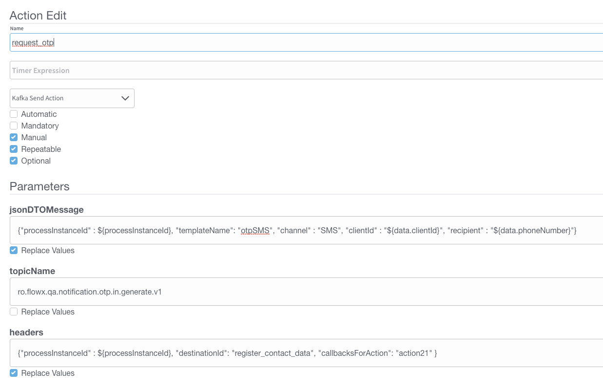
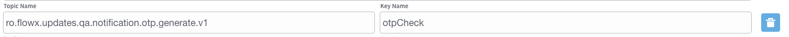

# Generate OTP

There are some cases when you will need to generate an OTP from a business flow, for example when validating an email account.

The notifications plugins handles both the actual otp code generation and sending the code to the user using a defined notification template.



## Define needed Kafka topics

Kafka topic names can be set by using environment variables:

* `KAFKA_TOPIC_OTP_GENERATE_IN`
* `KAFKA_TOPIC_OTP_GENERATE_OUT` - after the OTP was generated and send to the user, this is the topic used to send the response back to the Engine.

:::caution
The Engine is listening for messages on topics with names of a certain pattern, make sure to use an outgoing topic name that matches the pattern configured in the Engine.
:::

## Request to generate an OTP

Values expected in the request body:

* processInstanceId: process instance ID
* templateName: the name of the notification template that is used (this should have been added using the REST API)
* channel: notification channel: SMS / MAIL / PUSH
* recipient: notification receiver: email / phone number
* notification template parameters (ex. clientId): parameters that should be replaced in the notification template

## Response from generate OTP

Values expected in the reply body:

* processInstanceId = process instance ID
* clientId = the client id
* channel = notification channel used
* otpSent = confirmation if the notification was sent: true or false
* error = error description, if any

Example:

```
{
"processInstanceId": 12345,
"clientId": "1234567890",
"channel": "SMS",
"otpSent": true,
"error": null
}
```

## Example: generate an OTP from a business flow

It is important to identify what is the business identifier that you are going to use to validate that OTP, it can be, for example, a users personal identification number.

**Step 1:** Configure the templates that you want to use:

Make a `POST` request to `NOTIFICATION_URL/api/template` with the following body:

```
{
	"name": "otpMail",
	"type": "MAIL",
	"active": true,
	"language": "en",
	"subject":"otp for [(${clientId})]",
	"body": "<!DOCTYPE html><html xmlns:th='<http://www.thymeleaf.org>'><head><meta http-equiv='Content-Type' content='text/html; charset=UTF-8' /></head><body><p>Yay, an otp was generated for you:</p><p th:text='${otpValue}'></p></body></html>",
	"context": [],
	"params": [
		{
			"key": "clientId",
			"mandatory": true
		},
        {
			"key": "otpValue",
			"mandatory": true
		}
	]
}
```

SMS notification template body:

```
{
    "name": "otpSMS",
    "type": "SMS",
    "strategyType": "SMS",
    "active": true,
    "context": [],
    "language": "en",
    "subject": null,
    "body": "OTP [(${otpValue})]",
    "params": [
        {
            "key": "otpValue",
            "mandatory": true
        }
    ]
}
```

**Step 2:** Check that the needed topics are configured correctly:  the topic used to generate OTP (`KAFKA_TOPIC_OTP_GENERATE_IN`) and the topic used to receive the response (

`KAFKA_TOPIC_OTP_GENERATE_OUT`)

**Step 3:** Use the FLOWX Designer to add a new Kafka send event to the correct node in the process definition

**Step 4:** Add the proper configuration to the action, the Kafka topic and message to be sent.



**Step 5:** Add a node to the process definition (for the Kafka receive event)

**Step 6:** Configure on what key you want to receive the response on the process instance params

