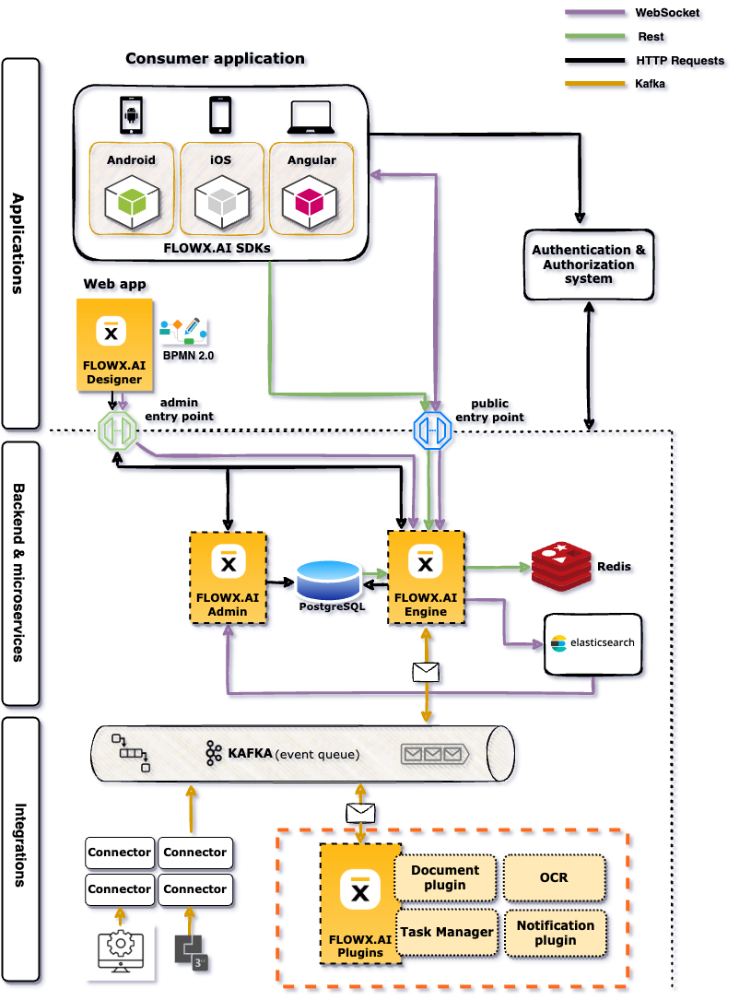
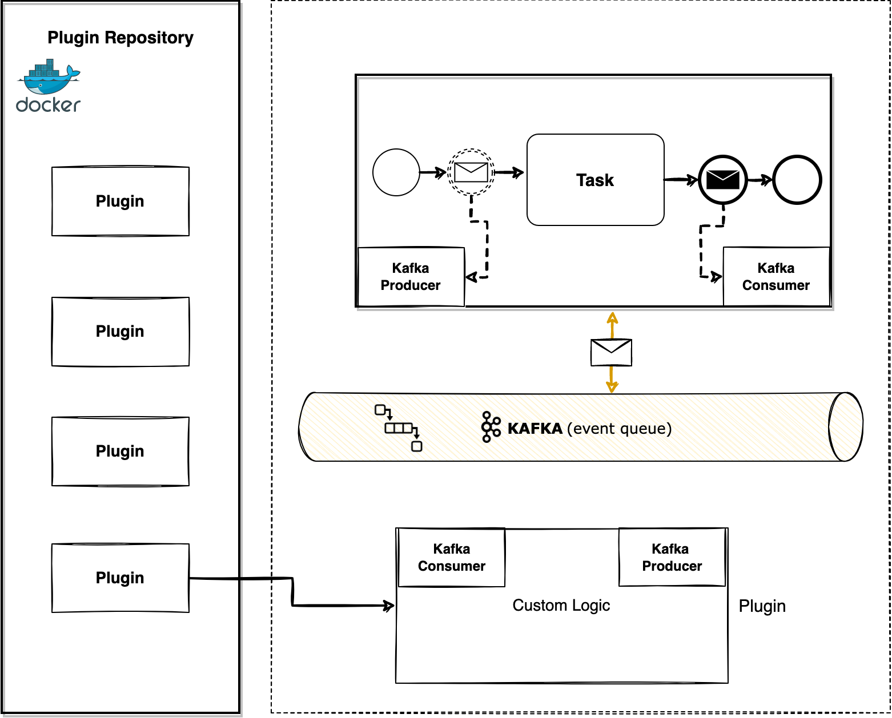

# Plugins

## What is a plugin?

**Adding new capabilities to the core platform** can be easily done by using plugins. FLOWX.AI Plugins represent **already-built functionality** that can be added to a FLOWX.AI platform deployment.

These could be either one of the provided custom plugins that we've already built or building your desired plugin.

On our roadmap, we’re also looking to enhance the **plugins library** with 3rd party providers, so stay tuned for more.

## High-level architecture

The plugins are microservice apps that can be developed using any tech stack. The only requirement is that they need to be able to connect to the core platform using Kafka events.

[Introduction to Kafka](../../platform-overview/frameworks-and-standards/event-driven-architecture-frameworks/intro-to-kafka-concepts.md)

[Kafka send event node](../../building-blocks/node/message-send-received-task-node.md#message-send-task)

[Kafka receive event node](../../building-blocks/node/message-send-received-task-node.md#message-receive-task)

To interact with plugins, you need to understand a few details about them:

* the events that can trigger them
* the infrastructure components needed
* the needed configurations

## Custom plugins

The currently available plugins are:

* **Documents** - easily generate, host and access any kind of documents
* **Notifications** - enhance your project with the option of sending custom emails or SMS notifications
* **OCR** - helps you scan your documents and integrate them into a business process
* **Task management** - a plugin suitable for back-officers and supervisors as it can be used to easily track and assign activities/tasks inside a company.