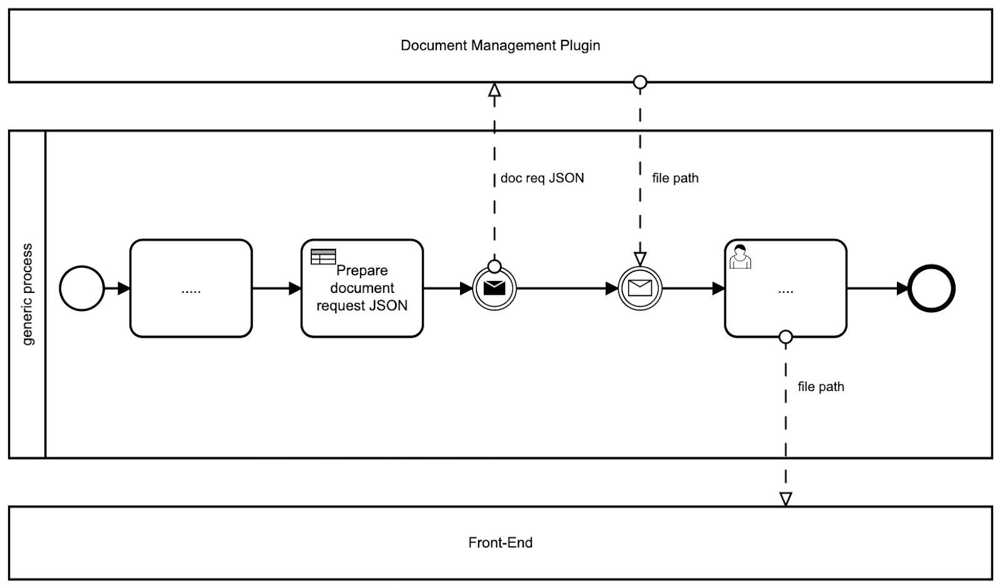

# Generating docs based on templates

One of the main features of the document management plugin is the ability to generate new documents based on custom templates and prefilled with data related to the current process instance.

The plugin supports using both docx and html template types.

Let's go through the specific details for defining and managing such custom templates and of adding the process actions for generating documents:

[Managing .docx templates](managing-docx-templates.md)

[Generating from .docx templates](generating-from-docx-templates.md)

[Managing HTML templates](managing-html-templates.md)

[Generating from HTML templates](generating-from-html-templates.md)
