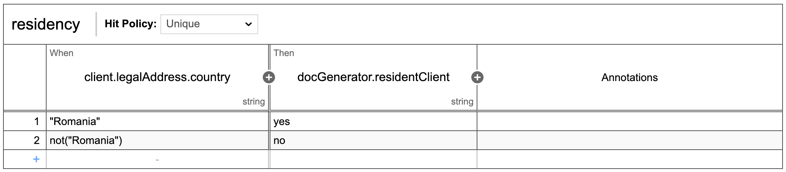
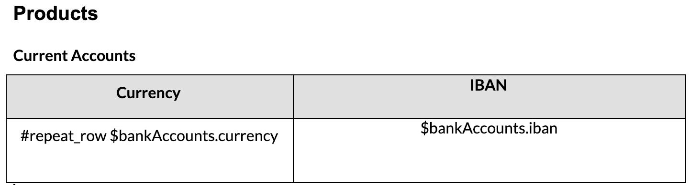
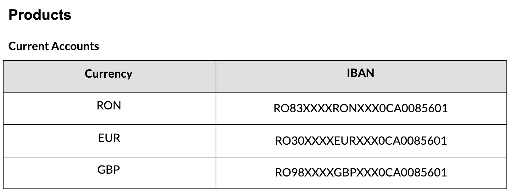

---
sidebar_position: 1
--- 

# Managing docx templates

## Defining a DOCX template format

The template should be in \*.docx format. For editing the document templates we recommend to avoid Google Docs.

The template can support the following types of parameters:

1. **Business entities attributes** - in order to use in the document values collected through the process and available in the process instance under the paramValues key

**Example** - display first name and last name of the client

* for process instance:

```
{
  "paramValues": {
    "client": {
      "identificationData": {
        "firstName": "John",
        "lastName": "Doe"
      }
    }
  }
}
```

* the document template should include the following placeholders:

```
Client $client.identificationData.lastName, $client.identificationData.firstName
```

* output for the paramValues above: `client John Doe`

**2.** **Pre-calculated params** - in case the data collected through the process needs to be processed in order to be displayed, then the value can be passed through a different parameter. The Analyst should add a Business Rule task in the process, prior to the Document Service call, and should define the business rule that will be used to calculate the new value.

**Example** - display the text "yes" or "no" in the document whether the legal address of the client is in Romania or not

* define a new param
  * let's assume we want to group all these parameters under the "docGenerator" object and name the key that will take "yes"/ "no" value "residentClient"
* define the business rule for this parameter
  * let's assume we will calculate the value according to the country declared by the client for his legal address, which we find in the paramValues under the key client.legalAddress.country
  * if we use a DMN table in order to define this rule, then it will look like in the image bellow



* the document template should include the following placeholders:

The client is resident: `$docGenerator.residentClient`

* output for "client.legalAddress.country": "Romania":

The client is resident: yes

**3. Dynamic** **sections** - used in order to dynamically display paragraphs of the document.

In case one or several paragraphs in the documents are displayed only when certain conditions are met, the paragraph must be enclosed under `<section> </section>` tags.

The Analyst should add a Business Rule task in the process, prior to the Document Service call, and should define the business rule that will be used in order to decide if a section is displayed.

**Example** - display section containing the phone number only if the client declared it

* define the section name
  * let's assume we will call this section "phoneNumber"
* define the business rule that must be met in order for the section to be displayed
  * let's assume that if the client declares the phone number, then is will be available in the paramValues under client.contactData.phoneNumber key
  * if we would use a MVEL expression in order to define this rule, then it will look like:

```
if(input.get("client.contactData.phoneNumber")!="" && input.get("client.contactData.phoneNumber")!=null){
      sectionsToKeep.add("phoneNumber");
    }
```

* the document template should include the following tags:

**Contact data** `<section name="phoneNumber"> phone number: $client.contactData.phoneNumber</section>` email address: john@doe.com

* output for "client.contactData.phoneNumber": "0700.000.000":

**Contact data** phone number: 0700.000.000 email address: john@doe.com

* output for "client.contactData.phoneNumber": null or "client.contactData.phoneNumber": ""

**Contact data** email address: john@doe.com

**4. Repeatable sections** - used to display list of objects.

In case the information you want to display in a document represents a list of objects, then you can display it using repeatable rows in a table, using the #repeat\_row tag.

Inside a repeatable row you can use placeholders for business entities attributes or pre-calculated parameters.

**Example** - display all the banks accounts that are generated after client on-boarding

* let's assume that the data is already collected though the process and does not need further processing

```
{
  "paramValues": {
    "bankAccounts": [
      {
        "currency": "RON",
        "iban": "RO0000000000000000000RON"
      },
      {
        "currency": "EUR",
        "iban": "RO0000000000000000000EUR"
      },
      {
        "currency": "GBP",
        "iban": "RO0000000000000000000GBP"
      }
    ]
  }
}
```

* the document template should include the following table:



output for the paramValues above:



## Managing DOCX templates

### **REST API**

**POST** `{{documentUrl}}/internal/templates` - create a template

**PUT** `{{documentUrl}}/internal/templates/DOC_TEMPLATE_ID` - update the template

**PUT** `{{documentUrl}}/internal/templates/upload/DOC_TEMPLATE_ID`- upload a file as a template

**POST** `{{documentUrl}}/internal/templates/generate` - generate a template

**GET** `{{documentUrl}}/internal/templates` - get all templates

**GET** `{{documentUrl}}/internal/templates/DOC_TEMPLATE_ID` - get a template by id

**DELETE** `{{documentUrl}}/internal/templates/DOC_TEMPLATE_ID` - delete a tempalte by id

### Example: Create / Upload new Template

**Step 1:** Check if the template already exists, get the available list of templates:

```
GET {{documentUrl}}/internal/templates
```

Possible responses:

```
[
    {
        "success": true,
        "templateId": 2,
        "templateName": "MARKETING_FILE",
        "type": "MARKETING_FILE"
    },
    {
        "success": true,
        "templateId": 3,
        "templateName": "SPECIAL_REQUEST",
        "type": "SPECIAL_REQUEST"
    },
    {
        "success": true,
        "templateId": 4,
        "templateName": "SALES_DOCUMENT",
        "type": "SALES_DOCUMENT"
    },
    {
        "success": true,
        "templateId": 5,
        "templateName": "SALES_DOCUMENT_CORPORATE",
        "type": "SALES_DOCUMENT_CORPORATE"
    },
    {
        "success": true,
        "templateId": 6,
        "templateName": "EMAIL_ATACHAMENT",
        "type": "EMAIL_ATACHAMENT"
    }
]
```

**Step 2:** If the TemplateName is not present in the list, create it using:

```
POST {{documentUrl}}/internal/templates
{
    "filename": "REQUEST",
    "type": "REQUEST"
}
```

and you will receive a similar response with id

```
{
    "success": true,
    "templateId": 14,
    "templateName": "REQUEST",
    "type": "REQUEST"
}
```

**Step 3:** You can upload an initial version of the template or update to a new version using the PUT method and a template id

```
PUT {{documentUrl}}/internal/templates/upload/TEMPLATE_ID
with form-data file field and the binary file
```