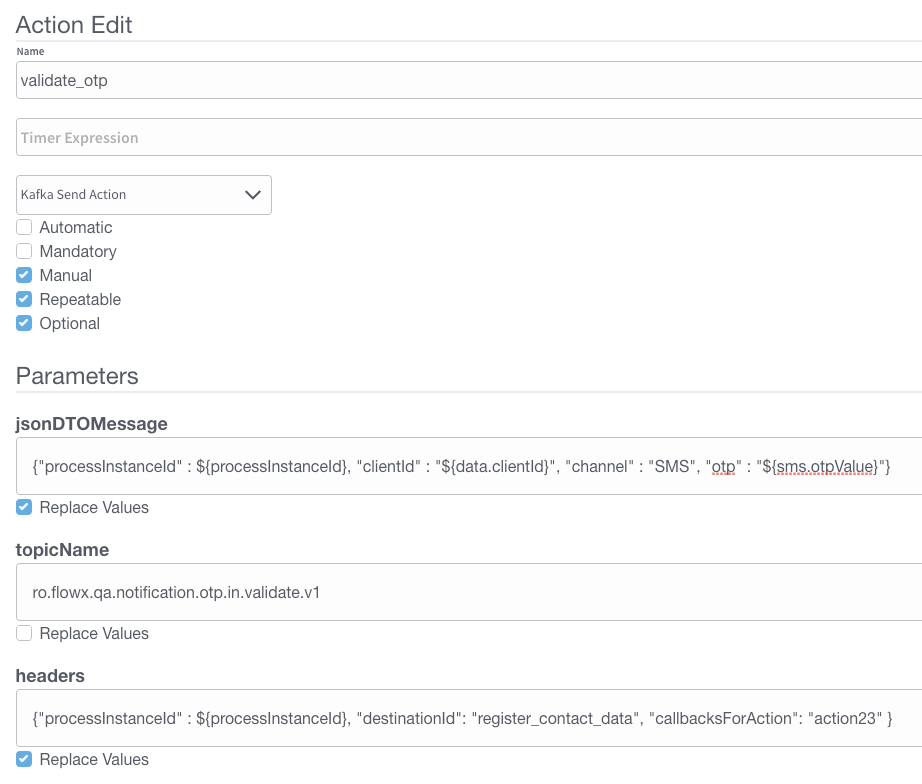

# Validate OTP

## Define needed Kafka topics

Kafka topic names can be set by using environment variables:

* `KAFKA_TOPIC_OTP_VALIDATE_IN` - Event send on this topic with an OTP and an identifier will check if the OTP is valid
* `KAFKA_TOPIC_OTP_VALIDATE_OUT` - Response to the request to validate an OTP will be send back to the Engine on this topic.


The Engine is listening for messages on topics with names of a certain pattern, make sure to use an outgoing topic name that matches the pattern configured in the Engine.


## Request to validate an OTP

Values expected in the request body:

* processInstanceId = process instance ID
* client id = the users unique id in the system
* channel = notification channel: SMS/MAIL/PUSH
* otp = OTP code that you received, used to compare with the one that was sent from the system

Example:

```
{ 
    "processInstanceId": 12345, 
    "clientId": "1234567890", 
    "channel": "SMS", 
    "otp": "1111" 
}
```

### Reply from validate OTP

Values expected in the reply body:

* processInstanceId = process instance ID
* client id = the users unique id in the system
* channel = notification channel used
* otpValid = confirmation if the provided OTP code was the same as the one sent from the system

Example:

```
{ 
    "processInstanceId": 12345, 
    "clientId": "1234567890", 
    "channel": "SMS", 
    "otpValid": true 
}
```

## Example: validate an OTP from a business flow

Similar to the generation of the OTP you can validate the OTP that was generated for an identifier.

**Step 1:** Check that the needed topics are configured correctly:   (`KAFKA_TOPIC_OTP_VALIDATE_IN`

&#x20;and `KAFKA_TOPIC_OTP_VALIDATE_OUT`)

**Step 2:** Add the actions for sending the validate OTP request on the node that contains the 'Generate OTP' actions

**Step 3:** Add the proper configuration to the action, the Kafka topic and message to be sent.



**Step 4:** Add a node to the process definition (for the Kafka receive event)

**Step 5:** Configure on what key you want to receive the response on the process instance params

