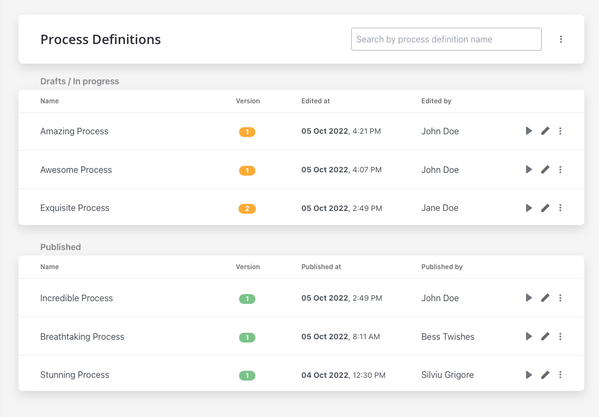
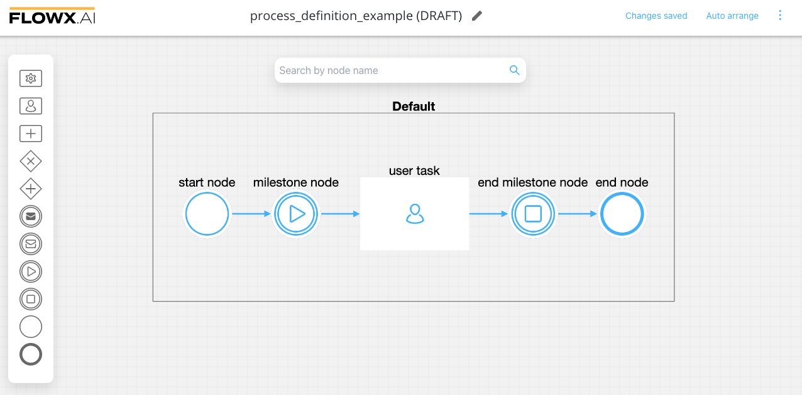
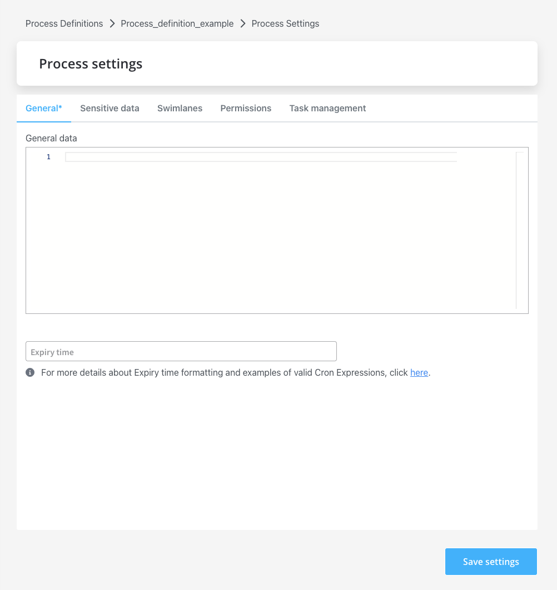
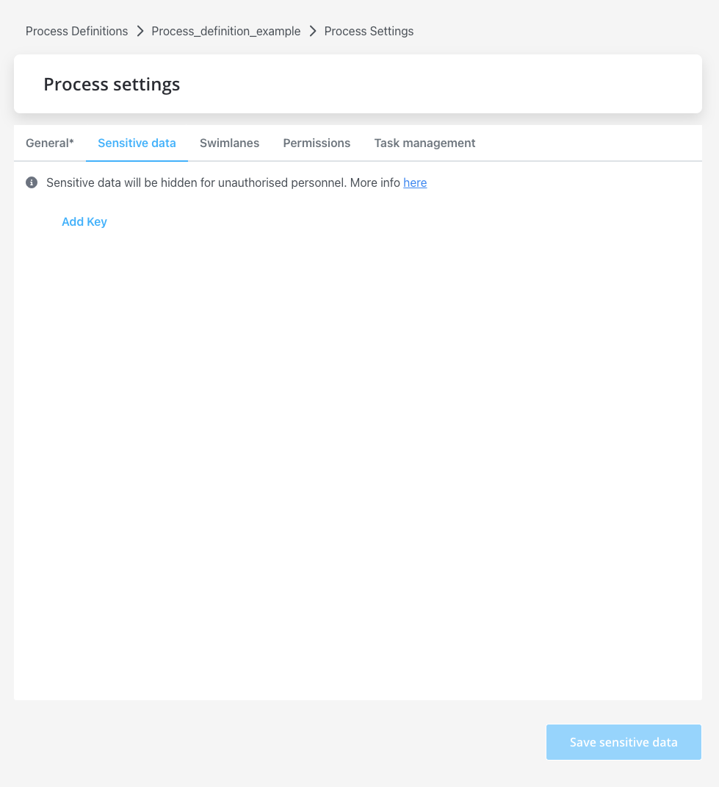
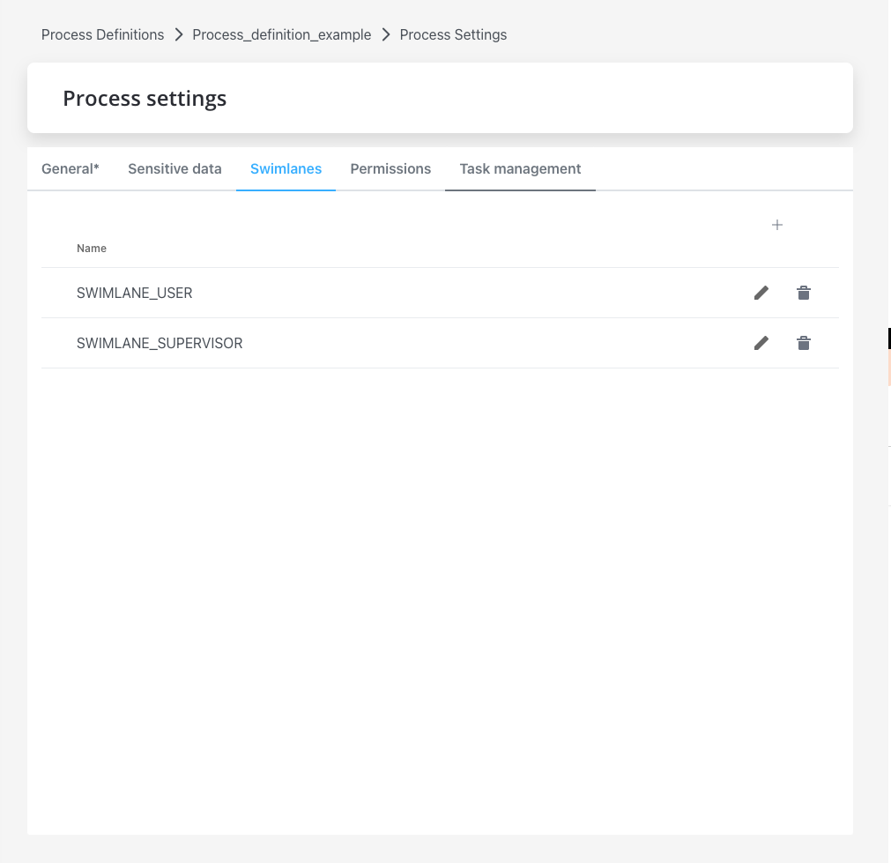
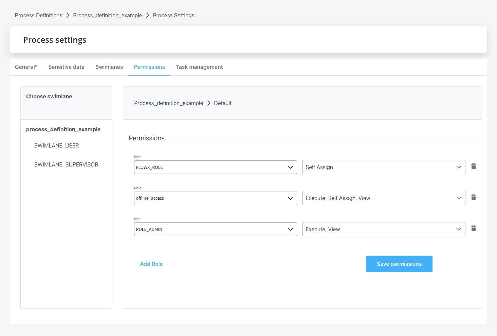
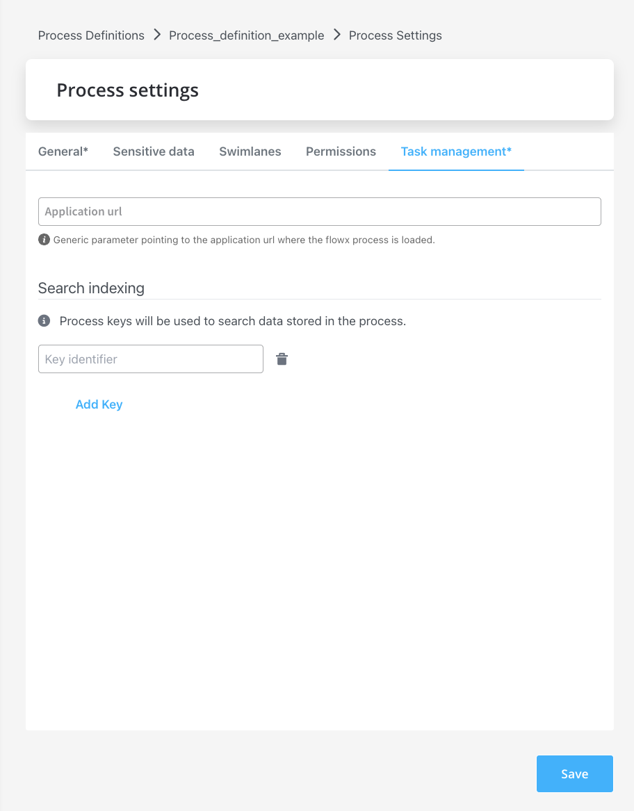

# Process definition

At the core of the platform are the process definitions. These are the blueprint of the business process, made up of [nodes](../../node) that are linked by sequences.

While designing the FLOWX components, we've tried to keep them as close to their BPMN counterparts as possible.

Check the following section for more details about nodes and how to use them:

[Node](../../node/node.md)

Once a process is defined and set as published on the platform, it can be executed, monitored, and optimized. When a business process is started, a new instance of the definition is created.

[Process instance](../active-process/process-instance/process-instance.md)

[Failed process start](../active-process/failed-process-start.md)

### Process settings

#### General

* **General data** - data that you can set and receive on a response
* **Expiry time** - a user can set up a `expiryTime` function on a process, for example, a delay of 30s will be set up like: `30 16 11 4 7 1`

For more information about **Cron Expressions** and **ISO 8601** formatting, check the following section:

[Timer Expressions](../../../platform-overview/frameworks-and-standards/timer-expressions.md)

#### Sensitive data

To protect your data and your customer's data, you can hide the data that could be visible in a process details (active processes or in the browser's console). You now have the possibility to secret data for a specific Key. 

#### Swimlanes

Swimlanes provide a way of grouping process nodes by process participants. Using swimlanes you can make sure only certain user roles have access to certain process nodes.

#### Permissions

After you define roles in the identity provider solution, they will be available to be used in the process definition settings panel for configuring swimlane access.

When you create a new swimlane, it comes with two default permissions assigned based on a specific role.

* execute - the user will be able to start process instances and run actions on them
* self-assign - the user can assign a process instance to them and start working on it

:::info
Other Permissions can be added manually, depending on the needs of the user.
:::

[Configuring access rights for processes](../../../platform-setup-guides/flowx-engine-setup-guide/configuring-access-roles-for-processes.md)

#### Task management

The Task Management plugin has the scope to show a process that you defined in Designer, offering a more business-oriented view. It also offers interactions at the assignment level.

* **Application URL** - generic parameter pointing to the application URL where the flowx process is loaded 
* **Search indexing** - process keys will be used to search data stored in the process

