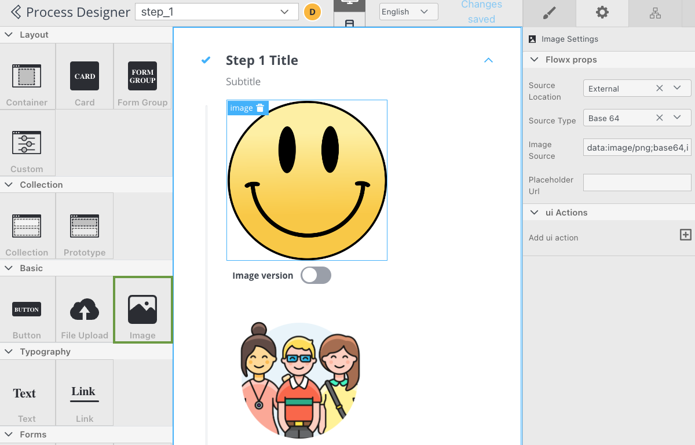
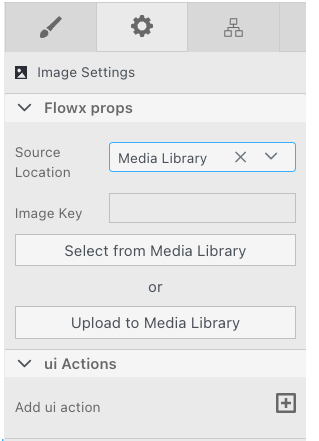
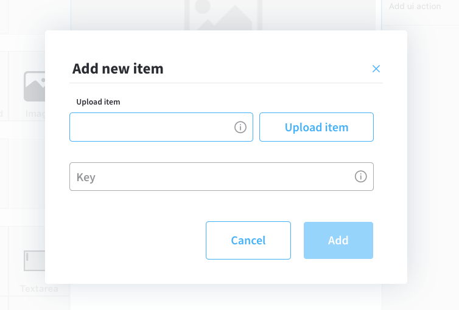
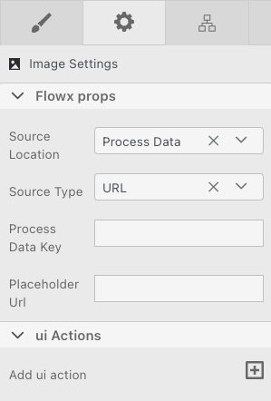
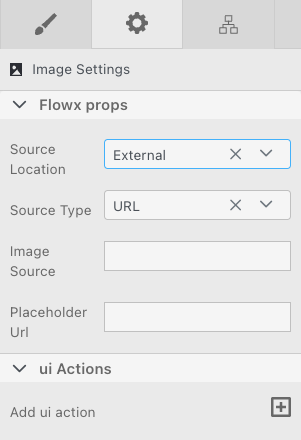
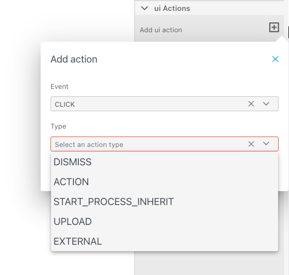

# Image

### Image settings

*  Flowx props
    * **Source location** - the location from where the image is loaded
        * **Media Library**
        * **Process Data**
        * **External**
        
Depending on which **Source location** is selected, different Flowx props are available.

#### Media library

* **Image key** - image key from media library
* **select from media library** - search item by key and select it from media library

* **upload to media library** - add a new item (upload an image on the spot)
    * **upload item** - supported formats: PNG, JPG, GIF, SVG, WebP; ❗️(maximum size - 1 MB)
    * **key** - the key must be unique and you cannot change it afterwards

#### Process Data

* **Source Type** - **URL** or **Base 64 string**
* **Process Data Key** - process key where the image can be found
* **Placeholder URL** - public URL where the image placeholder is available

#### External

* **Image source** - valid URL of the image
* **Placeholder URL** - public URL where the image placeholder is available

### UI actions

* **add UI action** - add a UI Action (must be configured on the same node) - more details [here](../ui-actions.md)

### Image styling

* **valid CSS properties** - more details [here](../../ui-designer/ui-designer.md#styling)