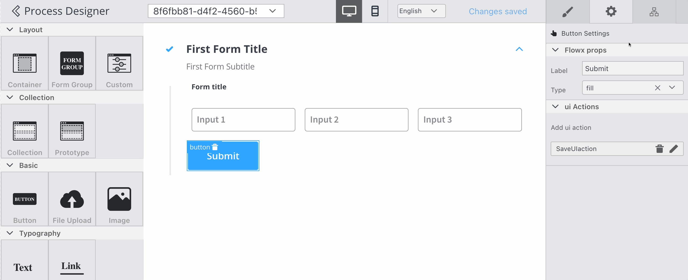
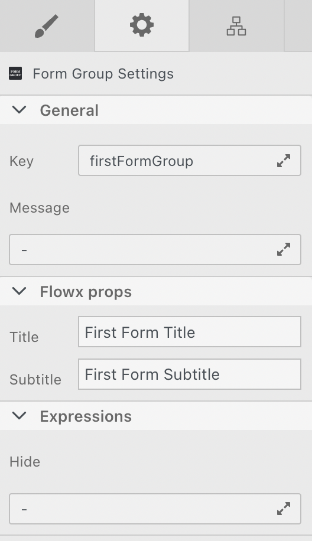
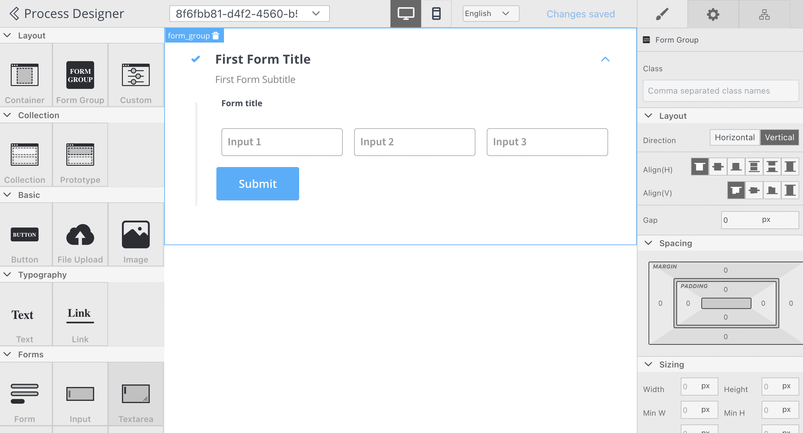
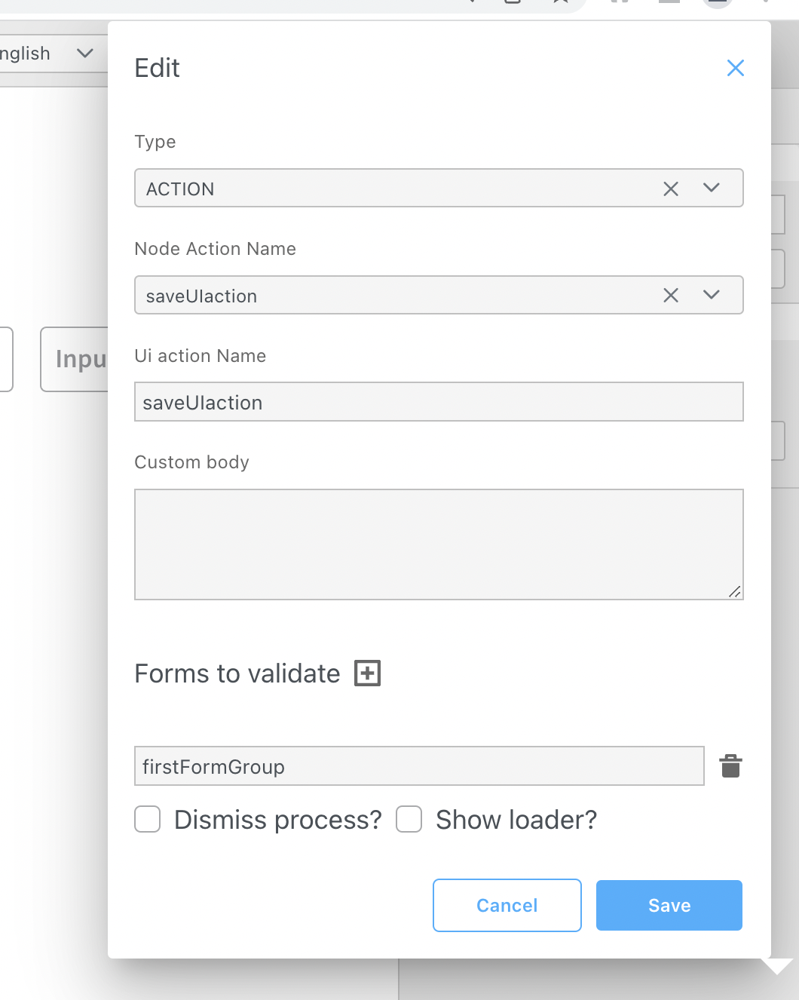

# Form Group

Form groups are used to group multiple components under a collapsible card.

The following properties can be configured:

#### Settings

1. **General** - where you define the **Key** and **Message**
   * **Key** - all values from child form elements will be grouped under this key in the frontend model; it is also used on the button configuration to tell the button what form it should submit and validate
   * **Message** - describes the data pushed to the frontend application when the process reaches this [user task](../../../node/user-task-node/user-task-node.md); should be a valid JSON
2. **Expressions (Hide)** - javascript expressions used to hide components when they're true

#### Styling

**Layout** - available for components that group children, more details about layouts can be found [here](https://tburleson-layouts-demos.firebaseapp.com/#/docs). The following styling properties can be edited:

* Direction - Vertical (column)
* Alignment - Align(H): start; Align(V): end
* other CSS properties

This example will generate a card with the layout configuration:

:::warning
To validate all form elements under a form group, you need to set the key of the form group on the property of the button: _Form To Validate._
:::

