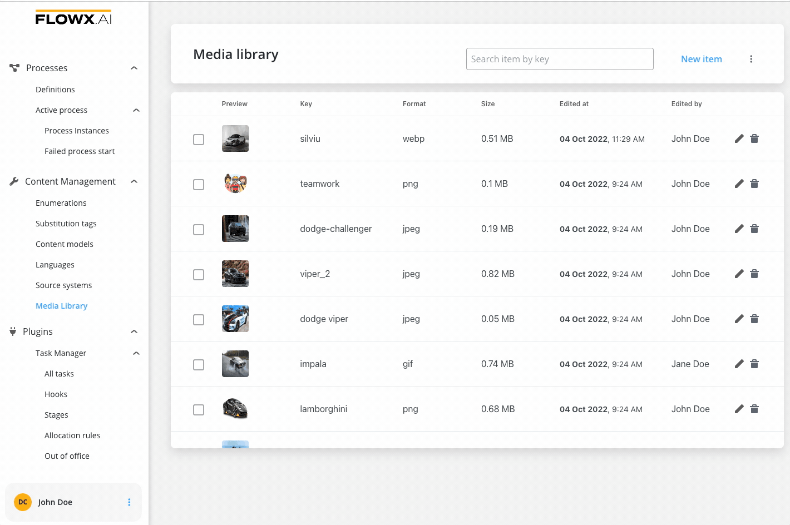
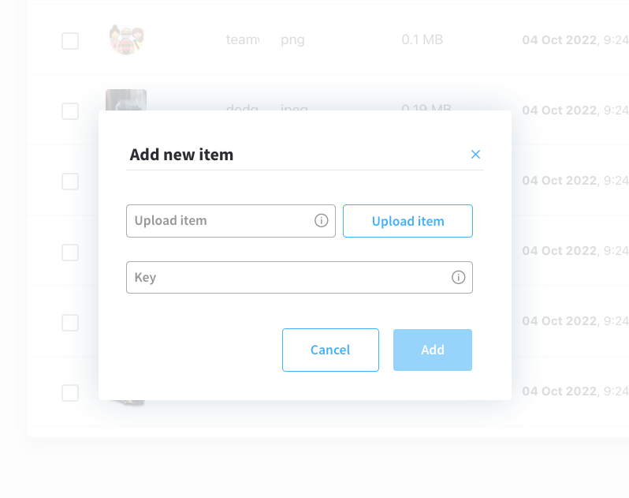
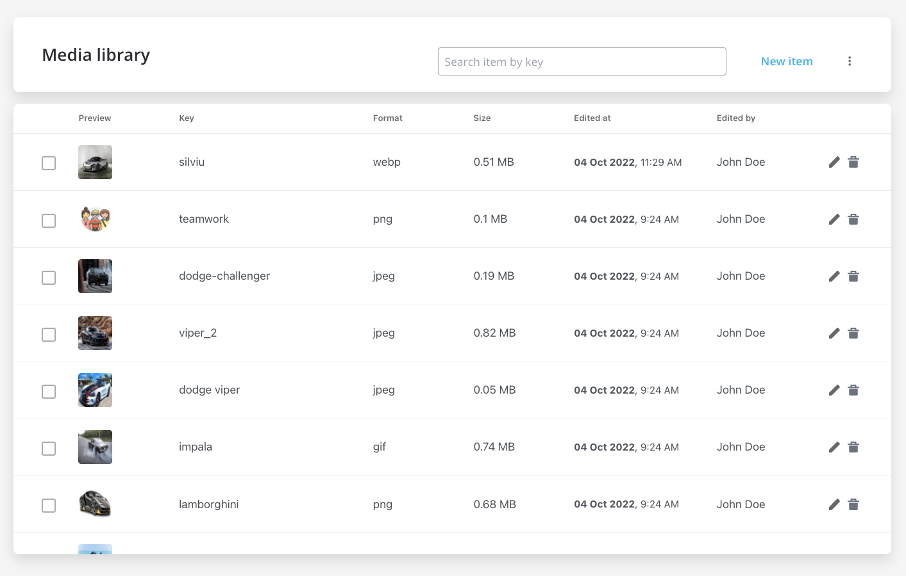
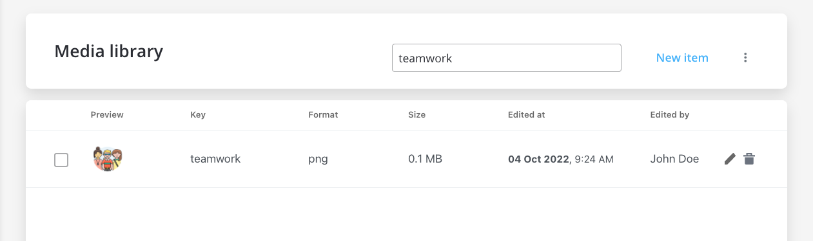
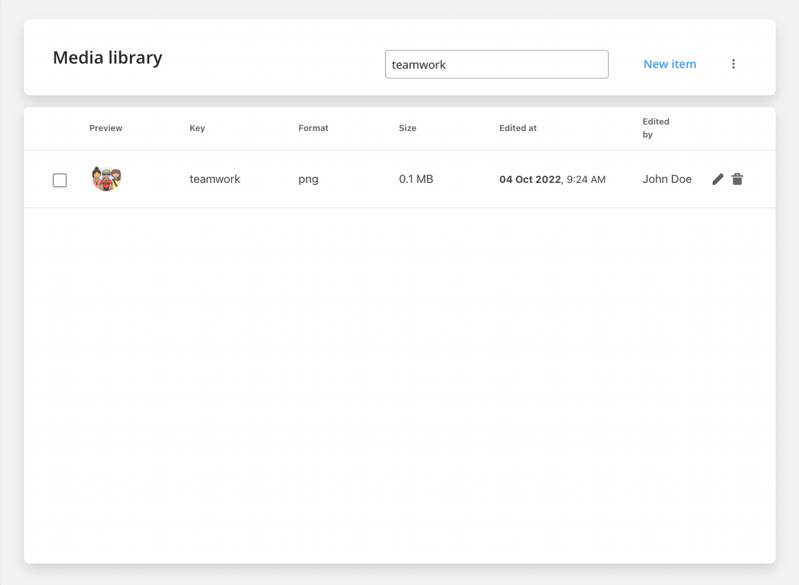
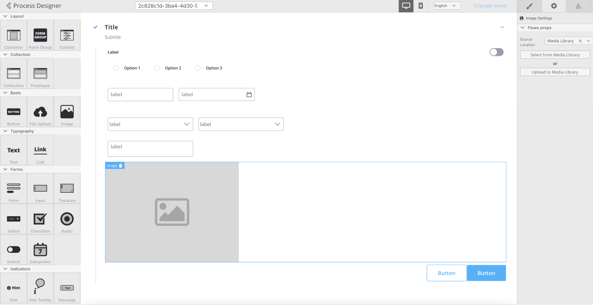

# Media Library

All the media files (such as images, gifs etc.) used on the processes that were uploaded to processes are listed in the media library. This is where you can manage all existing media files or upload new files.

:::info
You can also upload an image directly to the Media Library on the spot when configuring a process using the [**UI Designer**](../../../../building-blocks/ui-designer). More information [**here**](../../../../building-blocks/ui-designer/ui-component-types/image#media-library).
:::

### Uploading a new asset

To upload an asset to the Media Library, follow the next steps:

1. Open FLOWX.AI Designer.
2. Go to **Content Management** tab and select **Media Library**.
3. Click **Add new item**, the following details will be displayed:
    * **Upload item** - opens a local file browser
    * **Key** - the key must be unique, you cannot change it afterwards

4. Click **Upload item** button and select a file from your local browser.
5. Click **Upload item** button again to upload the asset.

:::caution
Supported formats: PNG, JPEG, JPG, GIF, SVG or WebP format, 1 MB maximum size.
:::

### Displaying assets

Users can preview all the uploaded assets just be accessing the **Media Library**.

You have the following information about assets:

* Preview (thumbnail 48x48)
* Key
* Format ("-" for unknown format)
* Size
* Edited at 
* Edited by

### Searching assets

You can search an asset by using its key (full or substring).

### Replacing assets

You can replace an item on a specific key (this will not break references to process definitions).

### Referencing assets in UI Designer

You have the following options when configuring image components using [UI Designer](../../../../building-blocks/ui-designer):

* Source Location - here you must select **Media Library** as source location 
* Image Key  
    Option 1: trigger a dropdown with images keys - you can type and filter options or can select from the initial list in dropdown 
    * Option 2: open a popup with images thumbnails and keys then you can type and filter options or can select from the initial list

:::info
More details on how to configure an image component using UI Designer - [**here**](../../../../building-blocks/ui-designer/ui-component-types/image).
:::