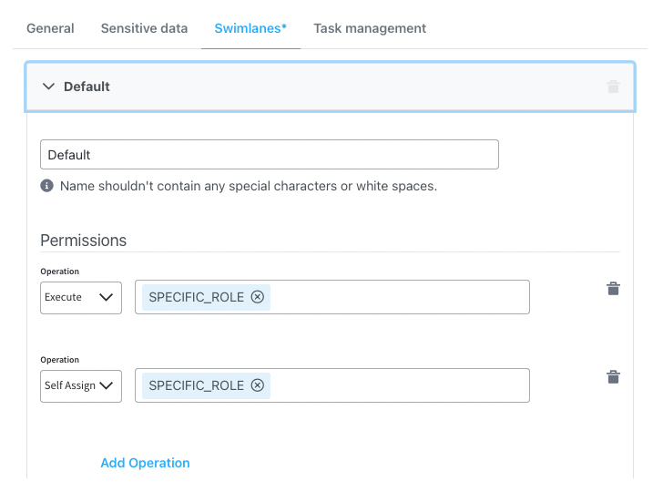
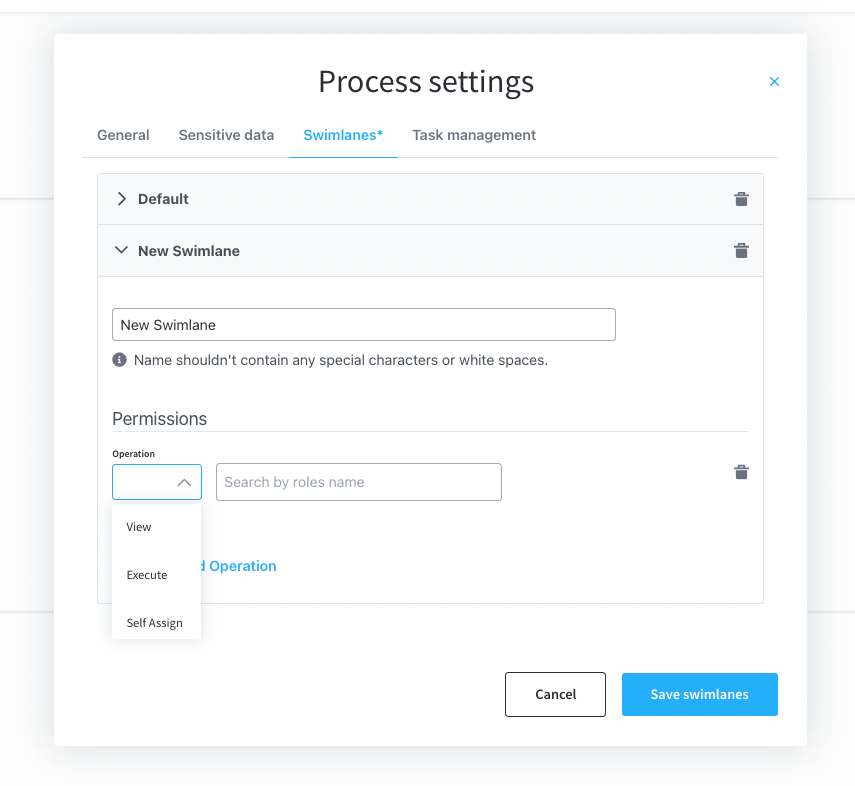
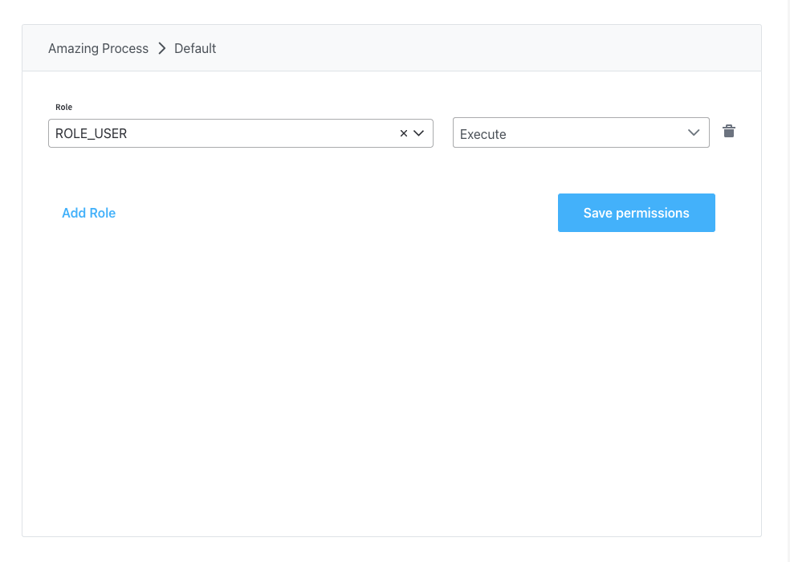
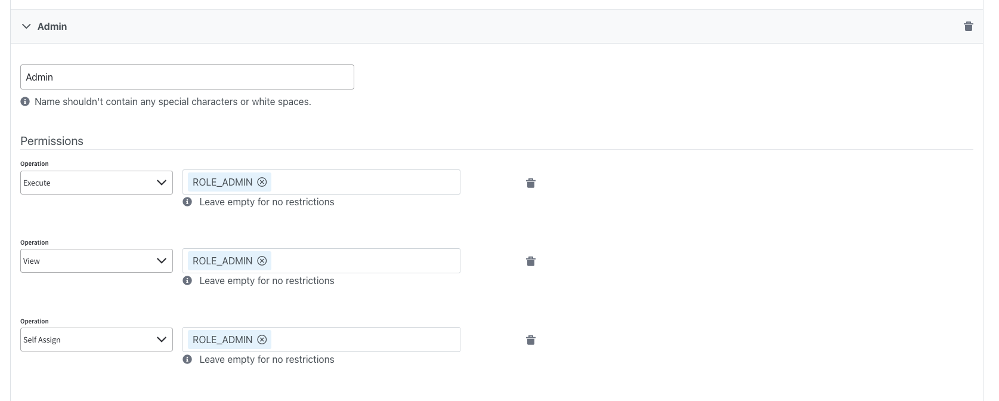

# Configuring access roles for processes

### Access to a process definition

Setting up user role-based access on process definitions is done by configuring swimlanes on the process definition.

[Swimlanes](../../../platform-deep-dive/user-roles-management/swimlanes.md)

By default, all process nodes belong to the same swimlane. If more swimlanes are needed, they can be edited in the process definition settings panel.

Swimlane role settings apply to the whole process, the process nodes or the actions to be performed on the nodes.

First, the desired user roles need to be configured in the identity provider solution and users must be assigned the correct roles.

:::warning
In order for the FLOWX platform to be able to access the roles defined in the identity provider solution, a service account with appropriate permissions needs to be added in the identity provider. And the details of that service account [need to be set up in the platform configuration](../../../flowx-designer/designer-setup-guide/designer-setup-guide.md#authorization--access-roles).
:::

The defined roles will then be available to be used in the process definition settings panel for configuring swimlane access.

A **Default** swimlane comes with two default permissions assigned based on a specific role.



* **execute** - the user will be able to start process instances and run actions on them
* **self-assign** - the user can assign a process instance to them and start working on it

:::warning
This is valid for **> 2.11.0** FLOWX.AI platform release.
:::

Other **Permissions** can be added manually, depending on the needs of the user. Some of the permissions are needed to be configured so you can use features inside [Task Management](../../plugins/custom-plugins/task-management/task-management.md) plugin. Specific roles need to be assigned separately on a few available process operations. These are:

* **view** - the user will be able to view process instance data
* **assign** - user can assign tasks to other users (this operation is only accessible through the **Task managemen**t plugin)
* **unassign** - user can unassign tasks from other users (this operation is only accessible through the **Task management** plugin)
* **hold** - user can mark the process instance as on hold (this operation is only accessible through the **Task management** plugin)
* **unhold** - user can mark the process instance as not on hold (this operation is only accessible through the **Task management** plugin)



:::warning
**< 2.11.0 platform release** - if no role is configured on an operation, no restrictions will be applied.

:exclamation: Starting with [**2.11.0**](/release-notes/v2.11.0-august-2022/) release, specific roles are needed, otherwise, restrictions will be applied.
:::

After setting up your preferred identity provider solution, you will need to add the desired access roles in the application configuration for the FLOWX Engine.





### Restricting process instance access based on business filters


[Business filters](../../user-roles-management/business-filters.md)

Before they can be used in the process definition the business filter attributes need to be set in the identity management platform. They have to be configured as a list of filters and should be made available on the authorization token. Application users will also have to be assigned this value.

### Viewing processes instances

Active process instances and their related data can be viewed from the FLOWX Designer. A user needs to be assigned to a specific role in the identity provider solution to be able to view this information.

By default, this role is named `FLOWX_ROLE`, but its name can be changed from the application configuration of the Engine by setting the following environment variable:

`FLOWX_PROCESS_DEFAULTROLES`

When viewing process instance-related data, it can be configured whether to hide specific sensitive user data. This can be configured using the `FLOWX_DATA_ANONYMIZATION` environment variable.

### Access to REST API

To restrict API calls by user role, you will need to add the user roles in the application config:

```
security:
  pathAuthorizations:
    -
      path: "/api/**"
      rolesAllowed: "ANY_AUTHENTICATED_USER" or "USER_ROLE_FROM_IDENTITY_PROVIDER"
```