# Configuring an IAM solution

## Recommended Keycloak setup

To build a minimal required Keycloak you have to configure the following items:

* [a realm](#creating-a-new-realm)
  * available roles - realm-level roles that can be assigned
  * realm default roles - realm-level roles assigned to new users
* [users](#creating-new-users)
* [import user roles](#creatingimporting-user-groups-and-roles)
* [clients](#adding-clients)
* [role mappers](#adding-protocol-mappers)
* [service accounts](#adding-service-accountss)

:::info
Recommended keycloak version: **18.0.x**
:::

[Keycloak documentation](https://www.keycloak.org/documentation)

#### Follow the next steps to build your Keycloak setup:

## Creating a new realm

:::info
**What are realms?**

A realm is a space where you manage objects, including users, applications, roles, and groups. A user belongs to and logs into a realm. One Keycloak deployment can define, store, and manage as many realms as there is space for in the database.
:::

To create a new realm, complete the following steps:

1. Log in to the **Keycloak Admin Console** (go to the **keylock admin URL** corresponding to the selected environment, for example, let's say you use a QA or a development environment or a production).

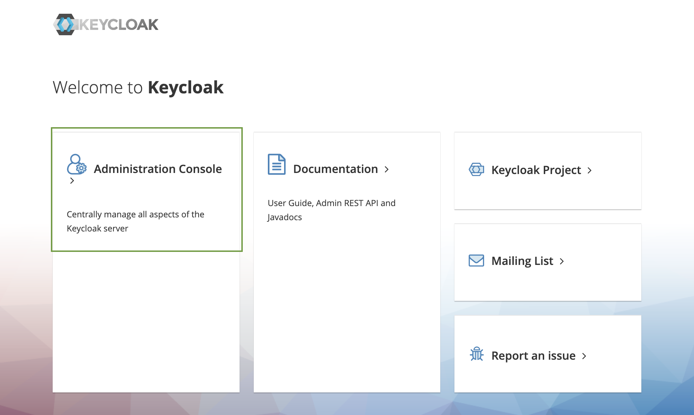

2. In the top left corner dropdown menu, click **Add Realm**.

:::info
If you are logged in to the master realm this dropdown menu lists all the realms created. The **Add Realm** page opens.
:::

3. You will be creating a brand-new realm from scratch, so type a **realm name** and click **Create**.

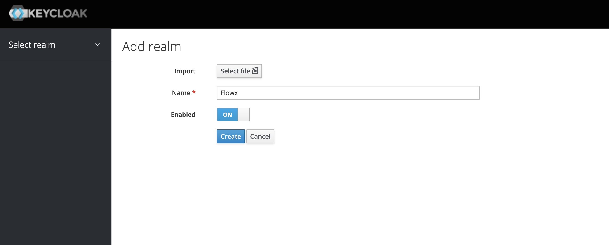

4. Go to **Realm Settings -> Tokens** and set the following properties:

* **SSO Session idle** - suggested: 30 Minutes
* **Access Token Lifespan** - suggested: 30 Minutes

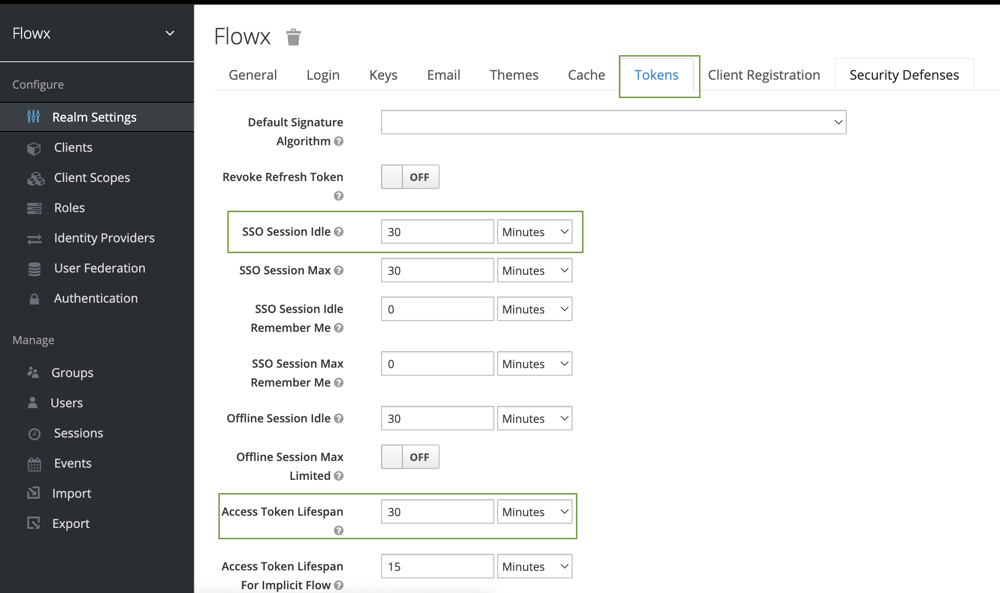

:::info
This is just an example, you can set any values you want for the token, and do not forget to check and apply properties suitable for your organization's needs.
:::

## Creating/importing user groups and roles

You can either create or import a user group into a realm. We prepared a [script](./#importing-user-roles) that helps you to import a **super admin group** provided with the necessary **default user roles**.

1. Run the Python script mentioned in the [previous section](./#importing-user-roles).
2. Add an admin user, for example, `admin@flowx.ai` user in the group `SUPER_ADMIN_USERS`(this group is added automatically if you use the script).
3. Add `ROLE_START_EXTERNAL` role in the **Roles** tab (this will be used later).

You can also validate if you were able to import all the roles by checking the following section:

[Default roles](./default-roles)

## Creating new users

To create a new user in the `Flowx` realm as well as a temporary password for that account, complete the following steps:

1. In the left menu bar click **Users**. The user list page opens.
2. On the right side of the empty user list, click **Add User**. :exclamation:Make sure you validate the user email by setting the **Email Verified** to **ON**.

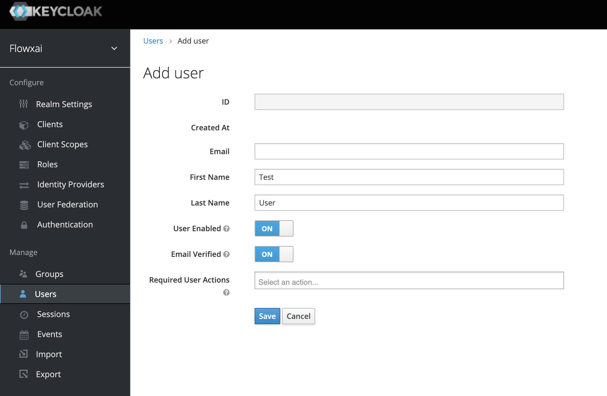

3. The only required field is `Username`. When you finish, click **Save**. The **management page** for your new user opens.

:::caution
If the **Username** field is not visible (as you can see in the example above), please follow the next steps:
:::

4. Right-click on the **Add user** page menu, then click **inspect element**.

5. Search for **username** (use **Ctrl + F**).

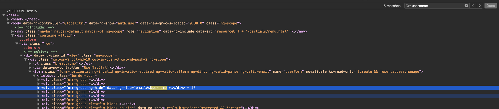

6. Delete the highlighted **`ng-hide attribute`** (from **`form-group ng-hide`**) and press **Enter**.

7. The **Username** field will be available.

8. Save the user and go to **Credentials**.

9. Enter **a password** and set it not to be temporary.

10. Go to the **Groups** tab and then click **join**.

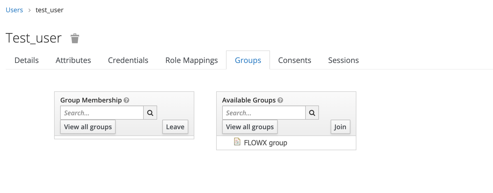

## Adding clients

:::info
**What are clients?**

Clients have trusted browser apps and web services in a realm. These clients can request Keycloak to authenticate a user. You can also define client-specific roles.
:::

To add clients, complete the next steps:

1. In the top left menu, click **Clients** then click **Create**.
2. Use `{example}-authenticate` as client ID - it will be used for login/logout/refresh token by web and mobile apps.
3. Open the newly created **client** and edit the following properties:
   * Set **Access type** to **public** (do not require a secret)
   * Set **Valid redirect URIs** - define a valid URI pattern that a browser can redirect to after a successful login or logout
   * Check **Direct Access Grants** **Enabled** and **Implicit Flow Enabled** to **ON**

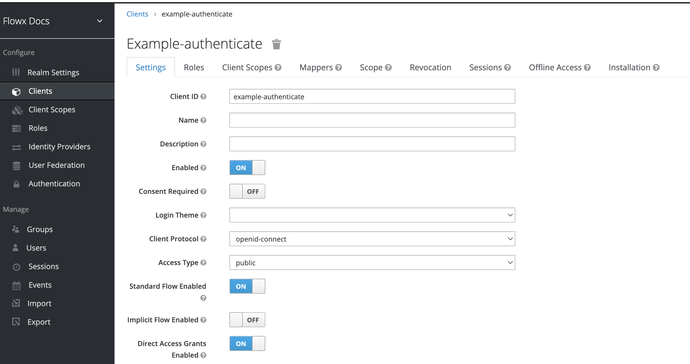

4. Add **groups mapper** to `{example}-authenticate` client - so the groups list will be added to the authorization token. For more information on how to add mappers to clients, check the following section.

## Adding protocol mappers

:::info
**What are protocol mappers?**

Protocol mappers perform transformation on tokens and documents. They can do things like map used data into protocol claims, or just transform any requests going between the client and auth server.
:::

There are multiple types of mappers that we will use in the following examples:

* [Group Membership mapper ](#group-membership-mapper)- it can be used to map user groups to the authorization token
* [User Attribute mapper](#user-attribute-mapper) - it can be used to map custom attributes, for example, mapping the [businessFilters ](../../platform-deep-dive/user-roles-management/business-filters.md) list to the token claim
* [User Realm Role](#user-realm-role) - it can be used to map a user realm role to a token claim

### **Group Membership mapper**

To add a mapper, complete the next steps (example used: adding user groups in the authorization token):

1. Go to **clients → your client → mappers**.
2. Fill in a suggestive **Name** for the mapper.
3. From the **Mapper Type** dropdown, choose **Group Membership**.
4. In the **Token Claim Name**, insert the name of the claim that will be included in the token.

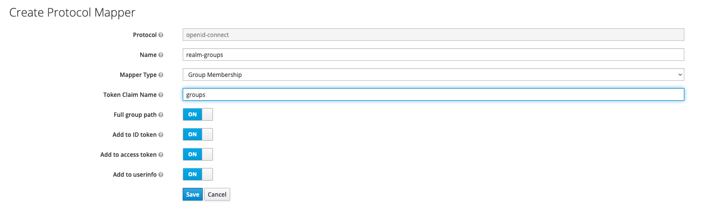

### **User Attribute mapper**

Add customer **business filters** attribute to `{example}-authenticate` client - so the business filters list will be added to the token claim.

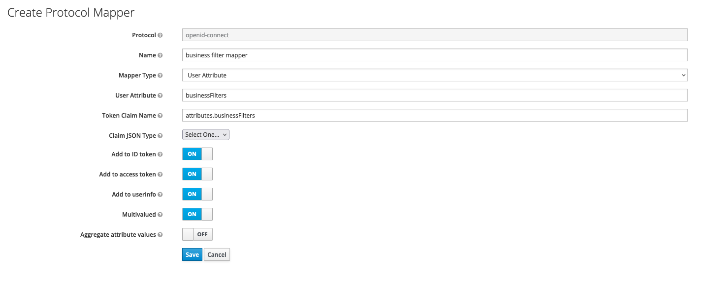

You can find more information about business filters in the following section:

[Business filters](../../platform-deep-dive/user-roles-management/business-filters.md)


### User realm role

Add **roles** **mapper** to `{example}-authenticate` client - so roles will be available on the OAuth user info response.

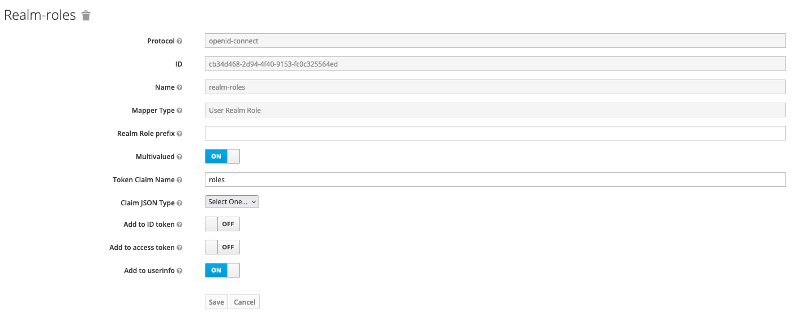

### Examples

#### Login

```url
curl --location --request POST 'http://localhost:8080/realms/flowx/protocol/openid-connect/token' \
--header 'Content-Type: application/x-www-form-urlencoded' \
--data-urlencode 'grant_type=password' \
--data-urlencode 'username=admin@flowx.ai' \
--data-urlencode 'password=password' \
--data-urlencode 'client_id= example-authenticate'
```

#### **Refresh token**

```
curl --location --request POST 'http://localhost:8080/realms/flowx/protocol/openid-connect/token' \
--header 'Content-Type: application/x-www-form-urlencoded' \
--data-urlencode 'grant_type=refresh_token' \
--data-urlencode 'client_id= example-authenticate' \
--data-urlencode 'refresh_token=ACCESS_TOKEN'
```

#### User info

```
curl --location --request GET 'localhost:8080/realms/flowx/protocol/openid-connect/userinfo' \
--header 'Authorization: Bearer ACCESS_TOKEN' \
```

#### Authorizing client

Add `{example}-authorize` client - it will be used to authorize rest requests to microservices and Kafka

* set **Access type** as **confidential**
* check **Standard Flow Enabled**

#### Minimal auth config for microservices

```yaml
security:
  type: oauth2
  basic:
    enabled: false
  oauth2:
    base-server-url: http://localhost:8080
    realm: flowx
    client:
      access-token-uri: ${security.oauth2.base-server-url}/realms/${security.oauth2.realm}/protocol/openid-connect/token
      client-id: example-authorize
      client-secret: CLIENT_SECRET
    resource:
      user-info-uri: ${security.oauth2.base-server-url}/realms/${security.oauth2.realm}/protocol/openid-connect/userinfo
```

## Adding service accounts

:::info
**What is a service account?**

A service account is an account that allows a component to directly access the Keycloak API.
:::

### **Admin service account**

This will be used by the admin microservice for making calls directly to the Keycloak API.

To add an **admin service account**, complete the next steps:

1. Add a **new client**:
   * set **Access type** as **confidential**
   * check **Service Accounts Enabled**

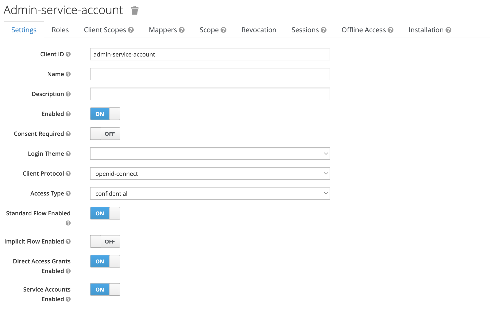

2. Go to **Clients → realm-management → Roles** and add the following **service account client roles**: **manage-users.**

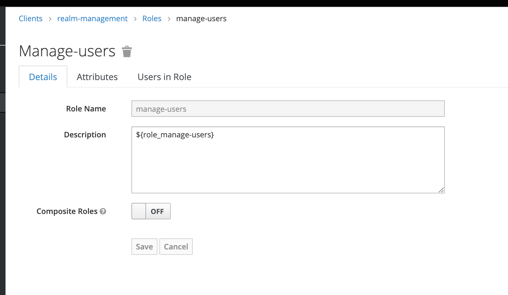

3. Add **realm roles mapper** to the newly created **admin-service-account** with the following properties:

* **name**: _realm roles_
* **Mapper Type**: _User Realm Role_
* **Token Claim Name**: _roles_
* **Claim JSON Type**: _String_

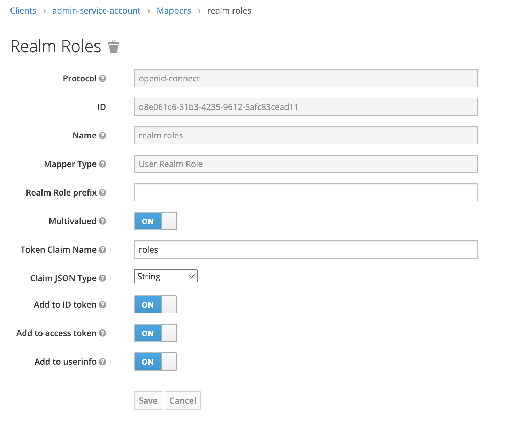

4. Give it the necessary **service account roles**:

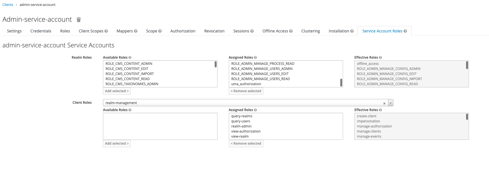

The **admin service account** defined in the example above can have the following assigned roles, based on the access scopes:

* manage-users

For more information, check the following section:

[Configuring access rights for admin](../../flowx-designer/designer-setup-guide/configuring-access-rights-for-admin.md)

### **Task management service account**

This will be used by the **task management microservice** for making calls directly to keycloak API.

To add a task management service account:

1. Add a **new client**:

* set **Access type** as **confidential**
* check **Service Accounts Enabled**

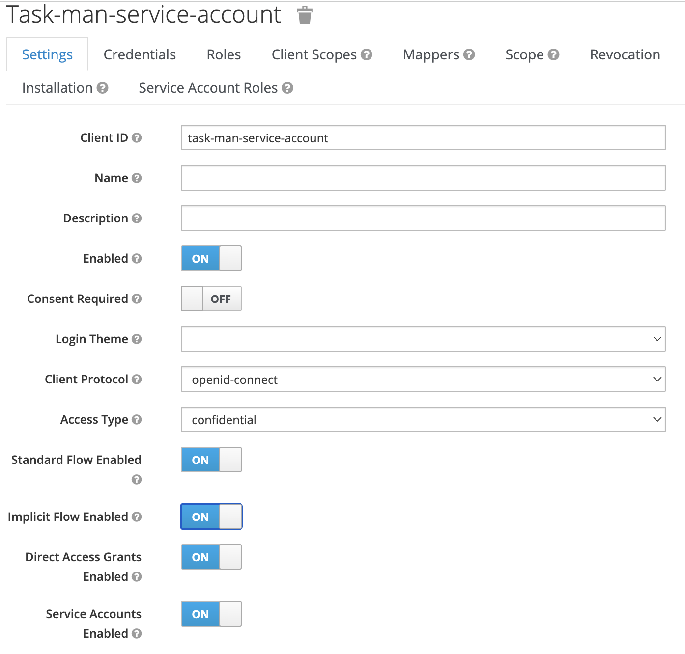

2. Go to **Clients → realm-management → Roles** and add the following **service account client roles** under **realm-management: view-users**.

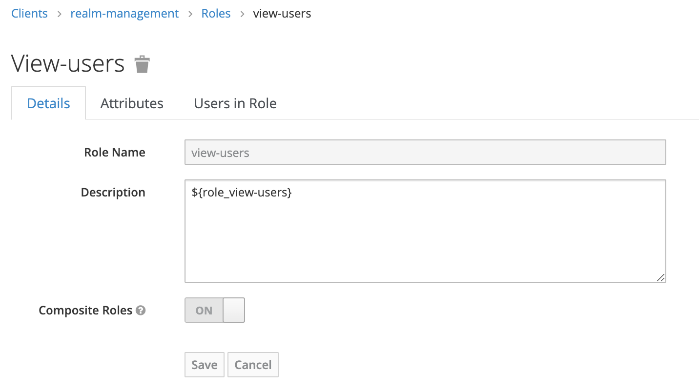

3. Add role `ROLE_START_EXTERNAL` to it in **service account roles → realm roles.**

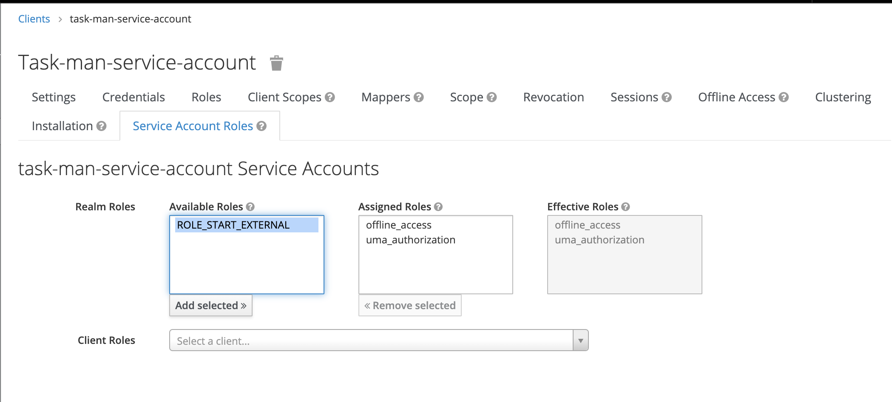

4. Add a **realm-roles mapper**:

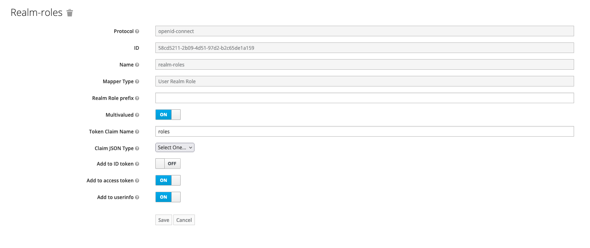

5. Add the **necessary service accounts** to it:

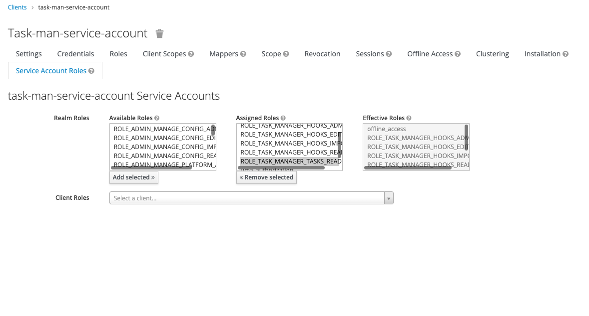

The **task management service account** defined in the example above can have the following assigned roles, based on the access scopes:

* manage-tasks
* manage-hooks

For more information, check the following section:

[Configuring access rights for Task Management](../../platform-deep-dive/plugins/plugins-setup-guide/task-management-plugin-setup/configuring-access-rights-for-task-management.md)
