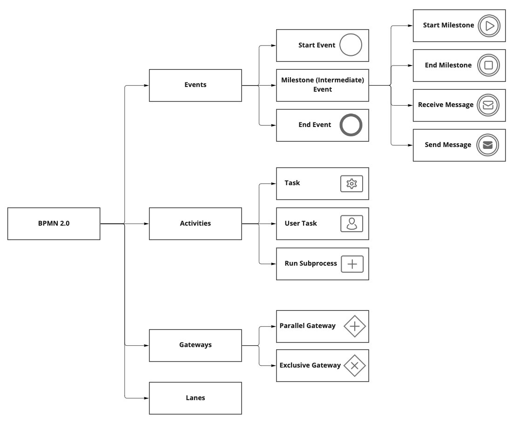
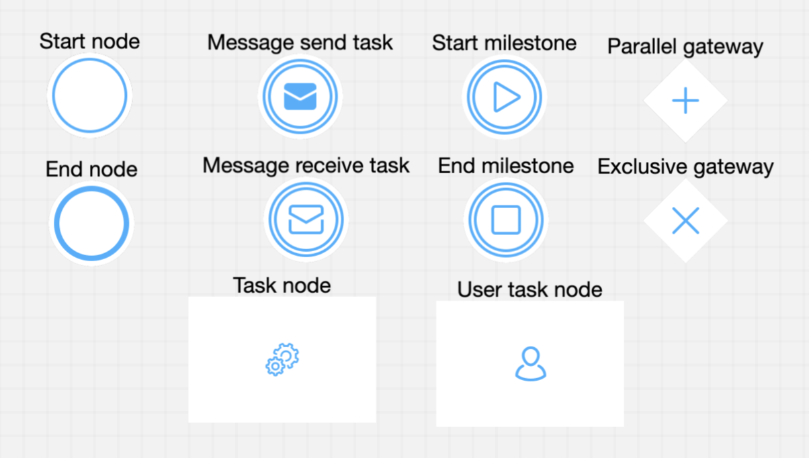
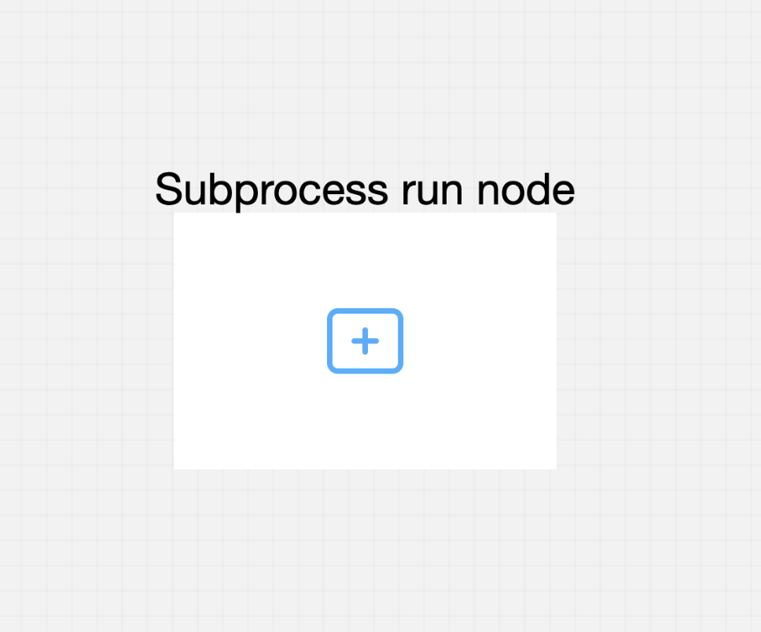

# Node

## What is a node?

A node is a visual representation of a point in your process. To mark the entrance of a record into the process, nodes are added at certain process points.

FLOWX.AI platforms support different [types of nodes], each needing a different configuration to fulfill its purpose in the business flow.

## Node types

Let's go through the most important types of nodes. These can be selected when adding a new node to a [process definition](../process/process-definition/process-definition.md) using the FLOWX Designer:

+ **​Start and end nodes**​​​ ​- they mark the beginning and end of a [process flow](../../platform-overview/frameworks-and-standards/business-process-industry-standards/intro-to-bpmn/intro-to-bpmn.md#bpmn-20-elements). A [process definition](../process/process-definition/process-definition.md) can have one or more start nodes (each linked with a start condition) and also one or more end nodes depending on the flow outcomes
+ **​Message send tasks and message received tasks** ​- are used to communicate with external systems (integrations and plugins)
+ ​**Task nodes**​​ - can be added when a [business rule](../node/task-node/business-rule-action/business-rule-action.md) needs to be run during a process flow
+ **​User task nodes** ​- these are used to configure the look and behavior of the UI and send data to custom component
+ ​**Exclusive gateways**​​ - are used to mark a decision point in the process flow and decide on the branch that needs to be followed
+ **​Parallel gateways**​​ - used to split the process flow into two or more [branches](../../flowx-designer/managing-a-process-flow/adding-more-flow-branches.md) that take place at the same time
+ **​Milestones**​​ - start and end nodes for milestones are currently used to mark the beginning and end of definitions for [UI components](../ui-designer/ui-component-types/ui-component-types.md) (like steppers displayed on a page)

Advanced node types:​

* ​**​Subprocess run node**​ - a node that provides advanced options for starting subprocessesAfter you get a broader overview of each node, you can play with them to create a process, more details are in the below section:

[Managing a process flow](../../flowx-designer/managing-a-process-flow/managing-a-process-flow.md)