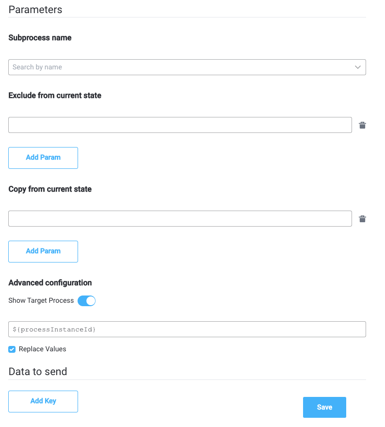
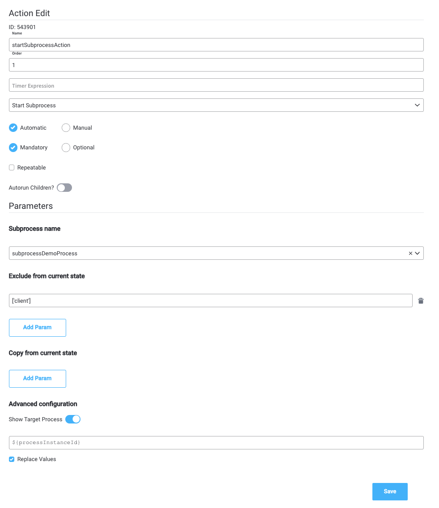

# Start Subprocess action

:::info
**What is it?** A **Start Subprocess action** is an action that allows you to start a subprocess from another (parent) process.

**Why is it important?**  Using [**subprocesses**](../../process/subprocess.md) is a good way to split the complexity of your business flow into multiple, simple and reusable processes.
:::

### Configuring a Start Subprocess action

After you create a process designed to be used as a [subprocess](../../process/subprocess.md), you will need to start it from another (parent) [process](../../process/process.md). To do this, you need to add a **Start Subprocess action** on a [**Task Node**](./) from the parent process.

The following properties must be configured:

* [Action Edit](start-subprocess-action.md#action-edit)
* [Back in steps (for Manual actions)](start-subprocess-action.md#back-in-steps)
* [Parameters](start-subprocess-action.md#parameters)
* [Data to send (for Manual actions)](start-subprocess-action.md#data-to-send)

#### Action Edit

* **Name** - used internally to make a distinction between different actions on nodes in the process. We recommend defining an action naming standard to be able to quickly find the process actions
* **Order** - if multiple actions are defined on the same node, the running order should be set using this option
* **Timer expression** - it can be used if a delay is required on that action. The format used for this is [ISO 8601 duration format ](https://www.digi.com/resources/documentation/digidocs/90001437-13/reference/r\_iso\_8601\_duration\_format.htm)(for example, a delay of 30 seconds will be set up as `PT30S`)
* **Action type** - should be set to **Start Subprocess**
* **Trigger type** (options are Automatic/Manual) - choose if this action should be triggered automatically (when the process flow reaches this step) or manually (triggered by the user); in most use cases, this will be set to automatic
* **Required type** (options are Mandatory/Optional) - automatic actions can only be defined as mandatory. Manual actions can be defined as mandatory or optional
* **Repeatable** - should be checked if the action can be triggered multiple times
* **Autorun Children** - when this is switched on, the child actions (the ones defined as mandatory and automatic) will run immediately after the execution of the parent action is finalized

#### **Back in steps**

* **Allow BACK on this action** - back in process is a functionality that allows you to go back in a business process and redo a series of previous actions in the process. For more details, check [**Moving a token backwards in a process**](../../../flowx-designer/managing-a-process-flow/moving-a-token-backwards-in-a-process.md) section.

#### **Parameters**

* **Subprocess name** - the name of the process that you want to start as a subprocess
* **Exclude from current state** - what fields do you want to exclude when copying the data from the parent process to the subprocess (by default all data fields are copied)
* **Copy from current state** - if a value is set here, it will overwrite the default behavior (of copying the whole data) with copying just the data that is specified

**Advanced configuration**

* **Show Target Process** - ID of the current process, to allow the subprocess to communicate with the parent process (which is the process where this action is configured)

#### Data to send

* **Keys** - are used when data is sent from the frontend via an action to validate the data (you can find more information in the [**User Task configuration**](../user-task-node/) section)

:::warning
**Data to send** option is configurable only when the action **trigger type** is **Manual**.
:::

### Example

To start a subprocess, we can, for example, create the following minimum configuration:

* **Subprocess name** - _`subprocessDemoProcess`_ - name of the process that we want to start as a subprocess
* **Exclude from current state** - _`["client"]`_ - copy all the data from the parent, except the client data
* **Copy from current state** - we leave this field empty in order to copy all the data (except the keys that are specified in the **Exclude from current state** field)

**Advanced configuration**

* **Target process (parentProcessInstanceId)** - `${processInstanceId}` **** - current process ID

