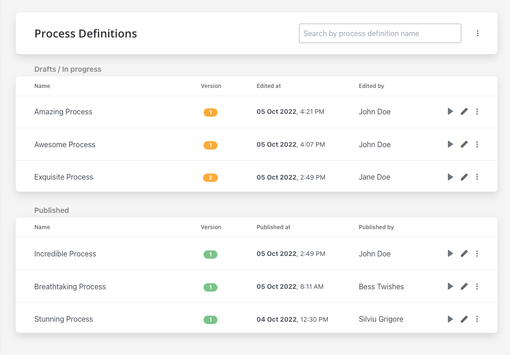
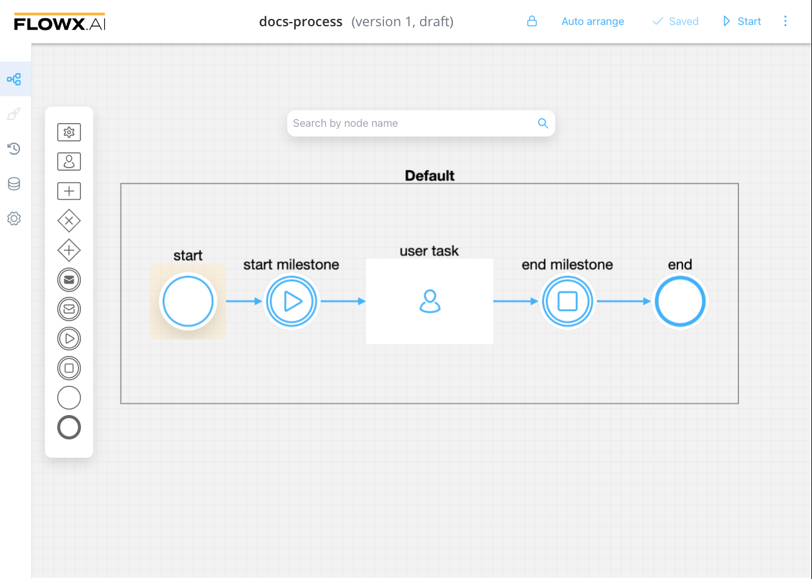
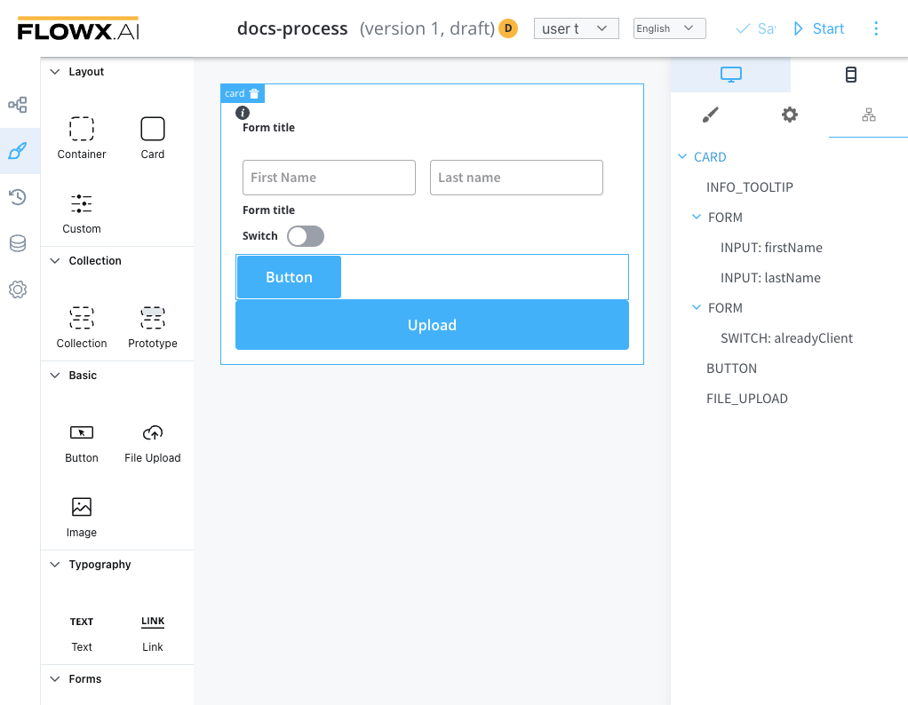
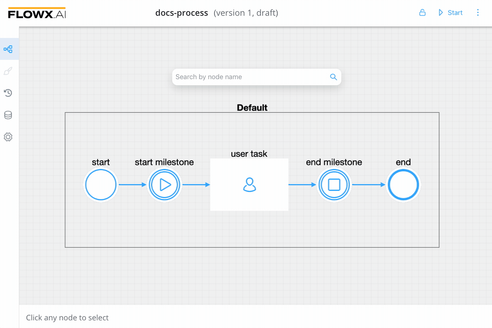
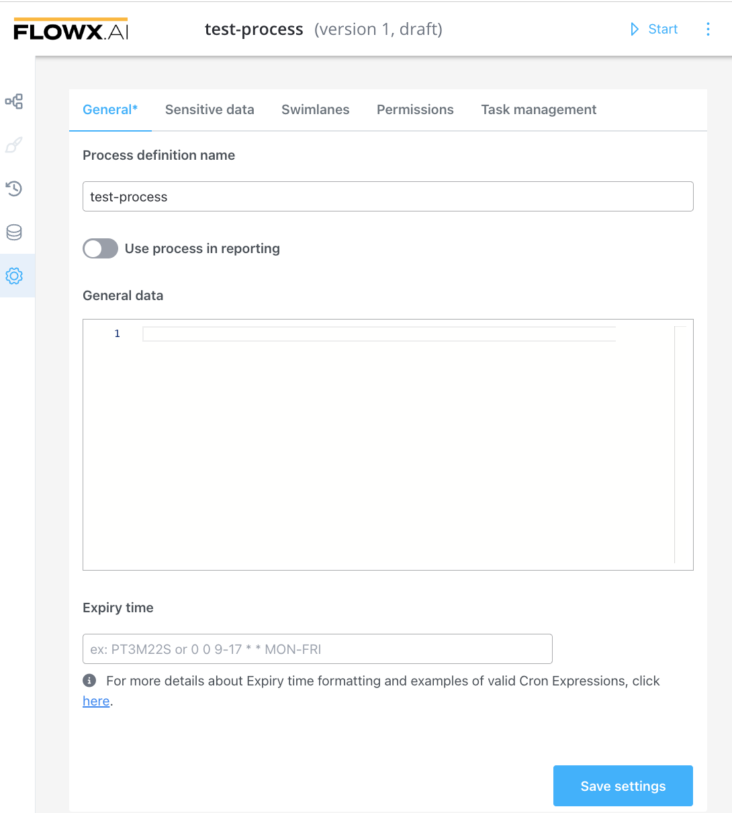
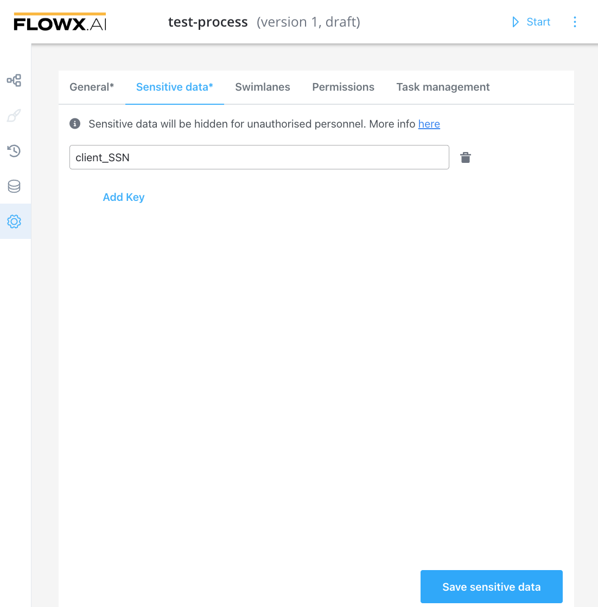
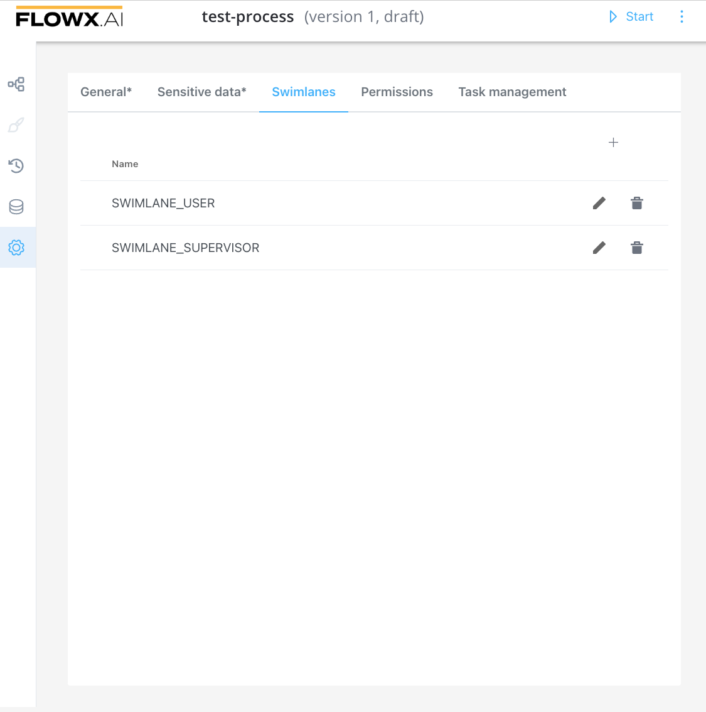
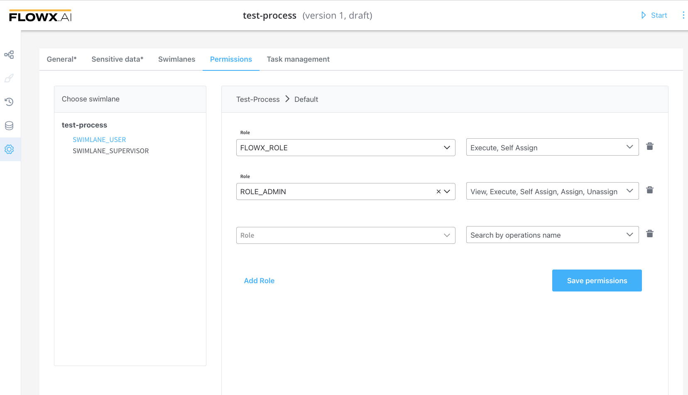
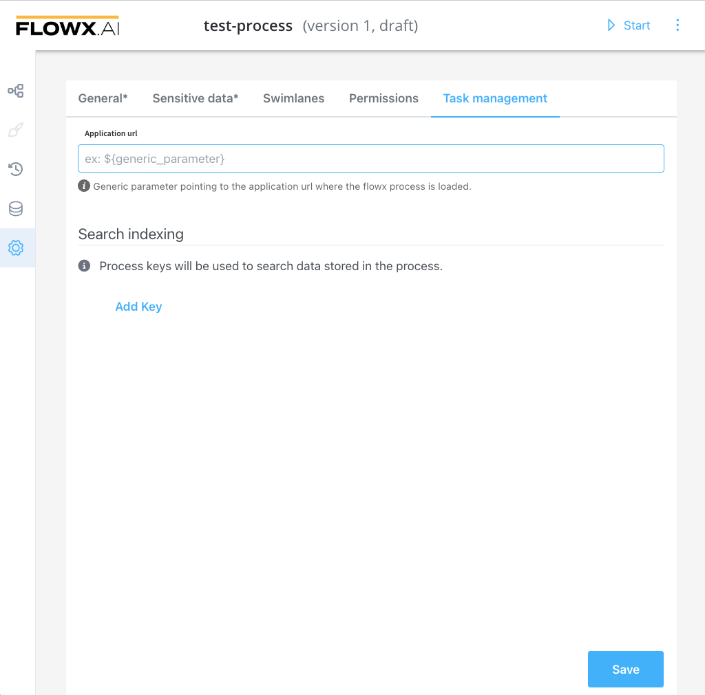

---
sidebar_position: 1
--- 

# Process definition

At the core of the platform are the process definitions. These are the blueprint of the business process, made up of [nodes](../../node) that are linked by sequences.

## Process designer

When a process definition is displayed, the name contains the following:

* process definition name 
* version number
* state

While designing the FLOWX.AI components, we've tried to keep them as close to their BPMN counterparts as possible.

Check the following section for more details about nodes and how to use them:

[Node](../../node/node.md)

Once a process is defined and set as published on the platform, it can be executed, monitored, and optimized. When a business process is started, a new instance of the definition is created.

[Process instance](../active-process/process-instance/process-instance.md)

[Failed process start](../active-process/failed-process-start.md)

## UI Designer

UI Designer editor makes it possible to create any kind of UI templates. You can use various elements from basic buttons, indicators, and forms, but also predefined collections or prototypes.

[UI Designer](../../../building-blocks/ui-designer/ui-designer.md)

## History

In the **History** tab you will find the following items:

* **Versions** - here you will find information about who edited a process/ when a process was modified, and also version number and the status
* **Audit log** - a record of events and changes 

### Versions

In the **Versions** tab you will find the following details:

* Last edited on - the last time when the process was modified
* Last edited by - the last person who modified a process
* Version - version number
* Status - can be either **Published** or **Draft** 

:::info HINT
❗️Published processes cannot be modified (they must be deprecated to be set as **Draft** before editing them).
:::

* View process - clicking on the eye icon will redirect you to the process definition 

### Audit log

In the **Audit log** tab you will find the following items:

* Timestamp 
* User 
* Subject 
* Event 
* Subject Identifier 
* Version
* Status 

:::info
Some items are filterable, so you can easily track the changes occurred in a process.
:::

[Audit](../../../platform-deep-dive/core-components/core-extensions/audit.md)

## Data model

You are now able to add new keys pair values in the Data Model. This will enable you to use shortcuts when adding new keys using the UI Designer, without having to switch back and forth between menus.

### Attributes type

Data model supports the following attributes type:

* STRING
* NUMBER
* BOOLEAN
* OBJECT
* ARRAY
* ENUM

:::info
When you export/import a [**Process definition**](process-definition.md) the data model will be also included.
:::

## Settings

#### General
* **Process definition name** - edit process definition name
* **Use process in reporting** - if switched on, the process will be included in reporting
* **General data** - data that you can set and receive on a response
* **Expiry time** - a user can set up a `expiryTime` function on a process, for example, a delay of 30s will be set up like: `30 16 11 4 7 1`

For more information about **Cron Expressions** and **ISO 8601** formatting, check the following section:

[Timer Expressions](../../../platform-overview/frameworks-and-standards/timer-expressions.md)

#### Sensitive data

To protect your data and your customer's data (for example, PII data), you can hide the data that could be visible in a process details (active processes or in the browser's console). You now have the possibility to secret data for a specific Key. 

#### Swimlanes

Swimlanes provide a way of grouping process nodes by process participants. Using swimlanes you can make sure only certain user roles have access to certain process nodes.

#### Permissions

After you define roles in the identity provider solution, they will be available to be used in the process definition settings panel for configuring swimlane access.

When you create a new swimlane, it comes with two default permissions assigned based on a specific role.

* execute - the user will be able to start process instances and run actions on them
* self-assign - the user can assign a process instance to them and start working on it

:::info
Other Permissions can be added manually, depending on the needs of the user.
:::

[Configuring access rights for processes](../../../platform-setup-guides/flowx-engine-setup-guide/configuring-access-roles-for-processes.md)

#### Task management

The Task Management plugin has the scope to show a process that you defined in Designer, offering a more business-oriented view. It also offers interactions at the assignment level.

* **Application URL** - generic parameter pointing to the application URL where the Flowx process is loaded 
* **Search indexing** - process keys will be used to search data stored in the process

