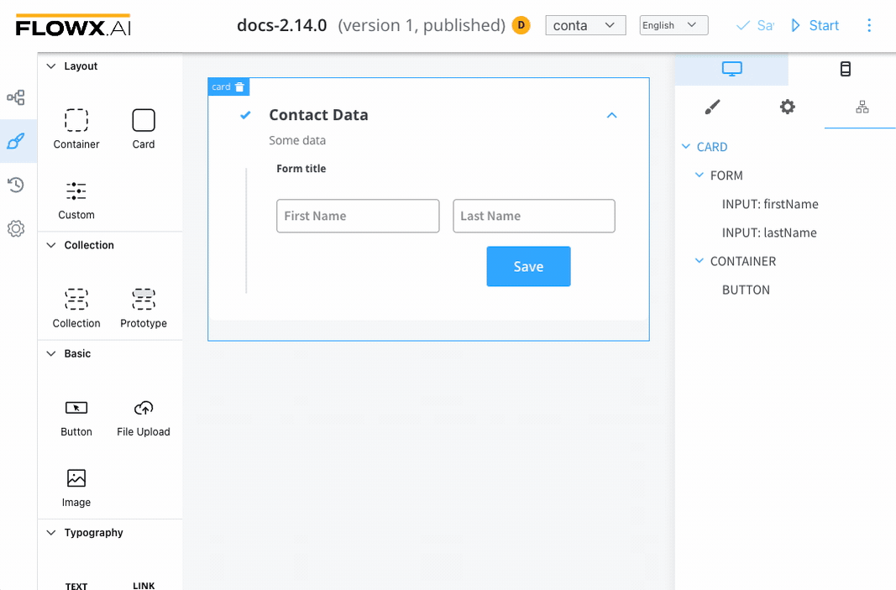
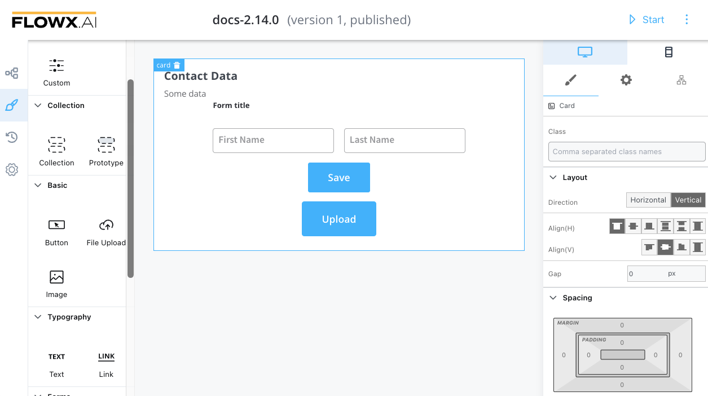
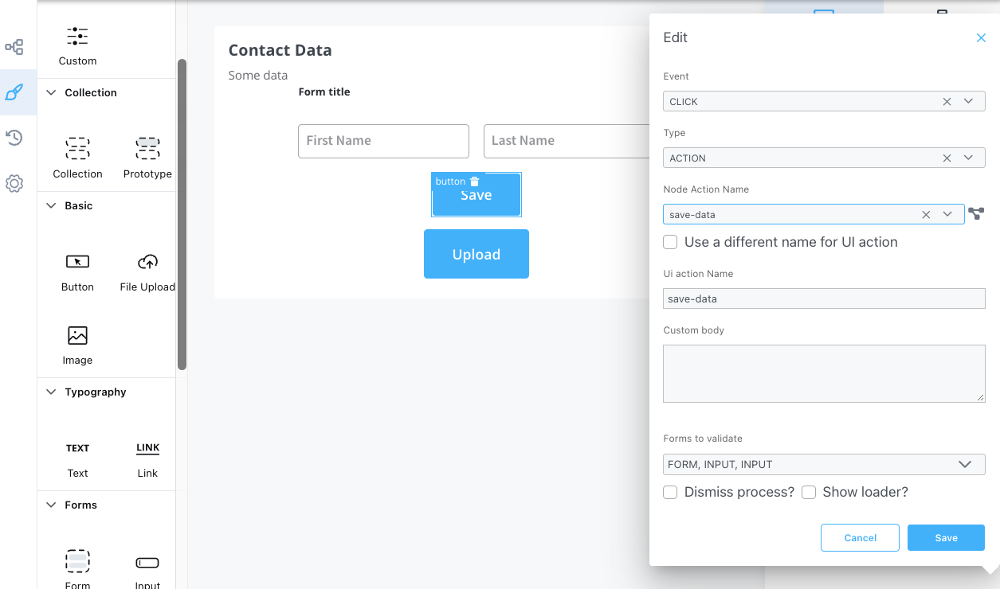

# Card

A card is a simple element that allows component grouping and alignment. It has the option to enable/disable an accordion element.

The following properties that can be configured:

#### **Settings**

1. **General** - where you define the **Message**
 * **Message** - describes the data pushed to the frontend application when the process reaches this user task; should be a valid JSON
2. **FLOWX props** - title and subtitle
3. **Has accordion?** - The Bootstrap accordion is a component that organizes content within collapsible items. Accordion allows the display of only one collapsed item at a time.

:::caution
Accordion element is not available for mobile.
:::

#### Styling

**Layout** - available for components that group children, more details about layouts can be found [here](https://tburleson-layouts-demos.firebaseapp.com/#/docs). 

The following styling properties can be edited (example):

* Direction - Vertical (column)
* Alignment - Align(H): start; Align(V): center
* other CSS properties

This example will generate a card with the following layout configuration:

:::warning
To validate all form elements under a card, you need to set the key of the form/element on the property of the button: _Forms To Validate._
:::

