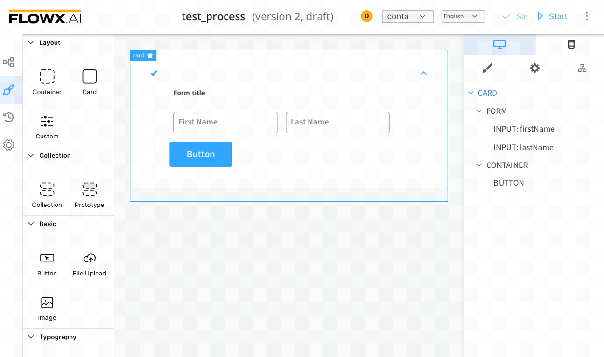
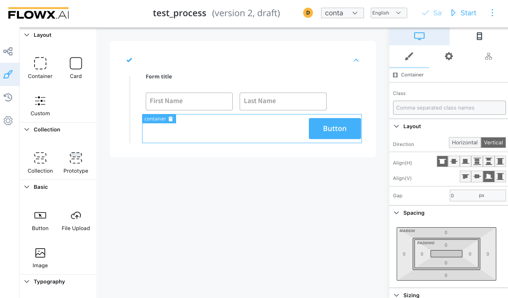

# Container

A container is a simple element that allows component grouping and alignment.

The following properties that can be configured:

#### Settings

**Expressions (Hide)** - JavaScript expressions used to hide components when they're true

#### Styling

**Layout** - available for components that group children, more details about layouts can be found [here](https://tburleson-layouts-demos.firebaseapp.com/#/docs). The following properties can be edited:

* Direction - _Vertical (column)_
* Alignment - _Align(H): start; Align(V): end_
* other CSS properties

The above example of properties will generate the following output (the button being displayed on the right side of the container, under the form with three form elements):

For more information about styling and layout configuration, check the following section:

[UI Designer](../../ui-designer.md#styling)