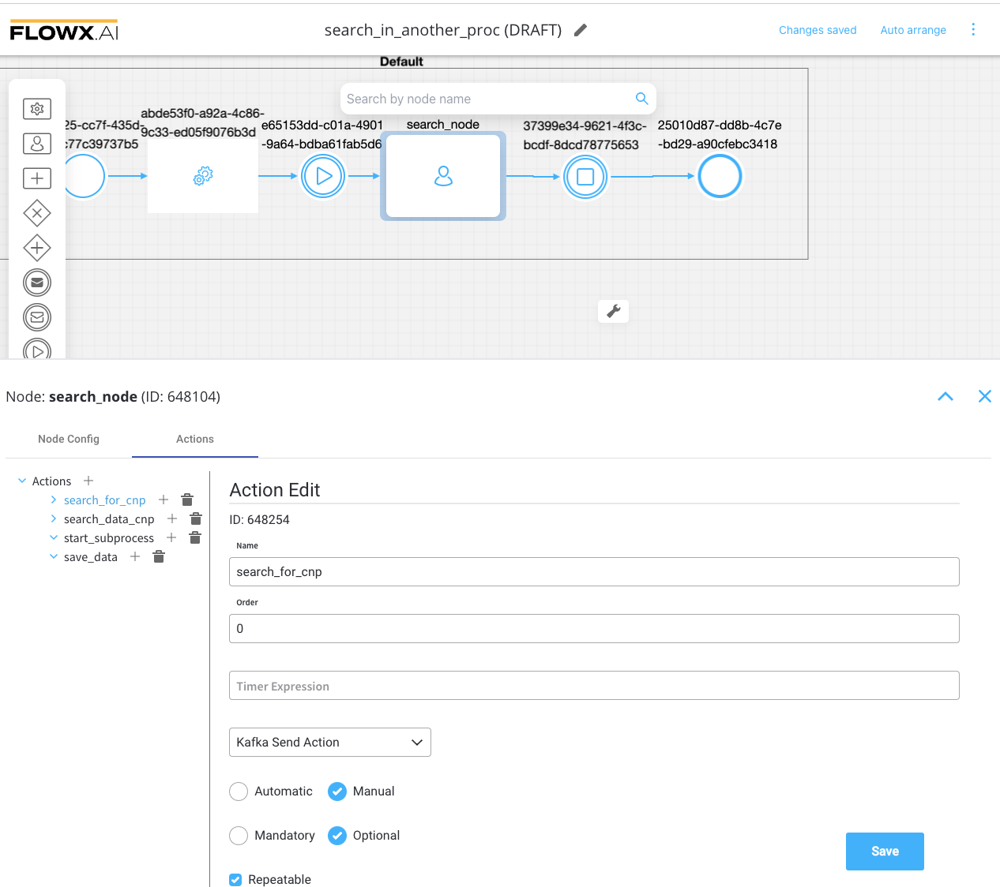
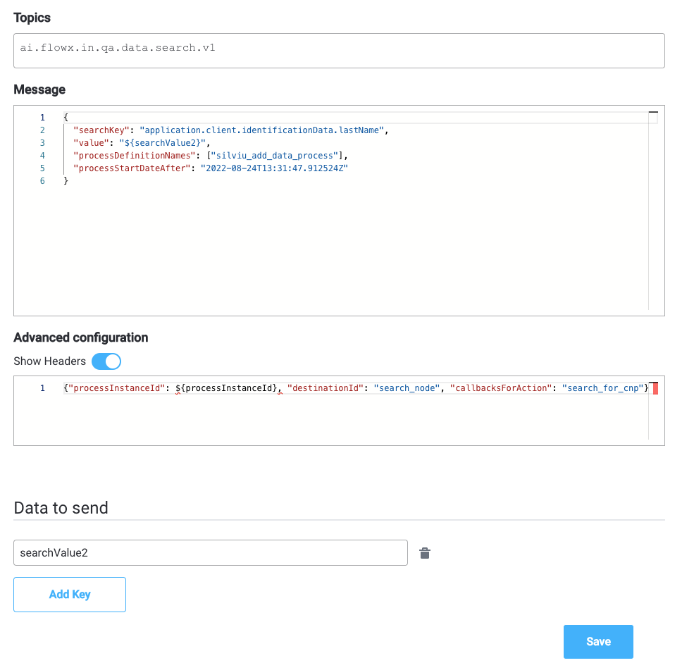
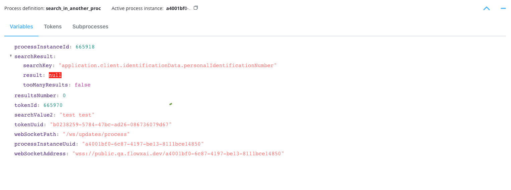
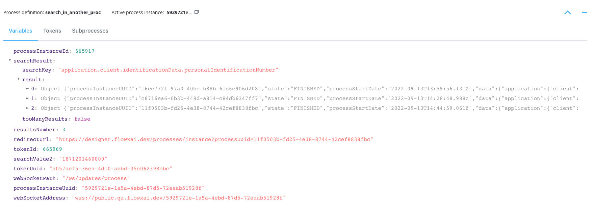

# Search data service

Search data is a microservice that searches for data in another process.

The new search data microservice enables you to create a process that can perform a search/look for data (using [Kafka send](../../../building-blocks/node/message-send-received-task-node.md#configuring-a-message-send-task-node) / [Kafka receive](../../../building-blocks/node/message-send-received-task-node.md#configuring-a-message-receive-task-node) actions) in other processes.

:::tip
Using elastic search, the new search microservice will be able to search for keys that are indexed in ES, via existing mechanics.
::: 

:::caution
Elastic search indexing must be switched on the FLOWX Engine configuration. You can find more details in the [**Search data service setup guide**](.././../../platform-setup-guides/search-data-service-setup-guide.md).
:::

## Using search data

Use case:
* search for data in other processes
* display results about other processes where the search key was found

1. Create a process using Process Designer.
2. From the newly created process where you want to perform the search, add a [Task Node](../../../building-blocks/node/task-node). 
3. Configure a send event via a [Kafka send action](../../../building-blocks/node/message-send-received-task-node.md#example-of-a-message-send-event).

4. Configure the following items:
    + **Topic name** - the Kafka topic on which the search service listens for requests; ❗️respect the [naming pattern](../../../platform-setup-guides/flowx-engine-setup-guide/flowx-engine-setup-guide.md#configuring-kafka)
	+ **Data to send** - (key) - used when data is sent from the frontend via an action to validate the data (you can find more information in the User Task configuration section)
    + **Headers** - required
    + **Body message**:

		+ `searchKey` - it will hold the result received from the elastic search
		+ `value` - value of the key
		+ `processDefinitionNames` - the process definition names where to perform the search
		+ `processStartDateAfter` - the service will look into process definitions created after the defined date

```javascript
{
	"searchKey": "application.client.name",
	"value": "12344",
	"processStartDateAfter": "formatDeDataStandard", (opt)
	"processStartDateBefore": "formatDeDataStandard", (opt)
	"processDefinitionNames": [ "processDef1", "processDef2" ],
	"status": ["ANY",...]
}
```

* Example (dummy values extracted from a process):



5. A custom microservice (a core extension) will receive this event and will search the value of the process in the elastic search.
6. It will respond to the engine via a Kafka topic.

:::tip
The topic must be defined in the **Node config** of the **User task** where you previously added the Kafka Send Action.
:::

The **body message** of the response will look like this:

	❗️If there is no result:

```javascript
{
	"searchKey": "application.client.name",
	"result": [],
	"processStartDate": date,
	"tooManyResults": true|false
}
```


* Example (dummy values extracted from a process):

:::tip
To access the view of your process variables, tokens and subprocesses go to **FLOWX Designer → Active process > Process Instances**. Here you will find the response.
::: 


    
	❗️If there is a list of results:

```javascript
{
	"searchKey": "application.client.name"
	"result":[{
			"processInstanceUUID": "UUID",
			"status": "CREATED",
			"processStartDate": date,
			"data" : {"all data in elastic for that process"}
	}],
	"tooManyResults": true|false
}
```
**NOTE**: You will receive up to 50 results - if `tooManyResults` is true.


* Example (dummy values extracted from a process):




Let's go now through the steps needed to deploy and set up the service:

[Search data service setup guide](../../../platform-setup-guides/search-data-service-setup-guide.md)