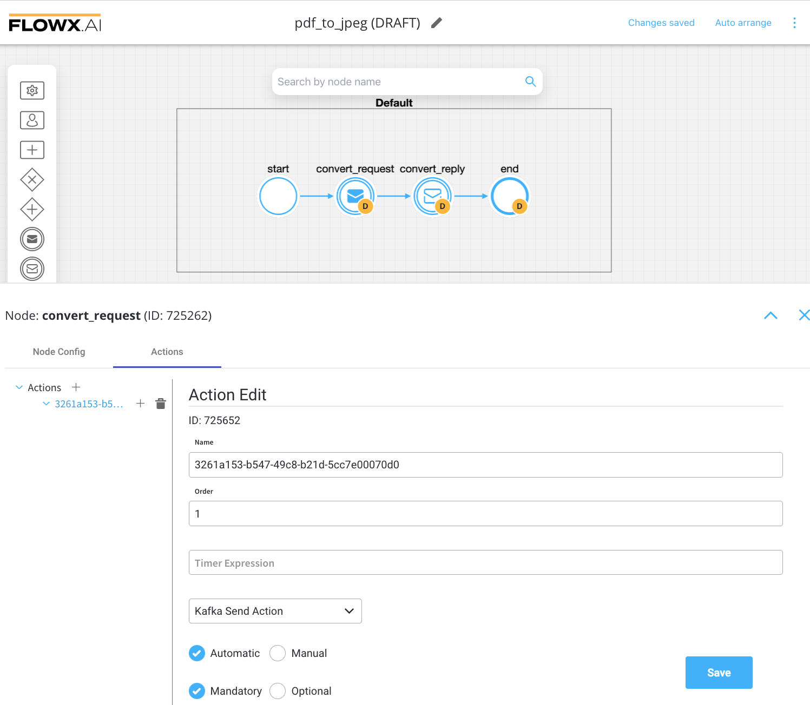
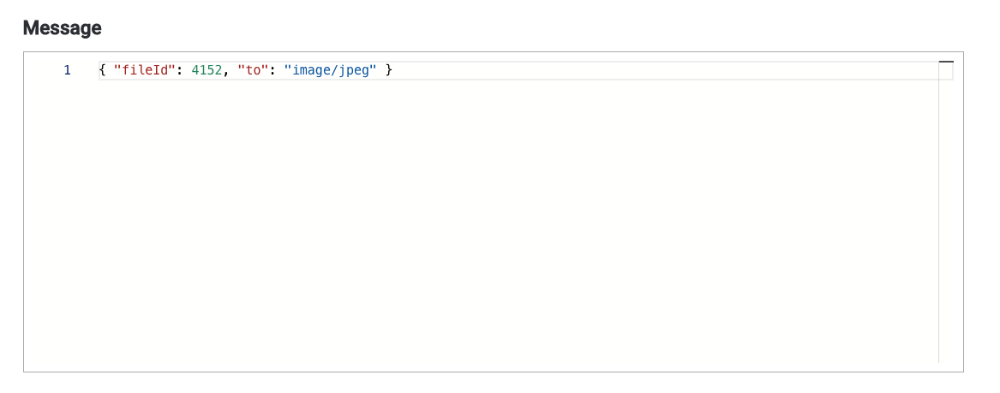
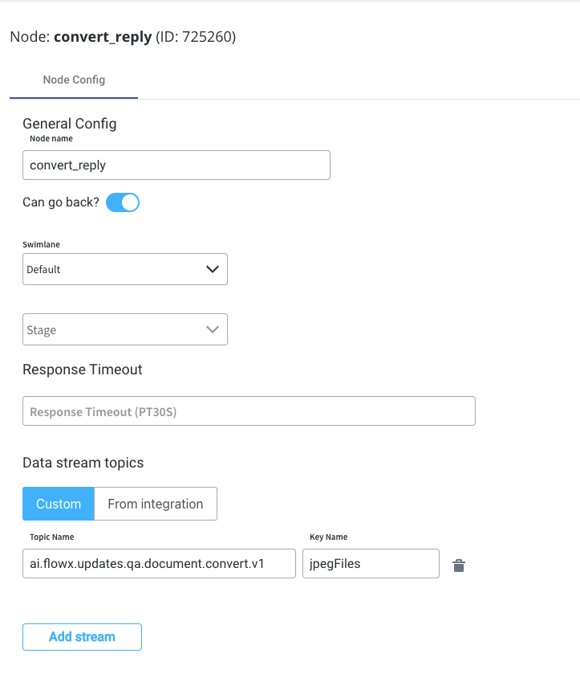
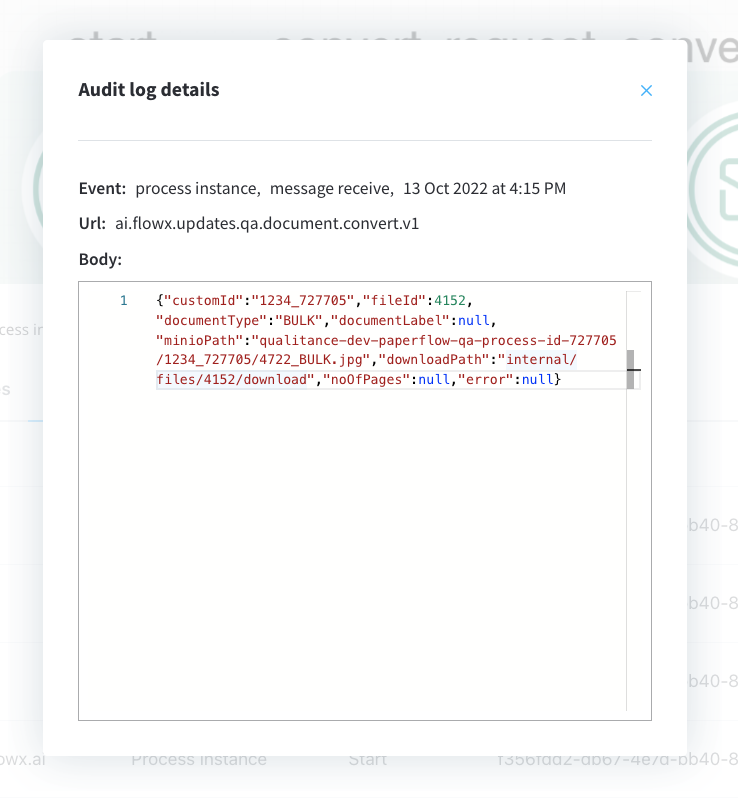

# Converting documents to different formats

:::caution
Currently, the supported conversion method is from **PDF** to **JPEG**.
:::

## Sending the request

To create a process that converts from PDF to JPEG format:

1. Create a process in which you add a [**Kafka send event**](../../../../../building-blocks/node/message-send-received-task-node.md#configuring-a-message-send-task-node) node and a [**Kafka receive event**](../../../../../building-blocks/node/message-send-received-task-node.md#configuring-a-message-receive-task-node) node (one to send the request, one to receive the reply). 

2. Configure the first node (**Kafka send event**) - add a **Kafka send action**. 


3. Add the [**Kafka topic**](../../../plugins-setup-guide/documents-plugin-setup/documents-plugin-setup.md#kafka-configuration) where to send the request:


4. Fill in the body message request:



* `fileId` = file ID that will be converted 
* `to` = file extension to convert to


:::info
Kafka topic names can be set by using (overwriting) the following environment variables in the deployment:

`KAFKA_TOPIC_FILE_CONVERT_IN` - default value: `ai.flowx.in.qa.document.convert.v1` - the topic that listens for the request from the engine

`KAFKA_TOPIC_FILE_CONVERT_OUT` - default value: `ai.flowx.updates.qa.document.convert.v1` - the topic on which the engine will expect the reply

The above examples of topics are extracted from an internal testing environment, when setting topics for other environments, follow the next pattern, for example, `ai.flowx.updates.{{environment}}.document.convert.v1`.
:::

:::caution
The Engine is listening for messages on topics with names of a certain pattern, make sure to use an outgoing topic name that matches the pattern configured in the Engine.
:::

## Receiving the reply

:::info
You can view the response by accessing the **Audit log** menu.
:::


The response will be sent on the out Kafka topic (defined on the Kafka receive event node), as available below:



Values expected in the reply body:

* customId = client ID
* fileId = file ID
* documentType = document type
* documentLabel = document label
* minioPath = minio path for the converted file
* downloadPath = download path for the converted file




Response:

```json
{
  "customId": "1234_727705",
  "fileId": 4152,
  "documentType": "BULK",
  "documentLabel": null,
  "minioPath": "qualitance-dev-paperflow-qa-process-id-727705/1234_727705/4152_BULK.jpg",
  "downloadPath": "internal/files/4152/download",
  "noOfPages": null,
  "error": null
}
```