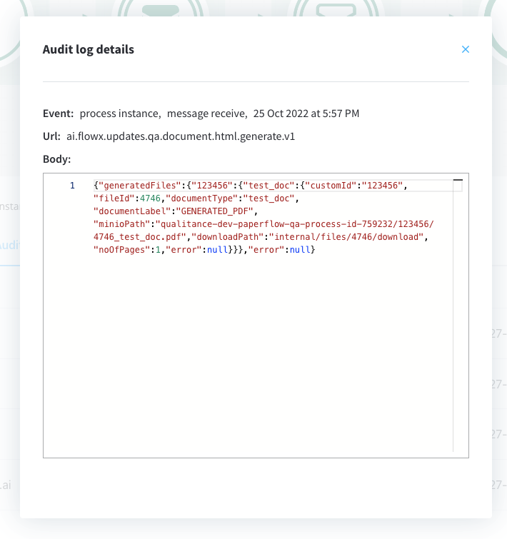

# Generating from HTML templates

Used to generate documents based on previously defined document templates. The following example covers generating documents using HTML templates.

## Creating a template

Use the [WYSIWYG](../../../../wysiwyg.md) editor to create a document template.


## Sending the request

1. Create a process in which you add a [**Kafka send event node**](../../../../../../building-blocks/node/message-send-received-task-node.md#message-send-task) and a [**Kafka receive event node**](../../../../../../building-blocks/node/message-send-received-task-node.md#message-receive-task) (one to send the request, one to receive the reply).
2. Configure the first node (Kafka send event) - add a **Kafka send action**.

3. Add the [**Kafka topic**](../../../../plugins-setup-guide/documents-plugin-setup/documents-plugin-setup.md#kafka-configuration) where to send the request:

4. Fill in the Message. Values expected in the request body:


* **documentList** - list of documents to be generated with properties (name and value to be replaced in the document templates)
* **customId** - client ID
* **templateName** - the name of the template to be used
* **language**
* **includeBarcode** - true/false
* **data** - a map containing the values that should be replaced in the document template; the keys used in the map should match the ones defined in the HTML template

:::info
Kafka topic names can be set by using (overwriting) the following environment variables in the deployment:

`KAFKA_TOPIC_DOCUMENT_GENERATE_HTML_IN` - default value: `ai.flowx.in.qa.document.html.generate.v1` - the topic that listens for the request from the engine

`KAFKA_TOPIC_DOCUMENT_GENERATE_HTML_OUT` - default value: `ai.flowx.updates.qa.document.html.generate.v1` - the topic on which the engine will expect the reply

The above examples of topics are extracted from an internal testing environment, when setting topics for other environments, follow the next pattern, for example, `ai.flowx.updates.{{environment}}.document.generate.v1`.
:::

:::caution
The Engine is listening for messages on topics with names of a certain pattern, make sure to use an outgoing topic name that matches the pattern configured in the Engine.
:::

## Reply

:::info
You can view the response by accessing the **Audit log** menu.
:::

The response will be sent on the out Kafka topic (defined on the Kafka receive event node), as available below:



Values expected in the event body:

* generatedFiles = list of generated files
  * customId = client ID
  * fileId
  * documentType
  * documentLabel
  * minioPath = minio path for the converted file
  * downloadPath = download path for the converted file

Example of generated file response:

```json
{
  "generatedFiles": {
    "123456": {
      "test_doc": {
        "customId": "123456",
        "fileId": 4746,
        "documentType": "test_doc",
        "documentLabel": "GENERATED_PDF",
        "minioPath": "qualitance-dev-paperflow-qa-process-id-759232/123456/4746_test_doc.pdf",
        "downloadPath": "internal/files/4746/download",
        "noOfPages": 1,
        "error": null
      }
    }
  },
  "error": null
}

```