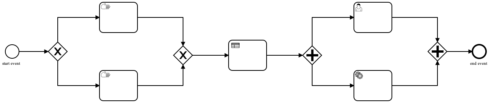

# Intro to BPMN

### What is Business Process Model and Notation (BPMN)?

Business Process Model and Notation (BPMN) is a graphical representation for specifying business processes in a business process model.

It is **the most widely used standard for business process diagrams**. It is intended to be used directly by the stakeholders who design, manage and realize business processes, but at the same time be precise enough to allow BPMN diagrams to be translated into software process components.

This is why we chose it for modeling the process flows. :sparkles:

## BPMN 2.0 elements

A BPMN business process flow is represented as a set of process elements connected by sequences.

Let's review the most common types of elements:

### Events

Events describe something that happens during the course of a process. There are three main events types: start events, intermediate events, and end events. These three types are also defined as either catching events (they react to a trigger) or throwing events (they are triggered by the process).

### Activities

An activity represents a unit of work to be performed by the business process. An activity can be atomic (a task) or can represent a group of more activities (a sub-process).

### Gateways

Gateways are used to control how a process flows. They act as a decision point that picks which sequence flow should the process instance take. This is based on the result of the evaluation of condition(s) specified (in case of exclusive gateways) or they can be used to split a process into more branches (in case of parallel gateways).

### Pools and lanes 

Pools and lanes are used in order to group the process steps by process participants. To show that certain user roles are responsible for performing specific process steps you can divide the process using lanes.

## In depth docs

[BPMN Quick guide](https://www.bpmnquickguide.com/view-bpmn-quick-guide/)

[BPMN docs](https://bpmn.io)

[BPMN best practices](https://bpmtips.com/interview-with-sandeep-johal-process-modeling-best-practices/)