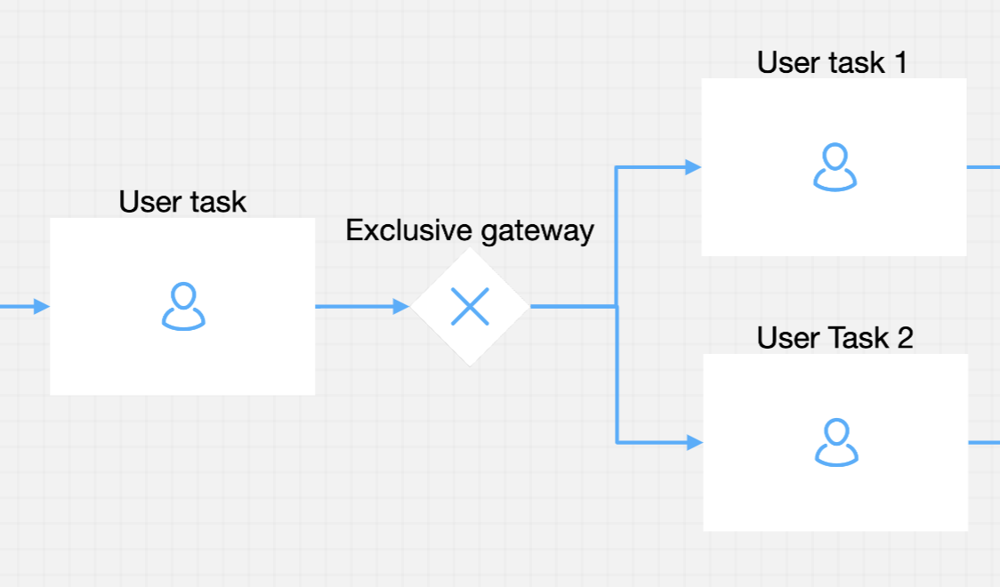
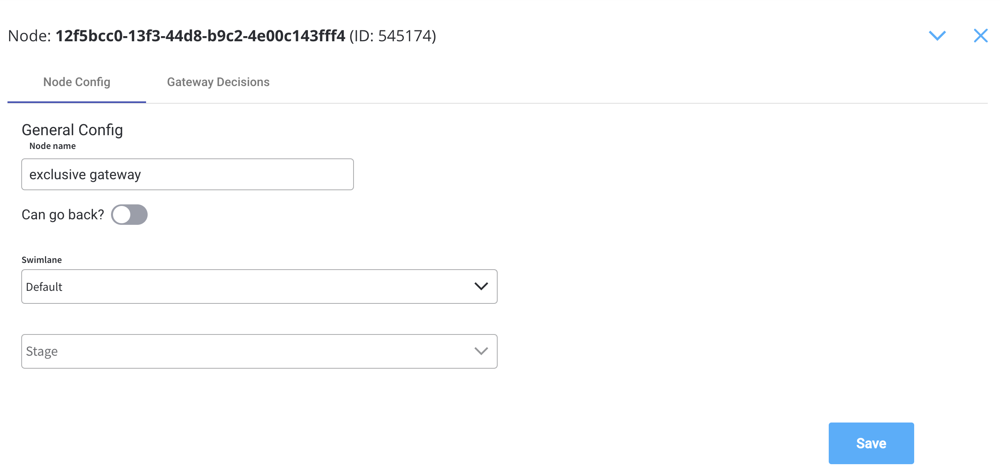
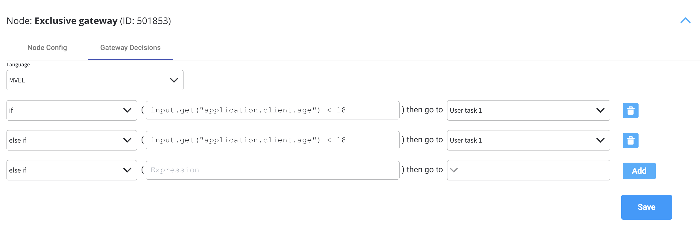
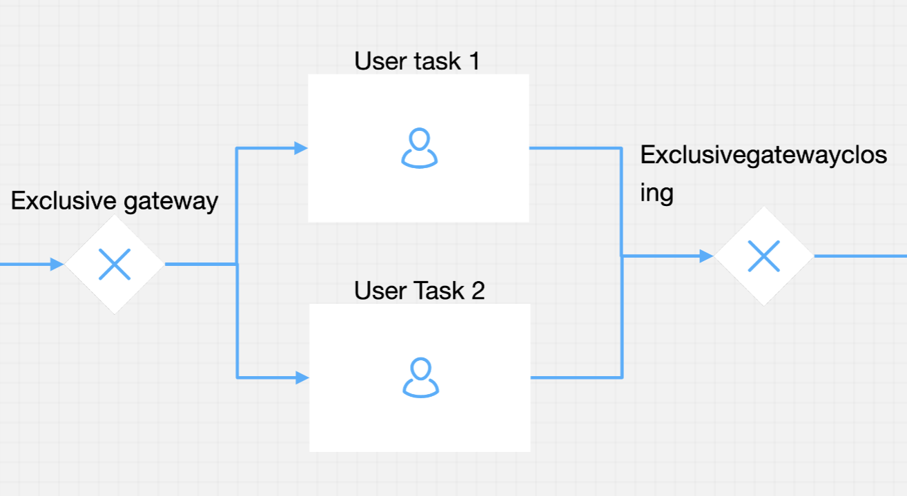
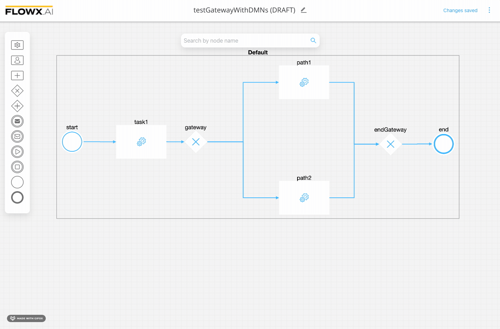
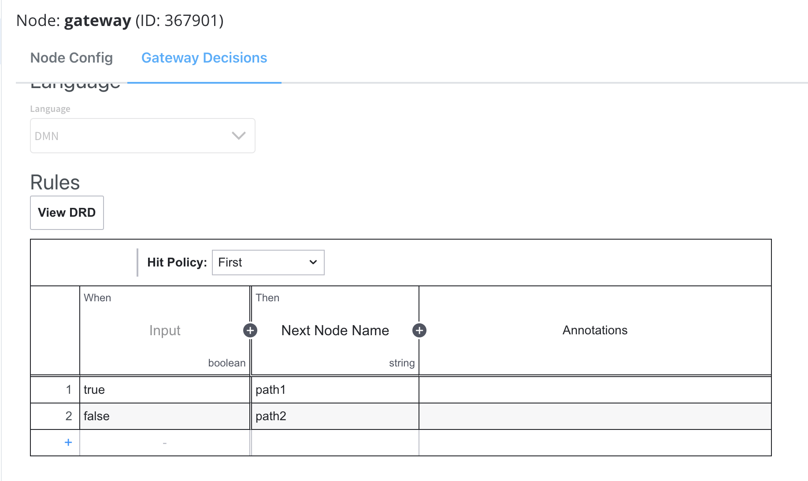

# Exclusive Gateway

Flow decisions can be configured using an Exclusive Gateway. Using this node will make `if condition then go to this node` constructions are available.

## Configuring an Exclusive Gateway node

To configure this kind of node, it is useful to previously configure the **in** and **out** sequence from the gateway process.

#### General Config

* **Node name** - the name of the node
* **Can go back** - setting this to true will allow users to return to this step after completing it

:::info
When encountering a step with `canGoBack` switched to false, all steps found behind it will become unavailable.
:::

* [**Swimlane**](../../platform-deep-dive/user-roles-management/swimlanes.md) - choose a swimlane (if there are multiple swimlanes on the process) to make sure only certain user roles have access only for certain process nodes- if there are no multiple swimlanes, the value is **Default**
* [**Stage** ](../../platform-deep-dive/plugins/custom-plugins/task-management/using-stages.md)- assign a stage to the node

#### Gateway Decisions

* **Language** - when configuring the condition, [MVEL](/docs/platform-overview/frameworks-and-standards/business-process-industry-standards/intro-to-mvel.md) (or [DMN](#configuring-a-dmn-exclusive-gateway-node)) will be used and you should enter an expression that will be evaluated as **true** or **false**
* **Conditions** - selecting the **Gateway Decisions** tab of the gateway we can see that we can configure a list of conditions (**if, else if, else**) and **select** from a dropdown where we should go if the condition is **true**

:::warning
Expression order is important because the first **true** evaluation will stop the execution and the token will move to the selected node.&#x20;
:::

After the exclusive part of the process (where a path or another will be used), you need to end each path or join back to a single process using a new exclusive gateway without any configuration on it.

#### Configuring a DMN Exclusive Gateway node

You can use [DMN](/docs/platform-overview/frameworks-and-standards/business-process-industry-standards/intro-to-dmn.md) to define gateway decisions, using exclusive gateways.

**Gateway Decision - DMN example** [(applicable only for exclusive gateway - XOR)](exclusive-gateway-node.md)

