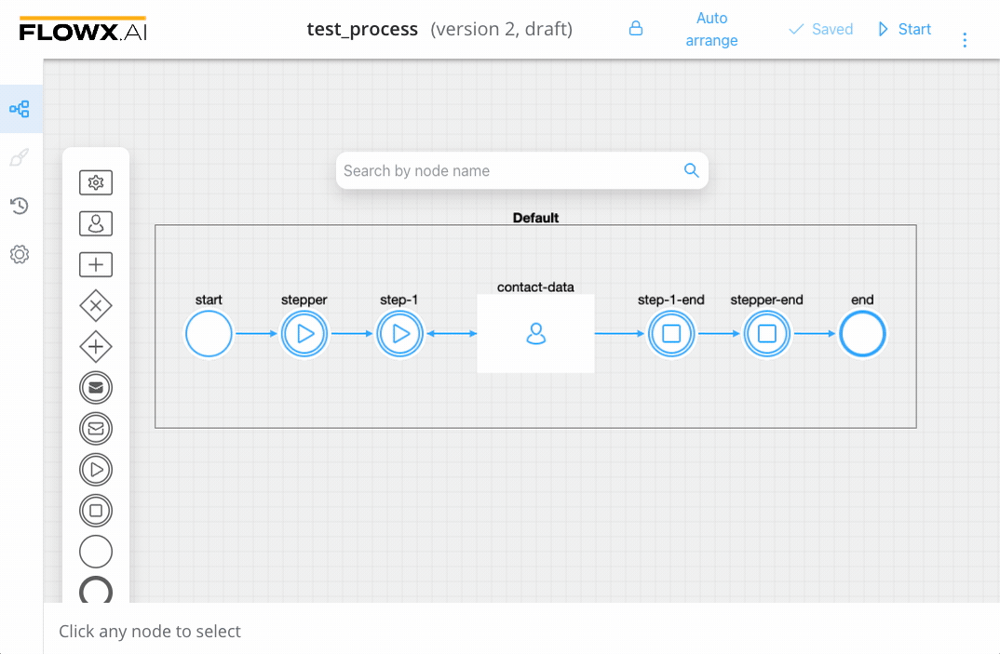
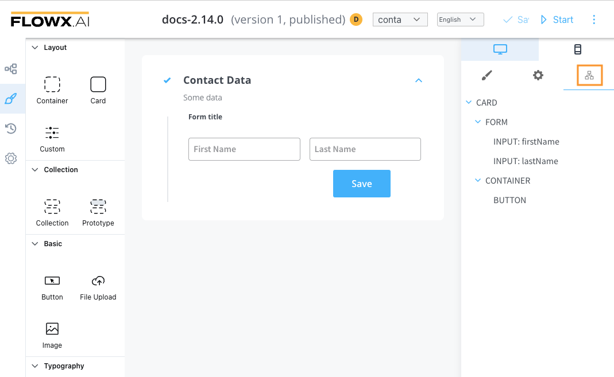

# Root components

Root components (layout elements) are used to group different types of components, each having a different purpose:

* [**Container**](container.md) - used to group and configure the layout for multiple **components** of any type
* [**Custom** ](custom.md)- these are Angular components developed in the container application and passed to the SDK at runtime, identified here by the component name
* [**Card**](card.md) - acts like a [**Container**](container.md) component; it also has the option to become an accordion 

The root component can hold a hierarchical component structure as follows

Available children for **Card** and **Container** are:

1. [**Form**](../form-elements/) - used to group and align form elements (**inputs**, **radios**, **checkboxes**, **selects**, **switches**)
2. [**Text area**](../form-elements/text-area.md) - a simple text area can be configured via this component, a basic configuration is available 
3. [**Image**](../image.md) - allows you to configure an image in the document
5. **Link** - used to configure hyperlinks 
6. [**Button**](../buttons.md) - multiple options are available for configuration, the most important part being the possibility to add actions
7. [**File Upload**](../buttons.md) - a specific type of button that allows you to select a file
8. [**Custom**](custom.md) - custom components

For more information about the form elements, check the following section:

[Form elements](../form-elements/form-elements.md)
