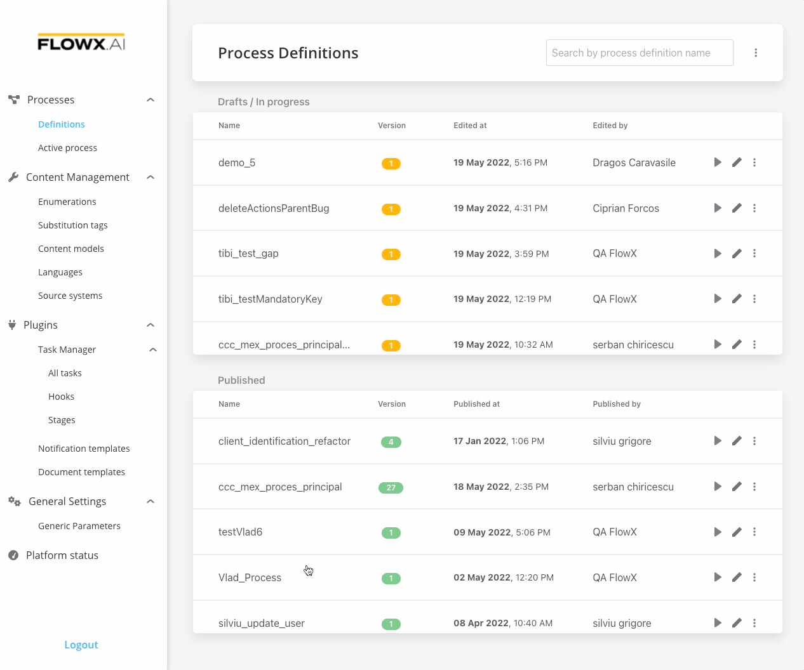

# Adding an action to a node

We use actions to add business decisions to the flow or link the process to custom integrations and plugins.

For more information about actions, check the following section:

[Actions](../../building-blocks/actions)

### Steps for creating an action

To create an action:

1. Open **FLOWX Designer** and from the **Processes** tab select **Definitions**.
2. Select your **process**.
3. Click the **Edit** **process** button.
4. Add a new **node**/ edit an existing one.
5. :exclamation:A few **action parameters** will need to be filled in depending on the selected action type.
6. Add **an action** to the **task node**, for example **sending a Kafka event** to an integration:

* set  **Address** (topic) name
* set message content to be sent
  * `{"test" : ${processInstanceId}, "title": "Test title"}`
* a custom header is always set by default to
  * `{"processInstanceId": ${processInstanceId}}`
* if you want some values to be replaced before sending them to Kafka, they should be marked as such in the action params

:::info
The nodes that support actions are [task nodes](../../building-blocks/node/task-node/task-node.md), [user task nodes](../../building-blocks/node/user-task-node/user-task-node.md), and [message send nodes](../../building-blocks/node/message-send-received-task-node.md).
:::

