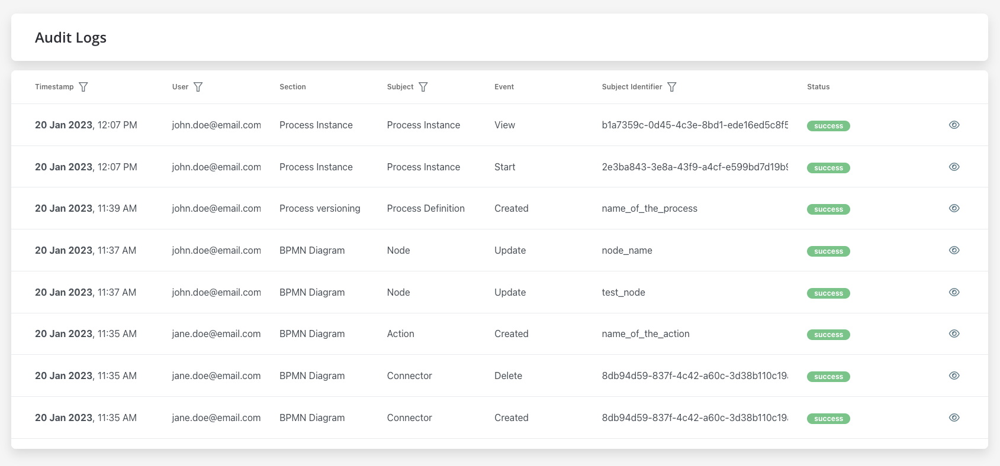
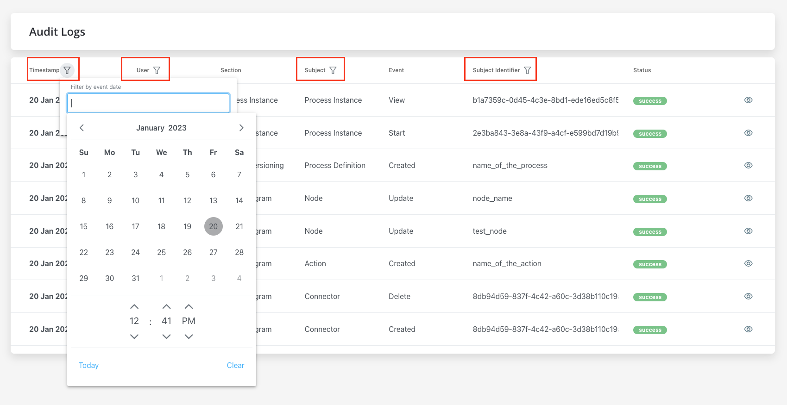
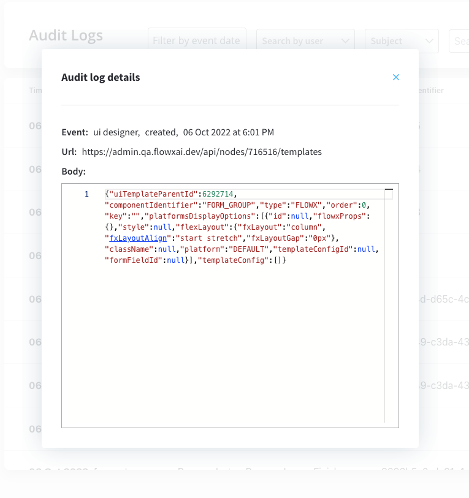

# Audit log

The Audit Log service provides a centralized location for all audit events. The following details are available for each event:

* **Timestamp** - the date and time the event occurred, the timestamp is displayed in a reversed chronologically order
* **User** - the entity who initiated the event, could be a username or a system
* **Subject** - the area or component of the system affected by the event

 Possible values 

* Process Instance
* Token
* Task
* Exception
* Process definition
* Node
* Action
* UI Component
* General Settings
* Swimlane
* Connector

* **Event** - the specific action that occurred

 Possible values 

* Create
* Update
* Update bulk
* Update state
* Export
* Import
* Delete
* Clone
* Start
* Start with inherit
* Advance
* View
* Expire
* Message Send
* Message Receive
* Notification receive
* Run scheduled action
* Execute action
* Finish
* Dismiss
* Retry
* Abort
* Assign
* Unassign
* Hold
* Unhold

* **Subject identifier** - the name related to the subject, there are different types of identifiers based on the selected subject

* **Version** - the version of the process definition at the time of the event

* **Status** - the outcome of the event (e.g. success or failure)

## Filtering

Users can filter audit records by event date and by selecting specific options for User, Subject, and Subject Identifier.

* Filter by event date 

* User - single selection, type at least 4 characters
* Subject - single selection
* Subject identifier - exact match

## Audit log details

To view additional details for a specific event, users can click the eye icon on the right of the event in the list. Additional information available in the audit log details window includes
Here you have the following information:

* Event - the specific action that occured
* URL - the URL associated with the event
* Body - any additional data or information related to the event

