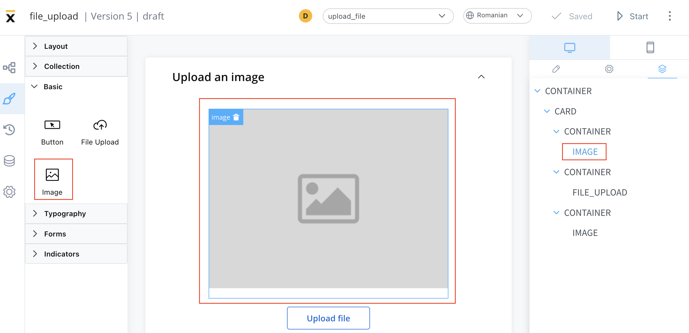
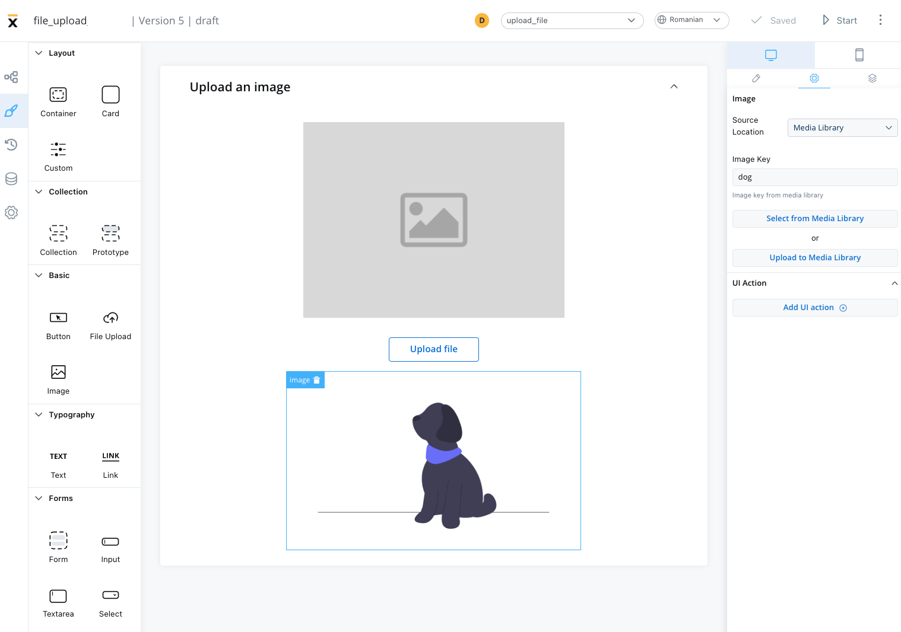
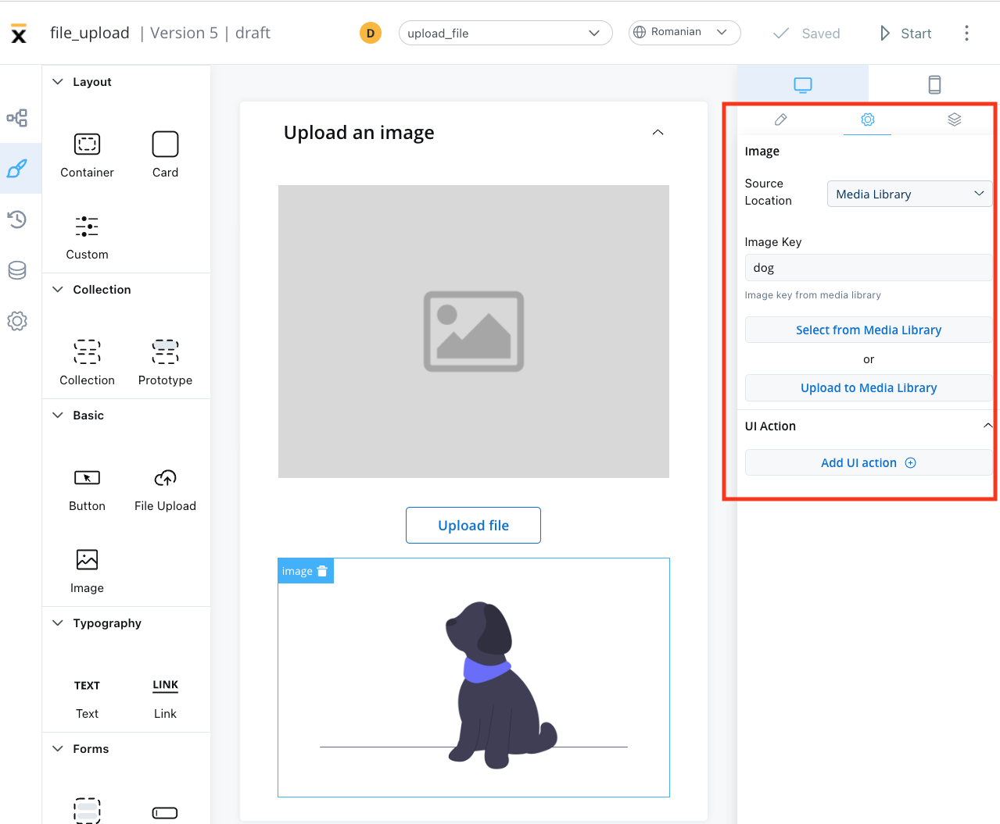
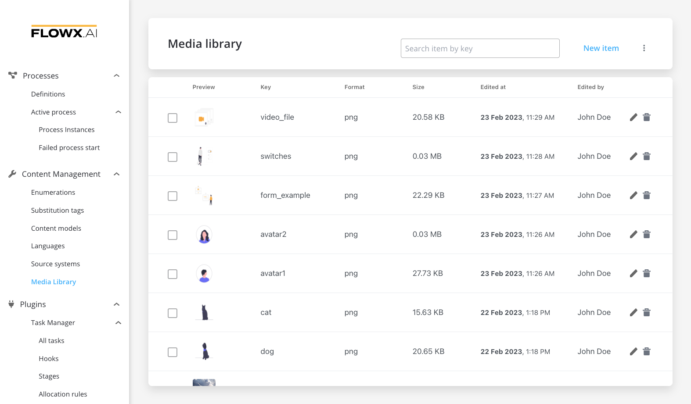
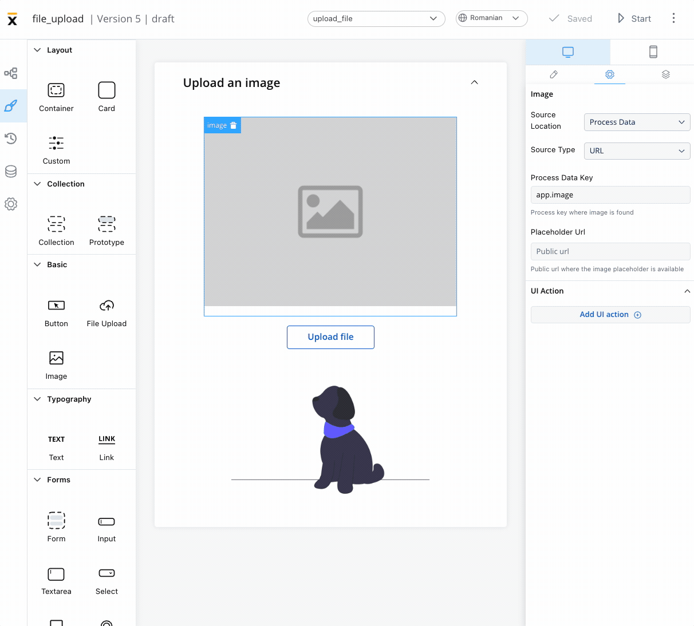
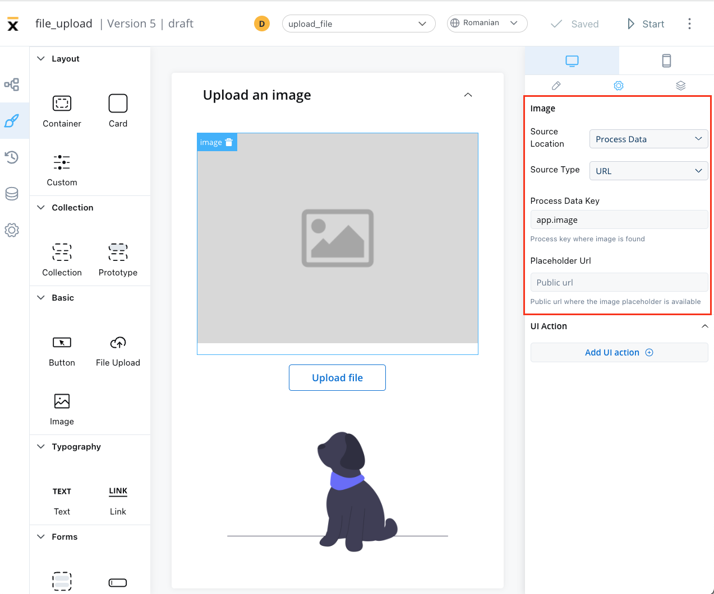
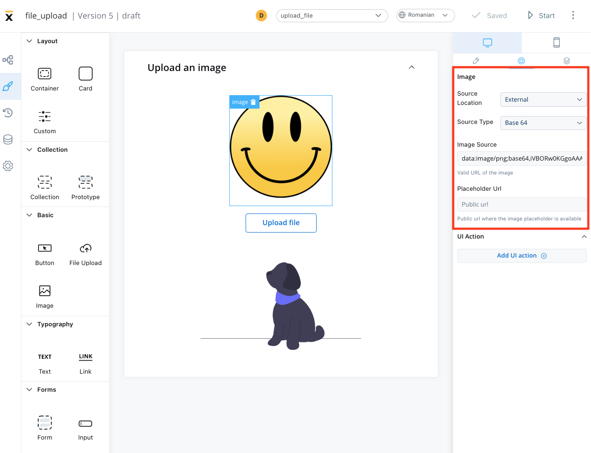
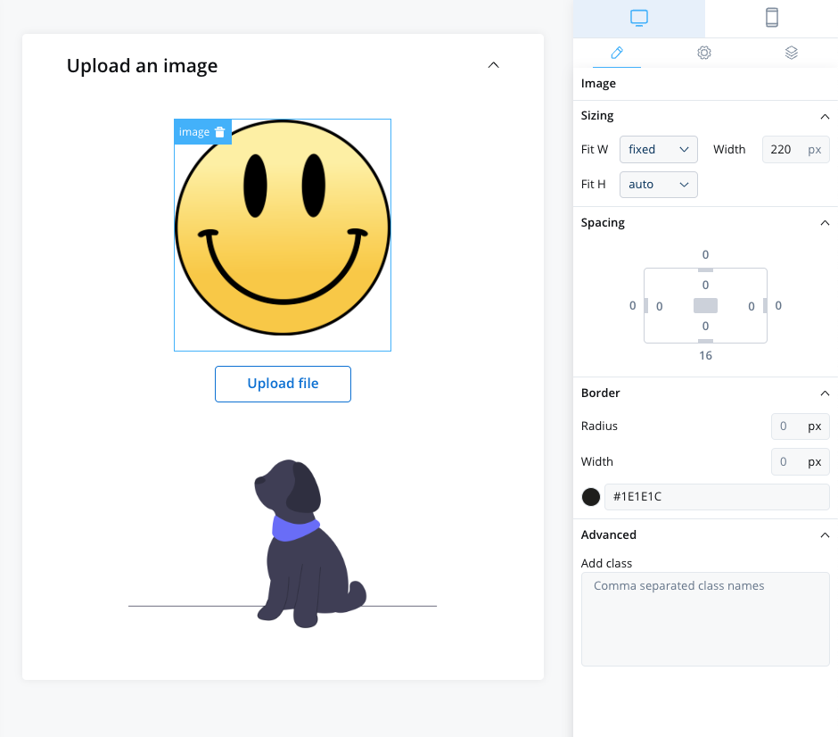

# Image

Image UI elements are graphical components of a user interface that display a static or dynamic visual representation of an object, concept, or content. 

These elements can be added to your interface using the UI Designer tool, and they are often used to convey information, enhance the aesthetic appeal of an interface, provide visual cues and feedback, support branding and marketing efforts, or present complex data or concepts in a more intuitive and accessible way.

## Configuring an image

Configuring an image in the UI Designer involves specifying various settings and properties. Here are the key aspects of configuring an image:

### Image settings

The image settings consist of the following properties:

* **Source location** - the location from where the image is loaded:

    * [**Media Library**](#media-library)
    * [**Process Data**](#process-data)
    * [**External**](#external)
        
Depending on which **Source location** is selected, different configurations are available:

### Media library

* **Image key** - the key of the image from the media library
* **Select from media library** - search for an item by key and select it from the media library

* **Upload to media library** - add a new item (upload an image on the spot)
    * **upload item** - supported formats: PNG, JPG, GIF, SVG, WebP; ❗️(maximum size - 1 MB)
    * **key** - the key must be unique and cannot be changed afterwards

### Process Data

- Identify the **Source Type**. It can be either a **URL** or a **Base 64 string**.
- Locate the data using the **Process Data Key**.
- If using a URL, provide a **Placeholder URL** for public access. This is the URL where the image placeholder is available.

### External

- **Source Type**: it can be either a **URL** or a **Base 64 string**
- **Image source**: the valid URL of the image.
- **Placeholder URL**: the public URL where the image placeholder is available

## UI actions

The UI actions property allows you to add a UI Action, which must be configured on the same node. For more details on UI Actions, refer to the documentation [here](../ui-actions).

## Image styling

The image styling property allows you to add or to specify valid CSS properties for the image. For more details on CSS properties, click [here](../../ui-designer/ui-designer.md#styling).

