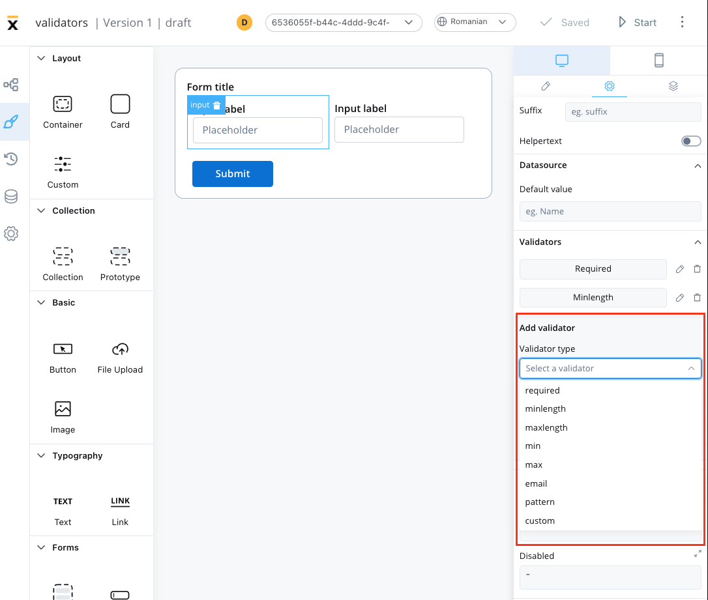
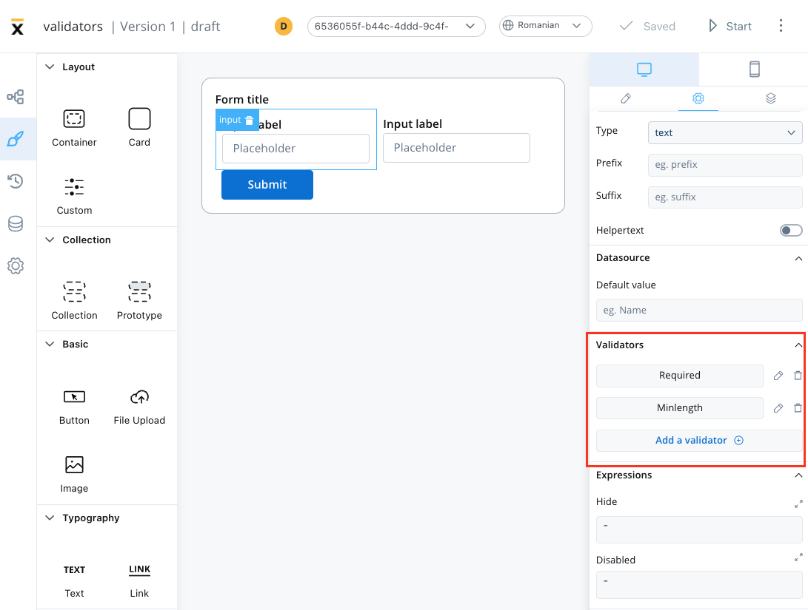
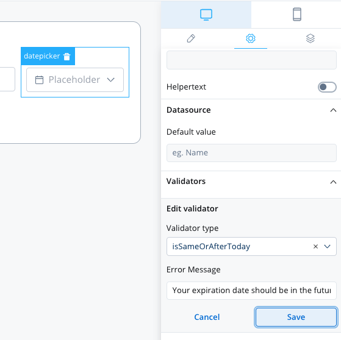

# Validators

Validators are an essential part of building robust and reliable applications. They ensure that the data entered by the user is accurate, complete, and consistent. In Angular applications, validators provide a set of pre-defined validation rules that can be used to validate various form inputs such as text fields, number fields, email fields, date fields, and more.



Angular provides default validators such as:

1. [min](https://angular.io/api/forms/Validators#min)
2. [max](https://angular.io/api/forms/Validators#max)
3. [minLength](https://angular.io/api/forms/Validators#minlength)
4. [maxLength](https://angular.io/api/forms/Validators#maxlength)
5. [required](https://angular.io/api/forms/Validators#required)
6. [email](https://angular.io/api/forms/Validators#email)

Other predefined validators are also available:

1. `isSameOrBeforeToday`: validates that a [datepicker](./ui-component-types/form-elements/datepicker-form-field) value is in the past
2. `isSameOrAfterToday`: validates that a datepicker value is in the future

:::info
Form validation is triggered by default when the button set to validate a [**form**](./ui-component-types/form-elements/form-elements.md#) is pressed.
:::

It's also possible to build [custom validators](#custom-validators) inside the container application and reference them here by name.

## Predefined validators

### required validator

This validator checks whether a value exists in the input field. 



It is recommended to use this validator with other validators like [minlength](#minlength-validator) to check if there is no value at all.


### minlength validator

This validator checks whether the input value has a minimum number of characters. If there are no characters at all, this validator will not trigger. It is advisable to use this validator with a [required](#required-validator) validator.


### maxlength validator

This validator checks whether the input value has a maximum number of characters. If there are no characters at all, this validator will not trigger. It is advisable to use this validator with a [required](#required-validator) validator.


### min validator

This validator checks whether a numeric value is smaller than the specified value. If there are no characters at all, this validator will not trigger. It is advisable to use this validator with a [required](#required-validator) validator.


### max validator

This validator checks whether a numeric value is larger than the specified value. If there are no characters at all, this validator will not trigger. It is advisable to use this validator with a [required](#required-validator) validator.


### email validator

This validator checks whether the input value is a valid email. If there are no characters at all, this validator will not trigger. It is advisable to use this validator with a [required](#required-validator) validator.


### pattern validator

This validator checks whether the input value matches the specified pattern (for example, a [regex expression](https://www.regexbuddy.com/regex.html)).


### datepicker - isSameOrBeforeToday 

This validator can be used to validate [datepicker](./ui-component-types/form-elements/datepicker-form-field.md) inputs. It checks whether the selected date is today or in the past. If there are no characters at all, this validator will not trigger. It is advisable to use this validator with a [required](#required-validator) validator.


### datepicker - isSameOrAfterToday

This validator can be used to validate datepicker inputs. It checks whether the selected date is today or in the future. If there are no characters at all, this validator will not trigger. It is advisable to use this validator with a [required](#required-validator) validator.




## Custom validators

Additionally, custom validators can be created within the web application and referenced by name. These custom validators can have various configurations such as execution type, name, parameters, and error message.

1. **Execution type** - sync/async validator (for more details check [this](https://angular.io/api/forms/AsyncValidator))
2. **Name** - name provided by the developer to uniquely identify the validator
3. **Params** - if the validator needs inputs to decide if the field is valid or not, you can pass them using this list
4. **Error Message** - the message that will be displayed if the field is not valid


:::info
The error that the validator returns **MUST** match the validator name.
:::


#### Custom validator example

Below you can find an example of a custom validator (`currentOrLastYear`) that restricts data selection to the current or the previous year:
   
##### currentOrLastYear

```typescript
currentOrLastYear: function currentOrLastYear(AC: AbstractControl): { [key: string]: any } {
    if (!AC) {
      return null;
    }

    const yearDate = moment(AC.value, YEAR_FORMAT, true);
    const currentDateYear = moment(new Date()).startOf('year');
    const lastYear = moment(new Date()).subtract(1, 'year').startOf('year');

    if (!yearDate.isSame(currentDateYear) && !yearDate.isSame(lastYear)) {
      return { currentOrLastYear: true };
    }

    return null;
```

##### smallerOrEqualsToNumber

Below is another custom validator example that returns `AsyncValidatorFn` param, which is a function that can be used to validate form input asynchronously. The validator is called `smallerOrEqualsToNumber` and takes an array of `params` as an input.

:::info
For this custom validator the execution type should be marked as `async` using the UI Designer.
:::

```typescript
export function smallerOrEqualsToNumber (params$: Observable<any>[]): AsyncValidatorFn {
  return (AC): Promise<ValidationErrors | null> | Observable<ValidationErrors | null> => {
    return new Observable((observer) => {
      combineLatest(params$).subscribe(([maximumLoanAmount]) => {
        const validationError =
          maximumLoanAmount === undefined || !AC.value || Number(AC.value) <= maximumLoanAmount ? null : {smallerOrEqualsToNumber: true};

        observer.next(validationError);
        observer.complete();
      });
    });
  };
}
```

If the input value is undefined or the input value is smaller or equal to the maximum loan amount value, the function returns `null`, indicating that the input is valid. If the input value is greater than the maximum loan amount value, the function returns a `ValidationErrors` object with a key `smallerOrEqualsToNumber` and a value of true, indicating that the input is invalid.

:::info
For more details about custom validators please check this [link](../../platform-deep-dive/core-components/renderer-sdks/angular-renderer.md).
:::

Using validators in your application can help ensure that the data entered by users is valid, accurate, and consistent, improving the overall quality of your application. 

It can also help prevent errors and bugs that may arise due to invalid data, saving time and effort in debugging and fixing issues. 

Overall, enforcing data validation using validators is a crucial step in building high-quality, reliable, and user-friendly applications.


