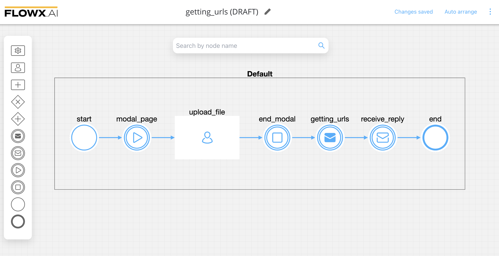
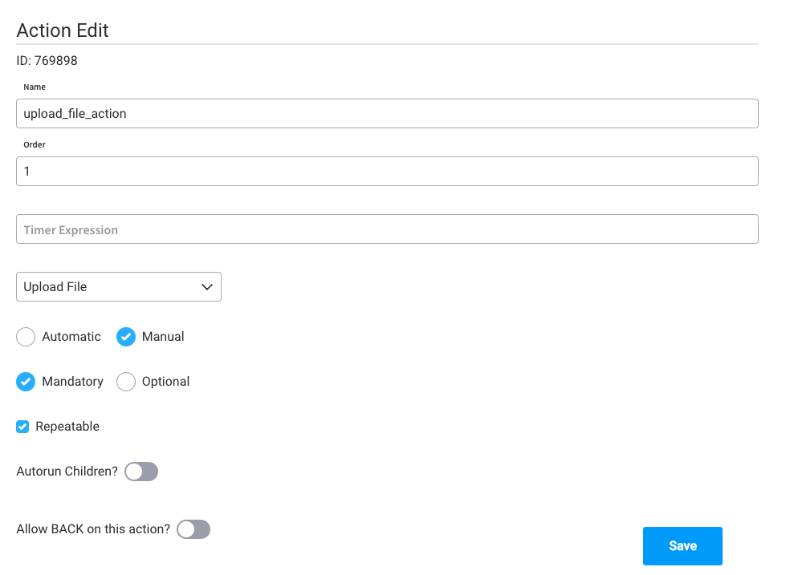
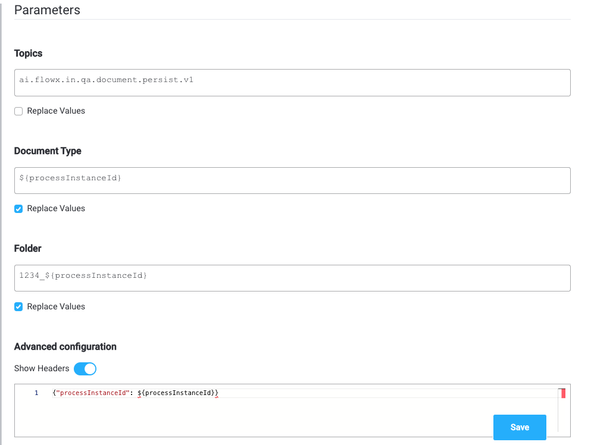
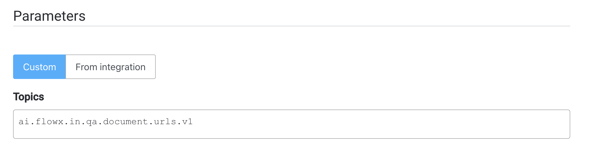
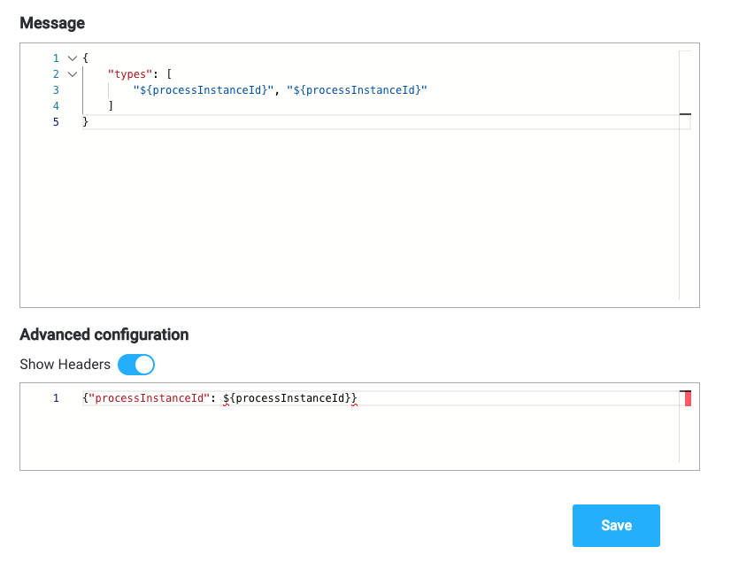
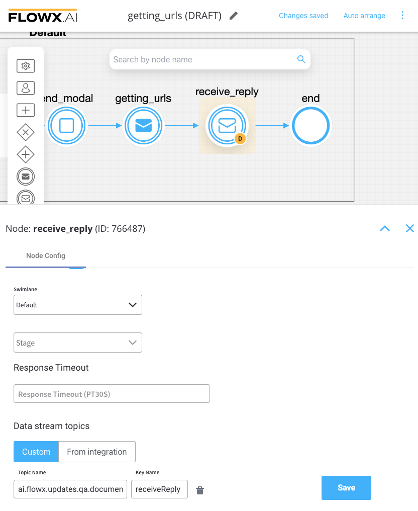
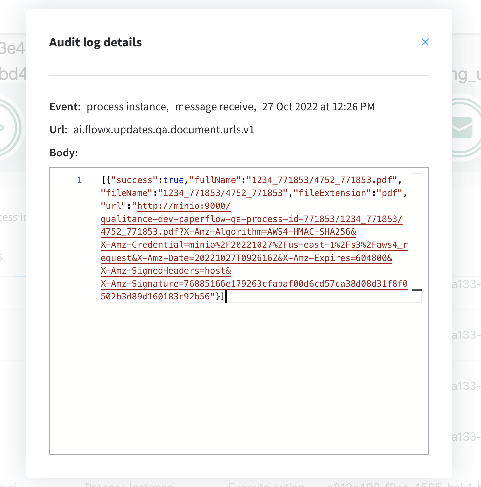

# Getting URLs to documents

There might be cases when you will need URLs pointing to uploaded documents, so they can be sent to and used by another integration.

In this case, you will need to add a custom action in the process that will request the URLs from the documents plugin.

## Sending the request

For example, get documents URLs to send to the notification plugin and attach them to emails.

1. Create a process in which you add the following nodes: 
* a [**Kafka send event node**](../../../../../building-blocks/node/message-send-received-task-node.md#configuring-a-message-send-task-node),
* a [**Kafka receive event node**](../../../../../building-blocks/node/message-send-received-task-node.md#configuring-a-message-receive-task-node)
* a [**user task node**](../../../../../building-blocks/node/user-task-node.md)
* [**start / end milestone**](../../../../../building-blocks/node/milestone-node.md) nodes to [create a modal](../../../../../building-blocks/node/milestone-node.md#modal)



2. Configure the **user task node**, and add an [**Upload action**](../../../../../building-blocks/actions/upload-file-action.md) to it.



3. Configure the **Upload action** parameters:



:::info
For more details on how to upload a document and how to configure an upload action, check the following sections:

[**Upload document**](uploading-a-new-document.md)

[**Upload action**](../../../../../building-blocks/actions/upload-file-action.md)
:::

4. Configure the Kafka send event node - add a **Kafka send action** and configure the [**Kafka topic**](../../../plugins-setup-guide/documents-plugin-setup/documents-plugin-setup.md#kafka-configuration) where to send the request:



5. Fill in the body message request of the action:



* `types` - list of document types


6. Configure the [**Kafka receive event node**](../../../../../building-blocks/node/message-send-received-task-node.md#configuring-a-message-receive-task-node) by adding the kafka topic on which the response will be sent.



:::info
Kafka topic names can be set by using environment variables:

* `KAFKA_TOPIC_DOCUMENT_GET_URLS_IN` - `ai.flowx.in.qa.document.urls.v1` - the topic that listens for the request from the engine

* `KAFKA_TOPIC_DOCUMENT_GET_URLS_OUT` - `ai.flowx.updates.qa.document.urls.v1` - the topic on which the engine will expect the reply

The above examples of topics are extracted from an internal testing environment, when setting topics for other environments, follow the next pattern, for example, `ai.flowx.updates.{{environment}}.document.urls.v1`.
:::

:::caution
The Engine is listening for messages on topics with names of a certain pattern, make sure to use an outgoing topic name that matches the pattern configured in the Engine.
:::


## Receiving the reply



Values expected in the reply body:

* success = boolean, true if the document exists and the URL was generated
* fullName = document file full name
* fileName = document file name without extension
* fileExtension = document file extension
* url = full download URL

Example:

```json
[
    {
        "success": true,
        "fullName": "1234_771853/4752_771853.pdf",
        "fileName": "1234_771853",
        "fileExtension": "pdf",
        "url": "<http://SOME_URL/1234_771853/4752_771853.pdf?X-Amz-Algorithm=SOME_ALGORITHM&X-Amz-Credential=SOME_CREDENTIAL&X-Amz-Date=20210223T113621Z&X-Amz-Expires=604800&X-Amz-SignedHeaders=host&X-Amz-Signature=>"
    }
]
```