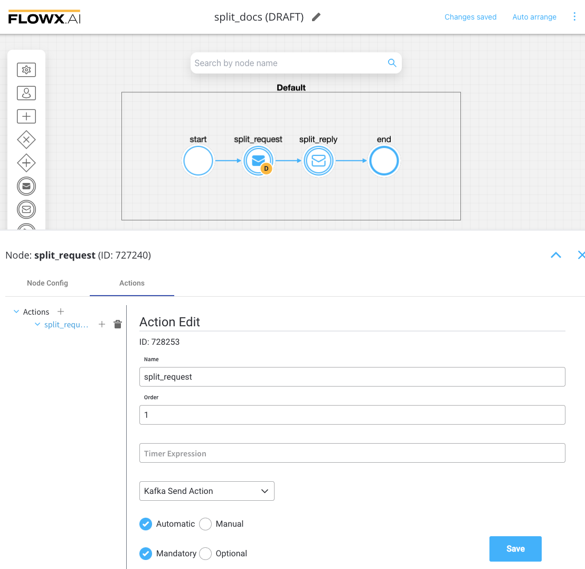
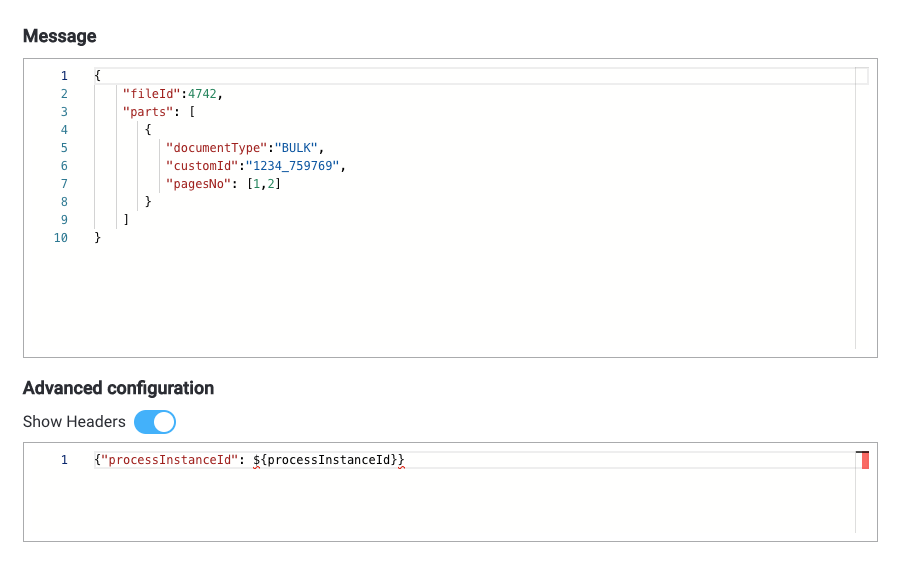
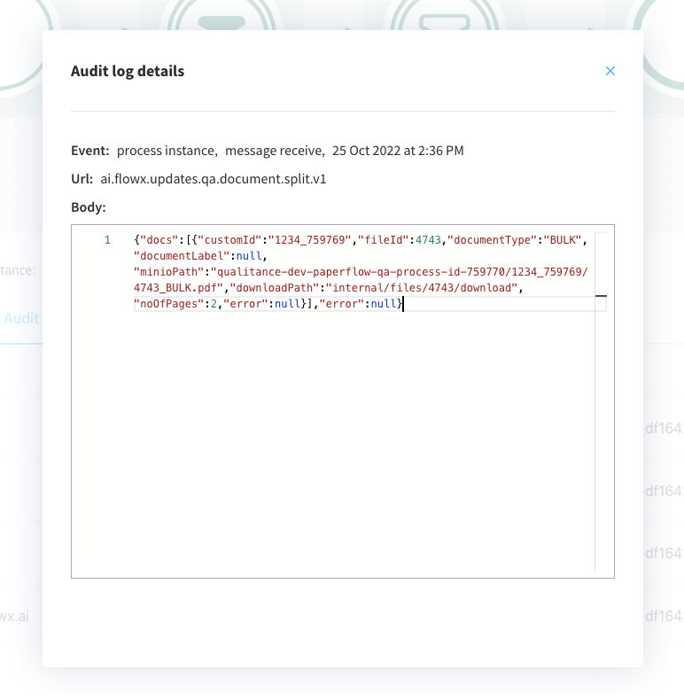

# Splitting a document

Split a document into multiple parts. This might be the case, for example, when the client uploads a set of documents as a bulk scanned file that needs to be split into more separate files.


## Sending the request

1. Create a process in which you add a [**Kafka send event node**](../../../../../building-blocks/node/message-send-received-task-node.md#configuring-a-message-send-task-node) and a [**Kafka receive event node**](../../../../../building-blocks/node/message-send-received-task-node.md#configuring-a-message-receive-task-node) (one to send the request, one to receive the reply).
2. Configure the first node (Kafka send event) - add a **Kafka send action**.



3. Add the [**Kafka topic**](../../../plugins-setup-guide/documents-plugin-setup/documents-plugin-setup.md#kafka-configuration) where to send the request:


4. Fill in the body message request:



* `fileId`- the id of the file to be split
* `parts` - a list of info about the expected document parts
  * `documentType` - document type
  * `customId` - the client ID
  * `shouldOverride` - boolean, `true` to override an existing document already saved
  * `pagesNo` - pages that you want to separate from the document

:::info
Kafka topic names can be set by using (overwriting) the following environment variables in the deployment:

`KAFKA_TOPIC_DOCUMENT_SPLIT_IN` - default value: `ai.flowx.in.qa.document.split.v1`

`KAFKA_TOPIC_DOCUMENT_SPLIT_OUT` - default value: `ai.flowx.updates.qa.document.split.v1`

The above examples of topics are extracted from an internal testing environment, when setting topics for other environments, follow the next pattern, for example, `ai.flowx.updates.{{environment}}.document.split.v1`.
:::

:::caution
The Engine is listening for messages on topics with names of a certain pattern, make sure to use an outgoing topic name that matches the pattern configured in the Engine.
:::

## Receiving the reply

:::info
You can view the response by accessing the **Audit log** menu.
:::


The response will be sent on the out Kafka topic (defined on the Kafka receive event node), as available below:


Values expected in the reply body:

* docs - list of documents
  * customId - client ID
  * fileId - file ID
  * documentType - document type
  * minioPath - minio path for the document
  * downloadPath - download path for the document
  * noOfPages - number of pages



Response:

```json
{
  "docs": [
    {
      "customId": "1234_759769",
      "fileId": 4743,
      "documentType": "BULK",
      "documentLabel": null,
      "minioPath": "qualitance-dev-paperflow-qa-process-id-759770/1234_759769/4743_BULK.pdf",
      "downloadPath": "internal/files/4743/download",
      "noOfPages": 2,
      "error": null
    }
  ],
  "error": null
}
```