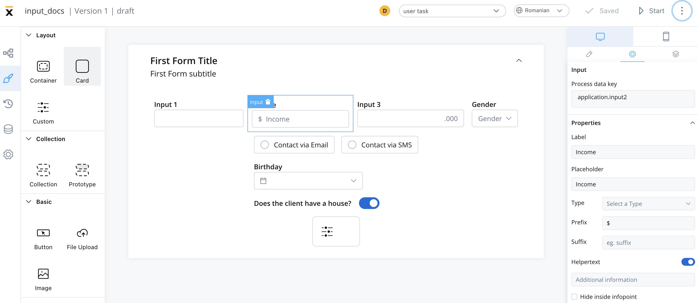
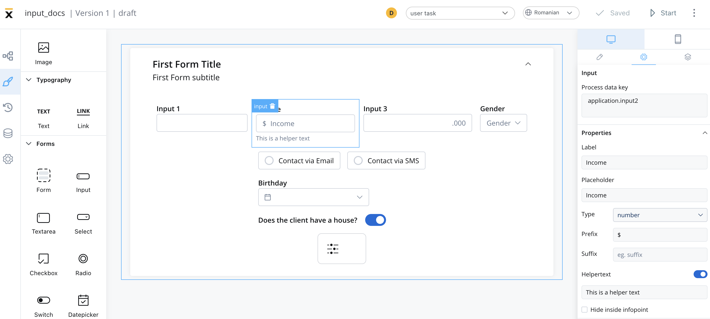
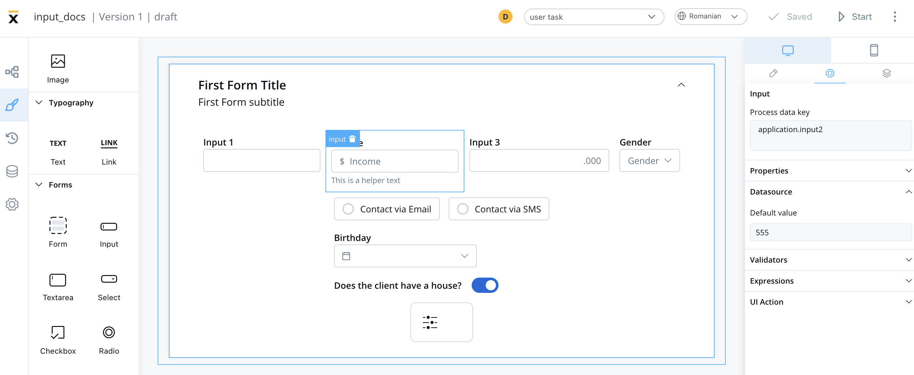
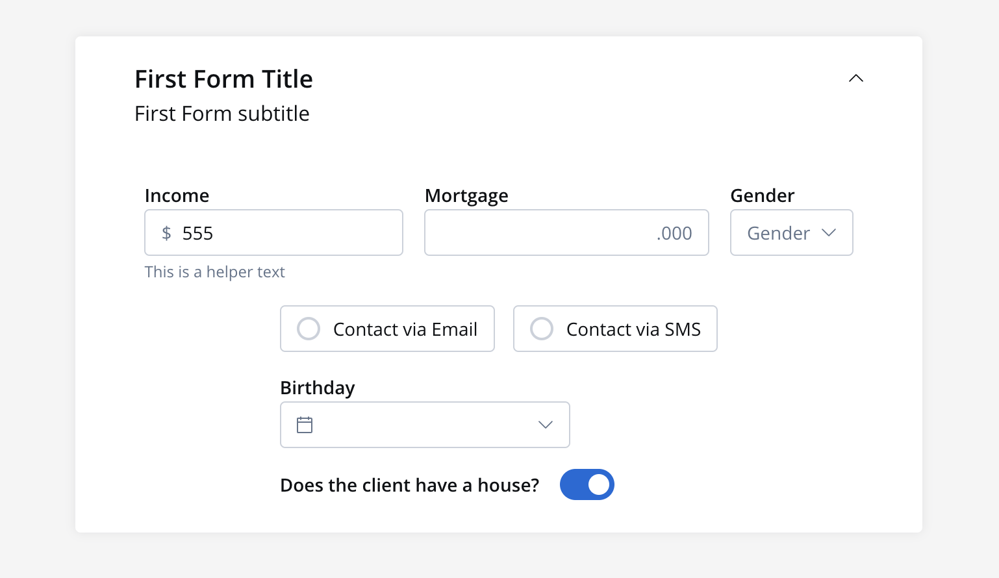
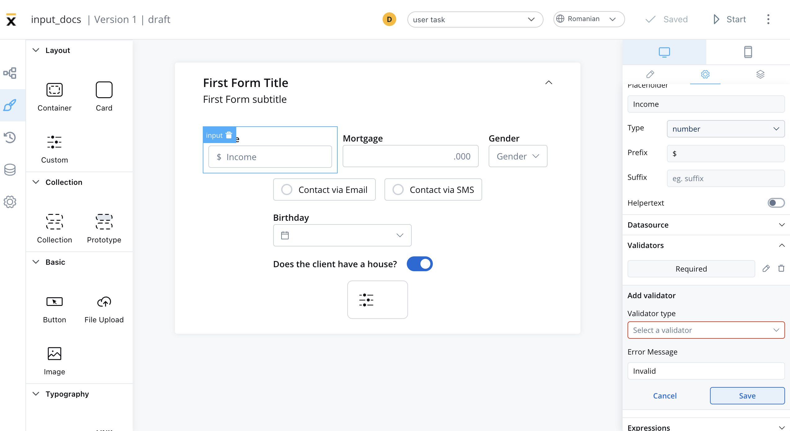
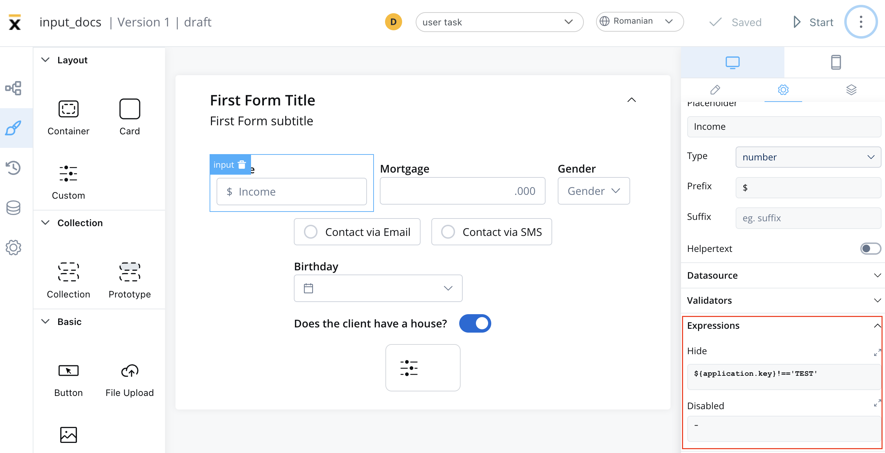

# Input

An input field is a form element that enables users to input data with validations and can be hidden or disabled.

## Configuring the input element

### Input settings

The Input Field offers the following configuration options:

- [**General**](#general)
- [**Properties**](#properties)
- [**Datasource**](#datasource)
- [**Validators**](#validators)
- [**Expressions**](#expressions)
- [**UI actions**](#ui-actions)
- [**Input styling**](#input-styling)

#### General
   
* **Process data key** - creates the binding between form element and process data, so it can be later used in [decisions](../../../node/exclusive-gateway-node.md), [business rules](../../../actions/business-rule-action/business-rule-action.md) or [integrations](../../../node/message-send-received-task-node.md#from-integration)

#### Properties

* **Label** - the label that appears on the input field
* **Placeholder** - the placeholder text that appears in the input field when it is empty
* **Type** - the type of data that the input field can accept, such as text, number, email, or password
* **Prefix** - a label that appears as a prefix to the input field
* **Suffix** - a label that appears as a suffix to the input field
* **Helpertext** - additional information about the input field (can be hidden inside an infopoint)

#### Datasource

The default value for the element can be configured here, this will autofill the input field when you will run the process.

#### Validators

There are multiple validators can be added to an input (more details [here](../../validators.md)).

#### Expressions  

The input field's behavior can be defined using JavaScript expressions for hiding or disabling the element. The following properties can be configured for expressions:
   
* **Hide** - JavaScript expression used to hide the Input Field when it returns a truthy value
* **Disabled** - JavaScript expression used to disable the Input Field when it returns a truthy value

:::info
It's important to make sure that disabled fields have the same expression configured under the path expressions → hide.
:::

#### UI actions

UI actions can be added to the Input Field to define its behavior and interactions.

* **Event** - possible value: `CHANGE`
* **Action Type** - select the action type

:::info
For more details on how to configure a UI action, click [**here**](../../ui-actions).
:::

### Input styling

* The Input Field can be styled using valid CSS properties (more details [here](../../#styling))

