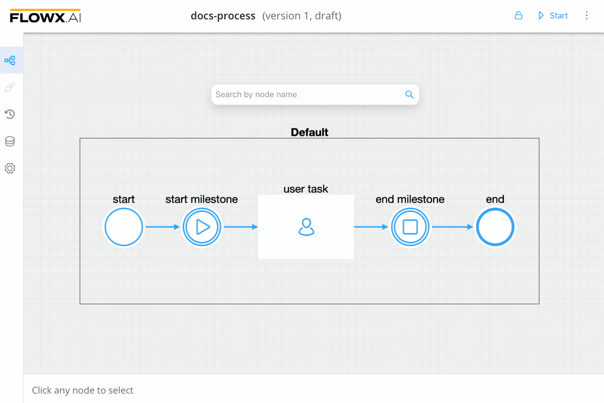
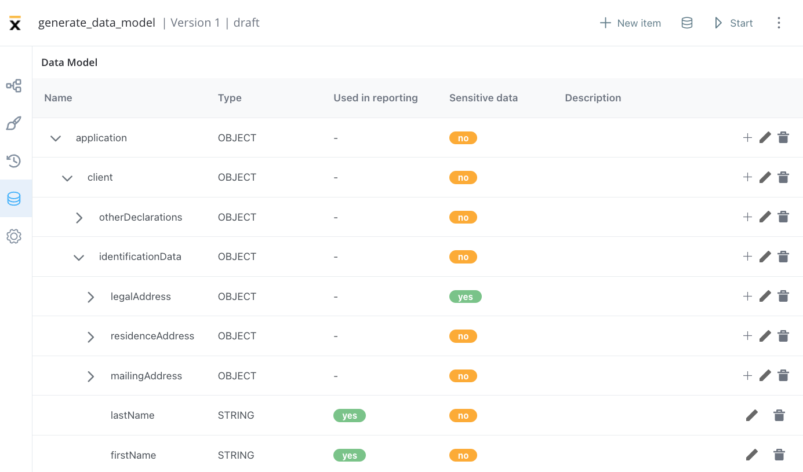
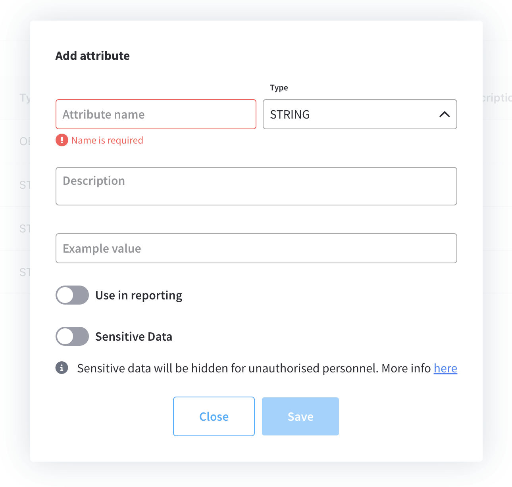
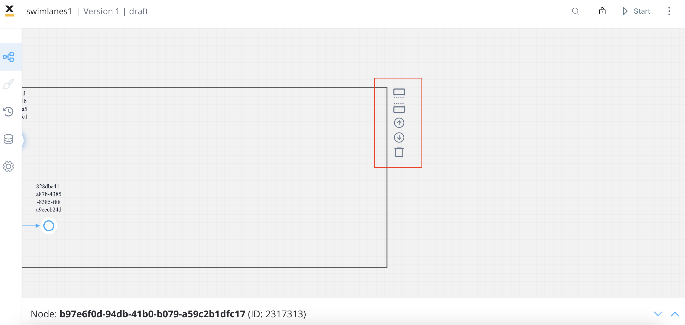
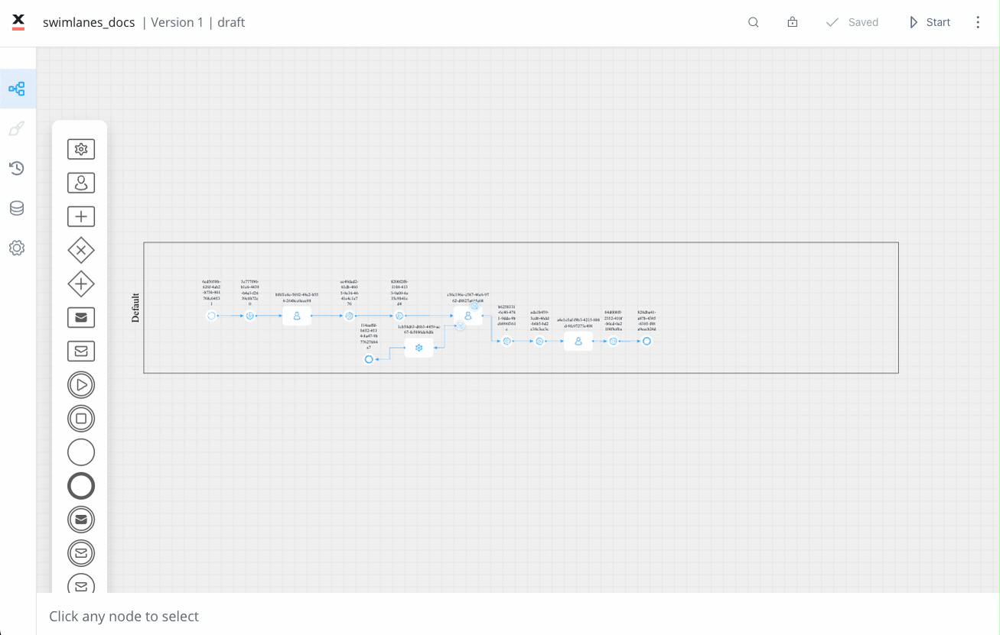
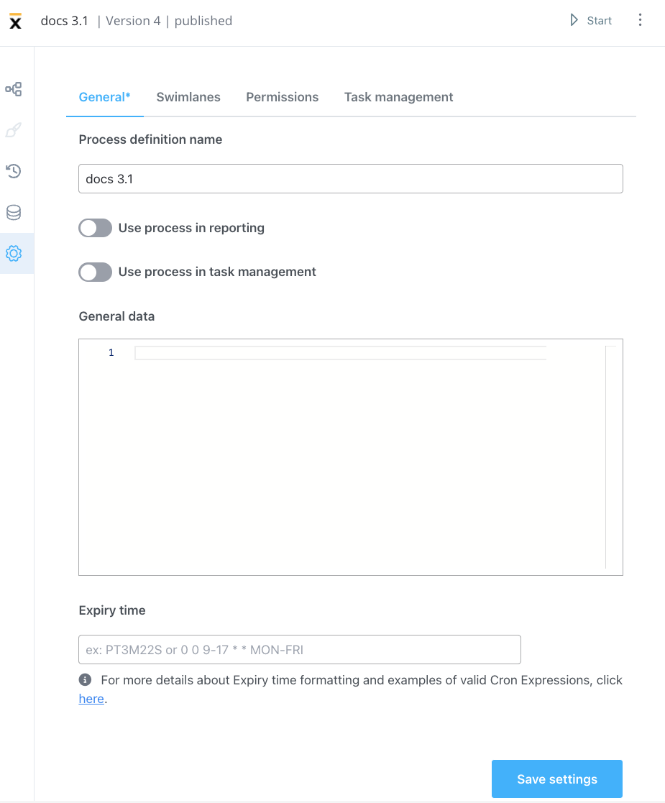
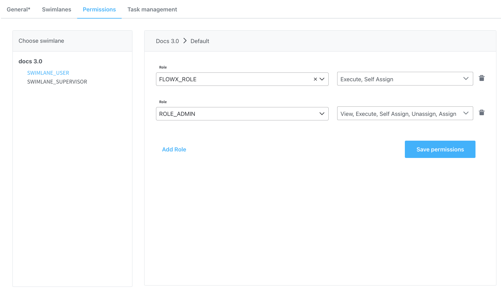
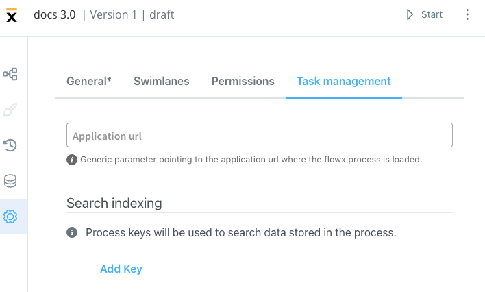

---
sidebar_position: 1
--- 

# Process definition

The core of the platform is the process definition, which is the blueprint of the business process made up of [nodes](../../node) that are linked by sequences.

Once a process is defined and set as published on the platform, it can be executed, monitored, and optimized. When a business process is started, a new instance of the definition is created.

[Process instance](../active-process/process-instance/process-instance.md)

[Failed process start](../active-process/failed-process-start.md)

## History

In the **History** tab, you will find a record of all the modifications and events that have occurred in the process.

* **Versions** - provides information on who edited the process, when it was modified, and the version number and status
* **Audit log** - provides a detailed record of events and changes

### Versions

In the **Versions** tab you will find the following details:

* Last edited on - the last time when the process was modified
* Last edited by - the last person who modified a process
* Version - version number
* Status - can be either **Published** or **Draft** 

:::info HINT
❗️Published processes cannot be modified (they must be deprecated to be set as **Draft** before editing them).
:::

* View process - clicking on the eye icon will redirect you to the process definition 

### Audit log

In the **Audit log** tab you will find the following items:

* Timestamp 
* User 
* Subject 
* Event 
* Subject Identifier 
* Version
* Status 

:::info
Some items in the Audit log are filterable, making it easy to track changes in the process.
:::

[Audit](../../../platform-deep-dive/core-components/core-extensions/audit.md)

## Data model

In the Data Model, you can add new key-pair values, which enables you to use shortcuts when adding new keys using the UI Designer, without having to switch back and forth between menus.

### Attributes type

The Data Model supports the following attribute types:

* STRING
* NUMBER
* BOOLEAN
* OBJECT
* ARRAY
    * ARRAY OF STRINGS
    * ARRAY OF NUMBERS
    * ARRAY OF BOOLEANS
    * ARRAY OF OBJECTS
    * ARRAY OF ENUMS
* ENUM

:::info
When you export or import a [**process definition**](process-definition.md), the data model will be included.
:::

### Data model reference

You can use data model reference feature to view attribute usage within the data model. You can now easily see where a specific attribute is being used by accessing the "View References" feature. This feature provides a list of process keys associated with each attribute and displays possible references, such as UI Elements.

For UI Elements, the references include the element label, node name, and UI Element key. Additionally, the context of the reference is provided, showing the node name and the UI element type along with its label. Users can conveniently navigate to the context by clicking the provided link to the node's UI page.

### Sensitive data

To protect your data and your customer's data, you can hide data that could be visible in the process details or in the browser's console. You can now also secret data for a specific key.

<!--

-->

### Reporting

The **Use in Reporting** tag is used for keys that will be used further in the reporting plugin.

[Reporting](../../../platform-deep-dive/plugins/custom-plugins/reporting/reporting.md)

### Generating data model

A data model can be generated using data values from a [process instance](../active-process/process-instance/process-instance.md). This can be done by either merging the data model with an existing one or replacing it entirely.

To generate a data model, follow these steps:

1. Open **FLOWX.AI Designer**.
2. Go to the **Definitions** tab and select the desired **process definition**.
3. Select the **Data Model** tab and then click **Generate data model** button.
4. Add the **process instance** of the process from which you want to generate the data model.
5. Choose whether to **replace** the existing data model or **merge** it with the new one.
6. Click the **Load Data** button to display the data model body.
7. Finally, click **Save** button to save the generated data model.

<!--

-->

By generating a data model, you can ensure that your data is structured and organized in a way that is appropriate for your business needs. It can also help you to identify any inconsistencies or errors in the data, allowing you to correct them before they cause problems down the line.

## Swimlanes

Swimlanes offer a useful method of organizing process nodes based on process participants. By utilizing swimlanes, you can establish controlled access to specific process nodes for particular user roles.

#### Adding new swimlanes

To add new swimlanes, please follow these steps:

1. Access the **FLOWX.AI Designer**.
2. Open an existing process definition or create a new one.
3. Identify the default swimlane and select it to display the contextual menu.

:::info
With the contextual menu, you can easily perform various actions related to swimlanes, such as adding or removing swimlanes or reordering them. 
:::

4. Choose the desired location for the new swimlane, either below or above the default swimlane.
5. Locate and click the **add swimlane icon** to create the new swimlane.

For more details about user roles management, check the following section:

[User roles management - Swimlanes](../../../platform-deep-dive/user-roles-management/swimlanes.md)

For more details about setting up user role-based access on process definitions, check the following section:

[Configuring access roles for processes](../../../platform-setup-guides/flowx-engine-setup-guide/configuring-access-roles-for-processes.md)

## Settings

### General

In the General settings, you can edit the process definition name, include the process in reporting, set general data, and configure expiry time using Cron Expressions and ISO 8601 formatting.

* **Process definition name** - edit process definition name
* **Use process in reporting** - if switched on, the process will be included in reporting
* **Use process in task management** - if switched on, tasks will be created and displayed in the Task manager plugin, more information [here](../../../platform-deep-dive/plugins/custom-plugins/task-management/task-management.md)
* **General data** - data that you can set and receive on a response
* **Expiry time** - a user can set up a `expiryTime` function on a process, for example, a delay of 30s will be set up like: `30 16 11 4 7 1`

For more information about **Cron Expressions** and **ISO 8601** formatting, check the following section;

[Timer Expressions](../../../platform-overview/frameworks-and-standards/timer-expressions.md)

### Permissions

After defining roles in the identity provider solution, they will be available to be used in the process definition settings panel for configuring swimlane access. 

When you create a new swimlane, it comes with two default permissions assigned based on a specific role: execute and self-assign. Other permissions can be added manually, depending on the needs of the user.

[Configuring access rights for processes](../../../platform-setup-guides/flowx-engine-setup-guide/configuring-access-roles-for-processes.md)

### Task management

The Task Management plugin offers a business-oriented view of the process you defined in the Designer and allows for interactions at the assignment level. It also includes a generic parameter pointing to the application URL where the Flowx process is loaded and uses process keys to search data stored in the process.

