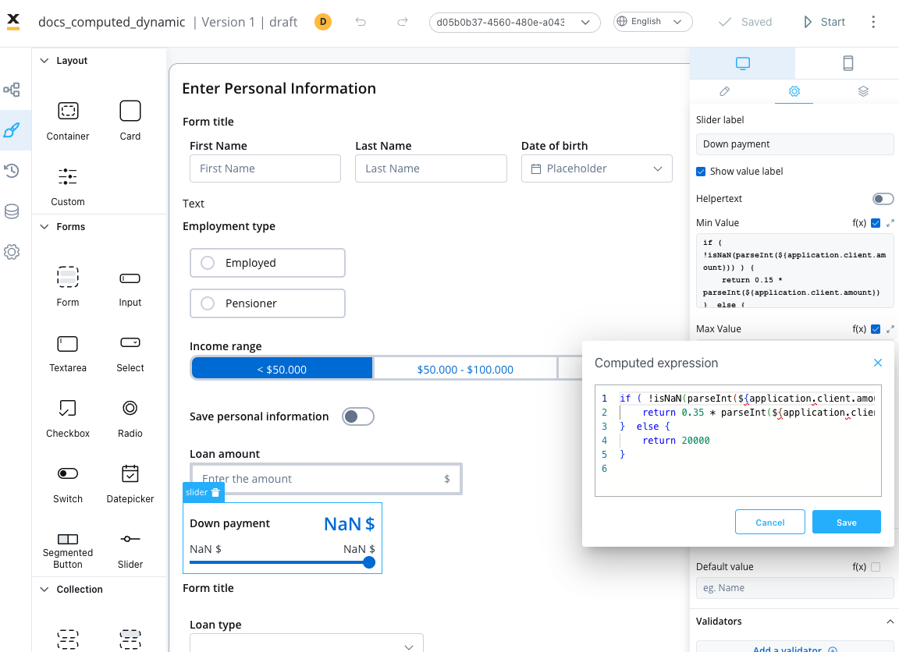
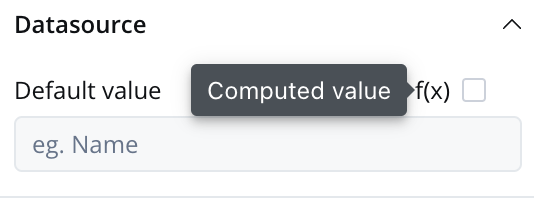

# Dynamic & computed values

In modern application development, the ability to create dynamic and interactive user interfaces is essential for delivering personalized and responsive experiences to users. Dynamic values and computed values are powerful features that enable developers to achieve this level of flexibility and interactivity.

## Dynamic values

Dynamic values refer to the capability of dynamically populating element properties in the user interface based on process parameters or substitution tags. These values can be customized at runtime, allowing the application to adapt to specific scenarios or user input. With dynamic values, you can personalize labels, placeholders, error messages, and other properties of UI elements, providing a tailored experience for users.

You can now utilize process parameters or [**substitution tags**](../../platform-deep-dive/core-components/core-extensions/content-management/substitution-tags.md) with the following UI elements and their properties:


| Element                                                                 | Property                                                         | Accepts Params/Subst Tags |
| ----------------------------------------------------------------------- | ---------------------------------------------------------------- | ------------------------- |
| [**Form Elements**](./ui-component-types/form-elements)                 | Default Value (except switch)                                    | Yes                       |
|                                                                         | Label, Placeholder                                               | Yes                       |
|                                                                         | Helper Text, Validators                                          | Yes                       |
| [**Document Preview**](./ui-component-types/file-preview.md)            | Title, Subtitle                                                  | Yes                       |
| [**Card**](./ui-component-types/root-components/card.md)                | Title, Subtitle                                                  | Yes                       |
| Form                                                                    | Title                                                            | Yes                       |
| Message                                                                 | Message                                                          | Yes                       |
| [**Buttons**](./ui-component-types/buttons.md)                          | Label                                                            | Yes                       |
| Select, Checkbox, Radio,Segmented Button (Static)                       | Label, Value                                                     | Subst Tags Only           |
| Text                                                                    | Text                                                             | Yes                       |
| Link                                                                    | Link Text                                                        | Yes                       |
| [**Modal**](../../building-blocks/node/milestone-node.md#modal)         | Modal Dismiss Alert, Title, Message, Confirm Label, Cancel Label | Yes                       |
| [**Step**](../../building-blocks/node/milestone-node.md#stepper--steps) | Label                                                            | Yes                       |

### Example using Substitution tags

<!--

-->

### Example using process parameters


#### Business rule example

In the above example, the following MVEL business rule was used to populate the keys with values from the task:

```json
///assigning a JSON object containing dynamic values for the specified keys to the "app" key 

output.put("app",{"label":"This is a label",
                    "title":"This is a title",
                    "placeholder":"This is a placeholder",
                    "helpertext":"This is a helper text",
                    "errorM":"This is a error message",
                    "prefix":"prx",
                    "suffix":"sfx",
                    "subtitile":"This is a subtitle",
                    "message":"This is a message",
                    "defaultV":"defaultValue",
                    "value":"Value101",
                    "value":"Value101",
                    "confirmLabel":"This is a confirm label",
                    "cancelLabel":"This is a cancel label",
                    "defaultValue":"dfs",
                    "defaultDate":"02.02.2025",
                    "defaultSlider": 90});

```

:::caution
Please note that for releases **<= 3.3.0**, it is not possible to concatenate process parameters with substitution tags when using dynamic values.
:::

## Computed values

Computed values take the concept of dynamic values a step further by allowing you to generate values dynamically using JavaScript expressions. Rather than relying solely on predefined values, computed values enable the calculation, transformation, and manipulation of data based on specific rules or conditions. 



Computed values can be created by writing JavaScript expressions that operate on process parameters or other variables within the application. 

:::info
To add a computed value, you have to explicitly check “Computed value” option (represented by the **f(x)** icon), which will transform the desired field into a JavaScript editor.

<div class = "image-scaled">



</div>

:::

By enabling computed values, the application provides flexibility and the ability to create dynamic and responsive user interfaces.

<!--

-->

### Slider example

The above example demonstrates the usage of computed values for a Slider element, where JavaScript expressions are used to compute the minimum and maximum values based on a value entered in an input UI element (linked by the process key `${application.client.amount}`).

#### Min Value

```js
if ( !isNaN(parseInt(${application.client.amount})) ) {
    return 0.15 * parseInt(${application.client.amount})
}  else {
    return 10000
}
```

#### Max Value


```js
if ( !isNaN(parseInt(${application.client.amount})) ) {
    return 0.35 * parseInt(${application.client.amount})
}  else {
    return 20000
}
```

#### Example details

The code snippets check whether the value of `${application.client.amount}` key can be successfully parsed as an integer. Here's a step-by-step explanation:

* The `parseInt()` function is used to attempt to convert `${application.client.amount}` into an integer.
* The `isNaN()` function is then used to check if the result of the conversion is `NaN` (not a number).
* If the value is not `NaN`, it means `${application.client.amount}` is a valid numeric value.
* In that case, the code calculates the computed value by multiplying the parsed integer by `0.15` (the minimum percentage value for the down payment or with 0.35, the maximum percentage value of the down payment). The result is returned as the computed value for the expression.
* If the value is `NaN` (or `${application.client.amount}` couldn't be successfully parsed as an integer), the code executes the else block and returns a default value of `10000`.

In summary, the JS expressions demonstrates how a computed value can be derived based on a conditional calculation. It first checks if a specific process parameter `(${application.client.amount})` is a valid numeric value, and if so, it computes the value by multiplying it by 0.15 or 0.35. Otherwise, it falls back to a default value of `10000` or `20000`.


### Usage

The UI Designer now allows JavaScript expressions to create computed values used on the following UI elements with their properties:


| Element                                | Properties                          |
| -------------------------------------- | ----------------------------------- |
| Slider                                 | min Value, max Value, default Value |
| Input                                  | Default Value                       |
| Any UI Element that accepts validators | min, max, minLength, maxLength      |
| Text                                   | Text                                |
| Link                                   | Link Text                           |


- **Slider**: The min value, max value, and default value for sliders can be set using JavaScript expressions applied to process parameters. This allows for dynamic configuration based on numeric values.
- **Any UI Element that accepts validators min, max, minLength, maxLength**: The "params" field for these elements can also accept JavaScript expressions applied to process parameters. This enables flexibility in setting validator parameters dynamically.
- **Default Value**: For input elements like text inputs or number inputs, the default value can be a variable from the process or a computed value determined by JavaScript expressions.
- **Text**: The content of a text element can be set using JavaScript expressions, allowing for dynamic text generation or displaying process-related information.
- **Link**: The link text can also accept JavaScript expressions, enabling dynamic generation of the link text based on process parameters or other conditions.

Please note that these settings are specifically applicable to numeric values and are not intended for date or string values.

:::caution
For input elements (e.g., text input), you may require a default value from a process variable, while a number input may need a computed value.
:::

