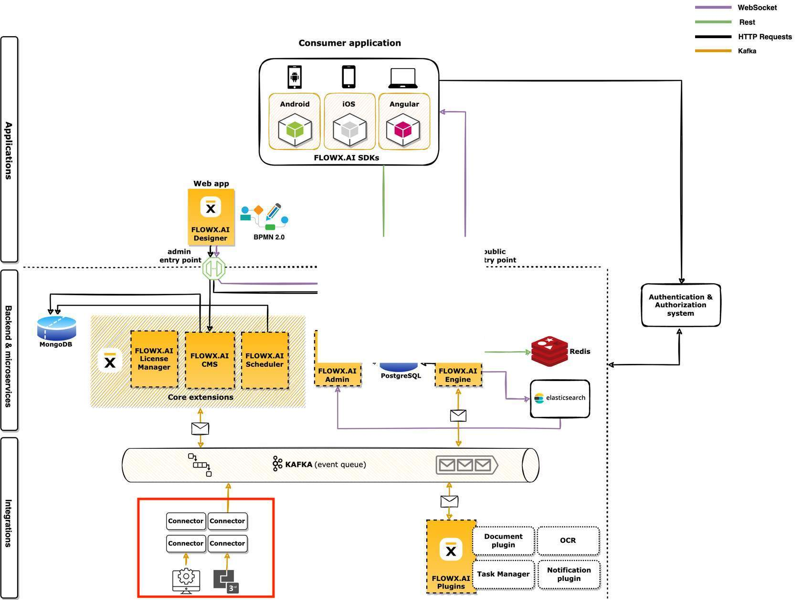
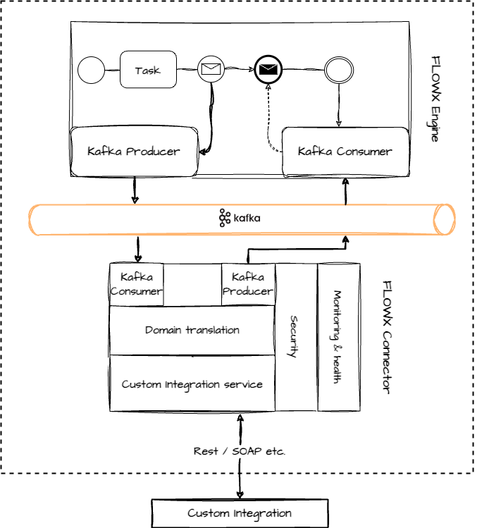

# Integrations

## What is an integration?

Integrations play a crucial role in **connecting legacy systems** or **third-party applications** to the [**FLOWX.AI Process engine**](../../terms/flowxai-process-engine). They enable seamless communication by leveraging custom code and the [**Kafka**](../../terms/flowx-kafka) messaging system.



Integrations serve various purposes, including working with legacy APIs, implementing custom file exchange solutions, or integrating with RPAs.

#### High-level architecture 



Integrations involve interaction with legacy systems and require custom development to integrate them into your FLOWX.AI setup.

## Developing a custom integration

Developing custom integrations for the [**FLOWX.AI platform**](../../terms/flowx) is a straightforward process. You can use your preferred technology to write the necessary custom code, with the requirement that it can send and receive messages from the [**Kafka**](../../terms/flowx-kafka) cluster.

#### Steps to create a custom integration

Follow these steps to create a custom integration:

1. Develop a microservice, referred to as a "Connector," using your preferred tech stack. The Connector should listen for Kafka events, process the received data, interact with legacy systems if required, and send the data back to Kafka.

2. Configure the [process definition](../../building-blocks/process/process-definition.md) by adding a [message](../../building-blocks/node/message-send-received-task-node.md) send action in one of the [nodes](../../building-blocks/node/node.md). This action sends the required data to the Connector.

3. Once the custom integration's response is ready, send it back to the FLOWX.AI engine. Keep in mind that the process will wait in a receive message node until the response is received.

For Java-based Connector microservices, you can use the following startup code as a quickstart guide:

[Quickstart connector](https://github.com/flowx-ai/quickstart-connector)

## Managing an integration

#### Managing Kafka topics

It's essential to configure the engine to consume events from topics that follow a predefined naming pattern. The naming pattern is defined using a topic prefix and suffix, such as "*ai.flowx.dev.engine.receive*."

:::info
The suggested naming convention is as follows:

```yaml
 topic:
    naming:
      package: "ai.flowx."
      environment: "dev."
      version: ".v1"
      prefix: ${kafka.topic.naming.package}${kafka.topic.naming.environment}
      suffix: ${kafka.topic.naming.version}
      engineReceivePattern: engine.receive

    pattern: ${kafka.topic.naming.prefix}${kafka.topic.naming.engineReceivePattern}*
```
:::

To ensure proper communication, make sure to:

* Convert data between different domains (e.g., date formats, list of values, units).
* Add integration-specific information that is not critical to the process flow (e.g., flags, trace GUIDs).

## Building a Connector

Connectors act as lightweight business logic layers and perform the following tasks:

* Converts data from one domain to another (date formats, list of values, units, etc.)
* Adds information that is required by the integration but is not important for the process (a flag, generates a GUID for tracing, etc.)


To build a Connector, you'll need to:

* Create a Kafka consumer - [**guide here**](./creating-a-kafka-consumer.md)
* Create a Kafka producer - [**guide here**](./creating-a-kafka-producer.md)

When designing Connectors, keep in mind that the communication between the engine and the Connector is asynchronous in an event-driven architecture. It is essential to design Connectors in a way that avoids bloating the platform. Depending on the communication type between the Connector and the legacy system, you may need to implement custom solutions for load balancing requests, scaling the Connector, etc.

:::caution
To ensure proper communication with the [**Engine**](../../terms/flowxai-process-engine), make sure to include all received Kafka headers in the response sent back to it.
:::

For easy process flow tracing, consider adding a minimal setup for Jaeger tracing to your custom Connectors.