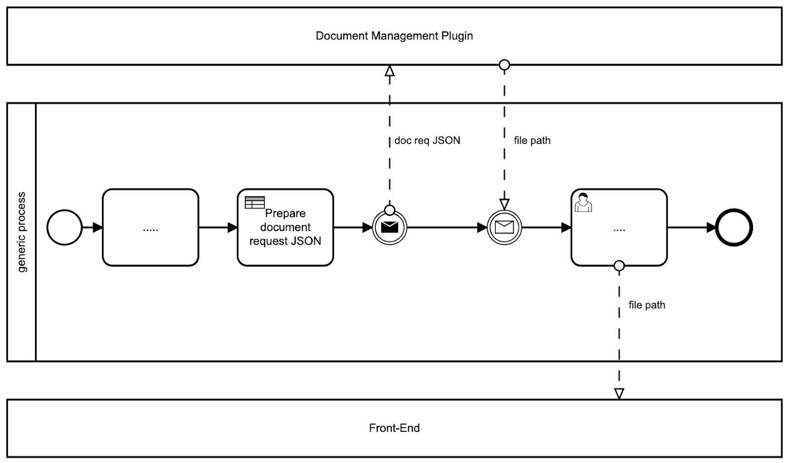

# Generating docs based on templates

One of the key features of the Document Management Plugin is the ability to generate new documents using custom templates, which can be pre-filled with data relevant to the current process instance. These templates can be easily configured using the [**What you see is what you get** (WYSIWYG)](../../../../wysiwyg.md). You can create and manage your templates by accessing the **Document Templates** section in [**FLOWX.AI Designer**](../../../../../../terms/flowx-ai-designer).

Let's explore the specific details of defining and managing these custom templates, as well as adding process actions for generating documents:

[WYSIWYG](../../../../wysiwyg.md)

[Managing HTML templates](managing-html-templates.md)

[Generating from HTML templates](generating-from-html-templates.md)
