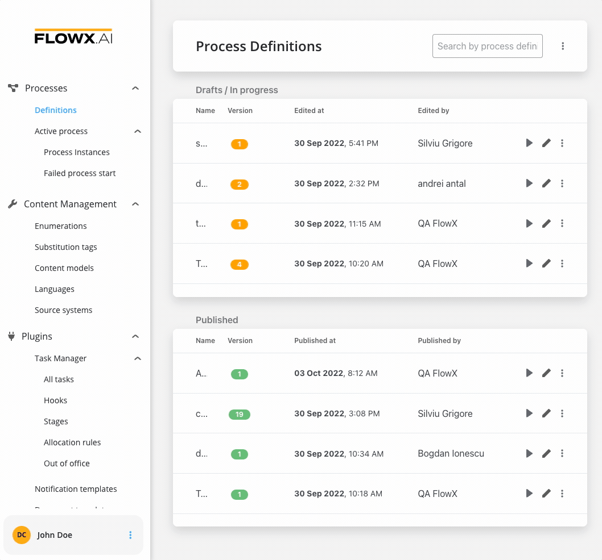
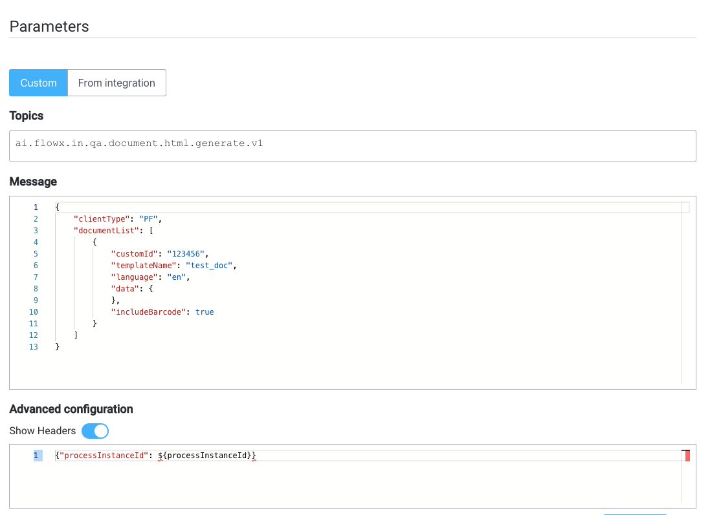
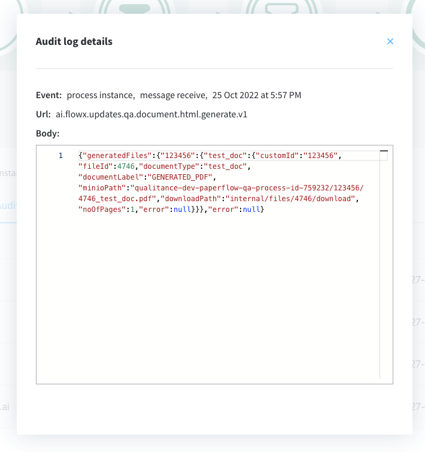

# Generating from HTML templates

The Document Management Plugin allows you to generate documents based on previously defined document templates. This example specifically covers generating documents using HTML templates.

## Creating a template

Use the [WYSIWYG](../../../../wysiwyg.md) editor to create a document template.



## Sending the request

1. Create a process that includes a [**Kafka send event node**](../../../../../../building-blocks/node/message-send-received-task-node.md#message-send-task) and a [**Kafka receive event node**](../../../../../../building-blocks/node/message-send-received-task-node.md#message-receive-task) (one for sending the request and one for receiving the reply).
2. Configure the first node (Kafka Send Event) by adding a **Kafka send action**.
3. Add the [**Kafka topic**](../../../../plugins-setup-guide/documents-plugin-setup/documents-plugin-setup.md#kafka-configuration) to which the request should be sent.
4. Fill in the message with the following expected values in the request body:



* **documentList**: A list of documents to be generated with properties (name and value to be replaced in the document templates)
* **customId**: Client ID
* **templateName**: The name of the template to be used
* **language**
* **includeBarcode**: True/False
* **data**: A map containing the values that should be replaced in the document template. The keys used in the map should match the ones defined in the HTML template.

:::info
Kafka topic names can be set by using (overwriting) the following environment variables in the deployment:

* **`KAFKA_TOPIC_DOCUMENT_GENERATE_HTML_IN`** - default value: `ai.flowx.in.qa.document.html.generate.v1` - the topic that listens for the request from the engine
* **`KAFKA_TOPIC_DOCUMENT_GENERATE_HTML_OUT`** - default value: `ai.flowx.updates.qa.document.html.generate.v1` - the topic on which the engine expects the reply

The above examples of topics are extracted from an internal testing environment. When setting topics for other environments, follow the pattern `ai.flowx.updates.{{environment}}.document.generate.v1`.
:::

:::caution
The engine listens for messages on topics with specific naming patterns. Make sure to use an outgoing topic name that matches the pattern configured in the engine.
:::

## Reply

:::info
You can view the response by accessing the **Audit log** menu.
:::

The response will be sent on the output Kafka topic defined in the Kafka Receive Event Node. The response will contain the following information:



Values expected in the event body:

* **generatedFiles**: List of generated files.
  * **customId**: Client ID.
  * **fileId**: The ID of the generated file.
  * **documentType**: The name of the document template.
  * **documentLabel**: A label or description for the document.
  * **minioPath**: The path where the converted file is saved. It represents the location of the file in the storage system, whether it's a MinIO path or an S3 path, depending on the specific storage solution.
  * **downloadPath**: The download path for the converted file. It specifies the location from where the file can be downloaded.
  * **noOfPages**: The number of pages in the generated file.
  * **error**: If there were any errors encountered during the generation process, they would be specified here. In the provided example, the value is null, indicating no errors.

Example of generated file response received on `KAFKA_TOPIC_DOCUMENT_GENERATE_HTML_IN` topic :

```json
{
  "generatedFiles": {
    "123456": {
      "test_doc": {
        "customId": "123456",
        "fileId": 4746,
        "documentType": "test_doc",
        "documentLabel": "GENERATED_PDF",
        "minioPath": "qualitance-dev-paperflow-qa-process-id-759232/123456/4746_test_doc.pdf", //or S3 path, depending on your storage solution
        "downloadPath": "internal/files/4746/download",
        "noOfPages": 1,
        "error": null
      }
    }
  },
  "error": null
}

```