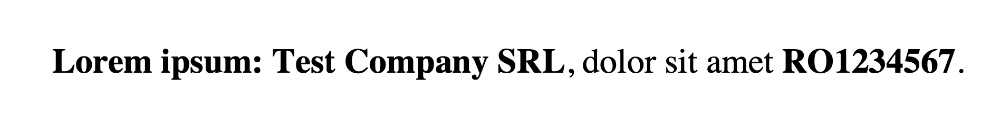
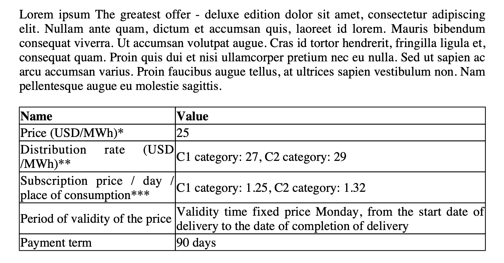
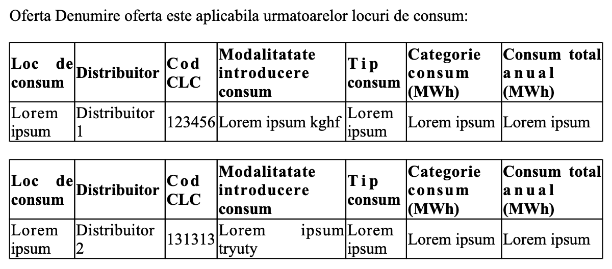
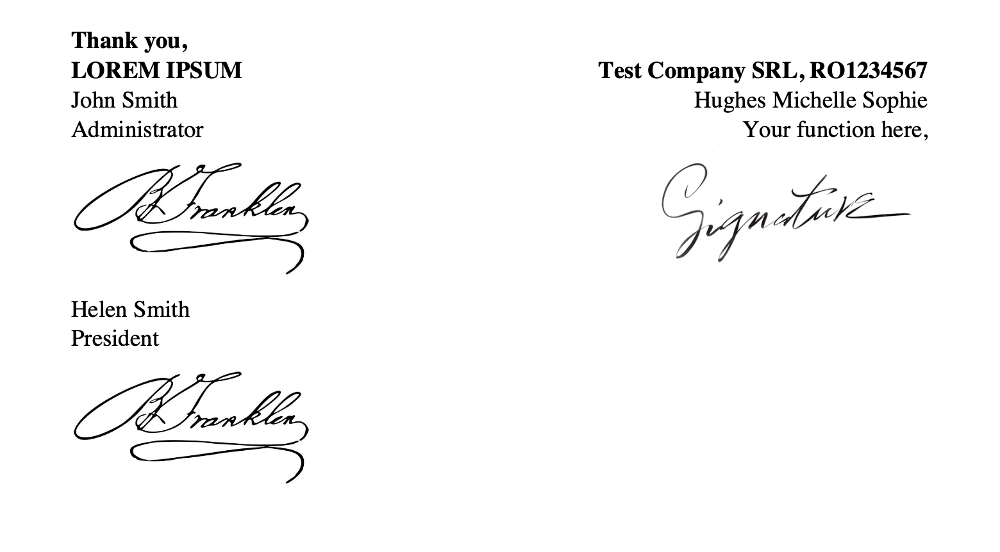
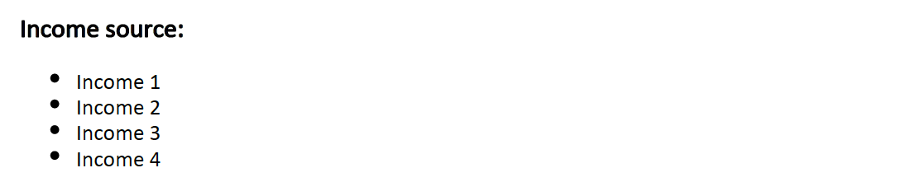

# Managing HTML templates

In the Document Management Plugin, you have the flexibility to define and manage HTML templates for generating documents. These templates can incorporate various types of parameters to customize the content. Let's explore the different types of parameters and their specifications:

## Configuring HTML templates

### Text parameters

Text parameters are used to include dynamic text in the template. For example, you can include the company name and registration number in an offer document. Here's an example of HTML template specifications:



```html
<p><strong>Lorem ipsum: <span th:text="${companyName}"></span></strong>, dolor sit amet <strong><span th:text="${cui}"></span></strong>.</p>
```

Data specifications:

```json
{
  "data": {
    "companyName": "Test Company SRL",
    "cui": "RO1234567"
  }
}
```

### Dynamic tables - repeatable rows

Dynamic tables are useful when you want to display a table with repeatable rows. Each row can represent a different element from a generated list of objects. Here's an example of HTML template specifications:



```html
<table>
    <thead>
        <tr class="headings">
            <th class="column-title">Name</th>
            <th class="column-title">Value</th>
        </tr>
    </thead>
    <tbody>
        <tr class='even pointer' th:each="row: ${offerValuesRows}" id="tablerow">
            <td th:each="header: ${offerValuesHeader}" th:text="${row.get(header)}">
        </tr>
    </tbody>
</table>
```

Data specifications:

```json
"data": {
   "offerValuesHeader": [ 
     "Name", 
     "Value" 
   ], 
   "offerValuesRows": [ 
     { "Name": "Price (USD/MWh)", "Value": "25" }, 
     { "Name": "Distribution rate (USD/MWh)", "Value": "C1 category: 27, C2 category: 29" }, 
     { "Name": "Subscription price / day / place of consumption", "Value": "C1 category: 1.25, C2 category: 1.32" }, 
     { "Name": "Period of validity of the price", "Value": "Validity time fixed price Monday, from the start date of delivery to the date of completion of delivery" }, 
     { "Name": "Payment term", "Value": "90 days" } 
   ]
 }

```

### Dynamic tables - repeatable table

This type of dynamic table allows you to display a table multiple times based on the elements of a generated list of objects. Here's an example of HTML template specifications:



```html
<p>Offer:</p>
<div th:each="type: ${consumptionPoints}">
<table> 
    <thead>
       <tr>
          <th> Usage place </th>
          <th> Distributor </th>
          <th> CLC code </th>
          <th> Usage method input </th>
          <th> Usage type </th>
          <th> Usage category \n(MWh) </th>
          <th> Total usage \n(MWh) </th>
       </tr>
    </thead>
    <tbody>
       <tr th:if="${type.consumptionPoint.empty}">
           <td colspan=\"7\"> No information available here! </td>
        </tr>
        <tr th:each=\"consumptionPoint : ${type.consumptionPoint}\=">
           <td><span th:text="${consumptionPoint.consumptionPoint}"> Usage place </span></td>
           <td><span th:text="${consumptionPoint.distribuitor}"> Distributor </span></td>
           <td><span th:text="${consumptionPoint.clcCode}"> Cod CLC </span></td>
           <td><span th:text="${consumptionPoint.consumerInputMethod}"> Usage method input </span></td>
           <td><span th:text="${consumptionPoint.consumerType}"> Usage type </span></td>
           <td><span th:text="${consumptionPoint.consumerCategory}"> Usage category \n(MWh) </span></td>
           <td><span th:text="${consumptionPoint.totalAnnualConsumption}"> Total usage \n(MWh) </span></td>
         </tr>
      </tbody>
   </table>
</div>
```

Data specifications:

```json
  "data": {
    "consumptionPoints": [
      {
        "consumptionPoint": [
          {
            "consumptionPoint": "Lorem ipsum",
            "distribuitor": "Distributor 1",
            "clcCode": "123456",
            "consumerInputMethod": "Lorem ipsum",
            "consumerType": "Lorem ipsum",
            "consumerCategory": "Lorem ipsum",
            "totalAnnualConsumption": "Lorem ipsum"
          }
        ]
      },
      {
        "consumptionPoint": [
          {
            "consumptionPoint": "Lorem ipsum",
            "distribuitor": "Distributor 2",
            "clcCode": "131313",
            "consumerInputMethod": "Lorem ipsum ipsum",
            "consumerType": "Lorem ipsum",
            "consumerCategory": "Lorem ipsum",
            "totalAnnualConsumption": "Lorem ipsum"
          }
        ]
      }
    ]
  }
```

### Dynamic sections

Dynamic sections allow you to display specific content based on certain conditions. For example, you can display a paragraph only when a certain condition is met. Here's an example of HTML template specifications:


```html
<span th:if="${pjCLient==true}">
    <p><b>PJ section, visible only if pjCLient = true</b></p>
    <p><span th:text="${termTechnicalServices}"></span></p>
</span>
<span th:if="${pjCLient==false}">
    <p><b>PF section, visible only if pjCLient = false</b></p>
    <p><span th:text="${termInsuranceServices}"></span></p>
</span>

```

Data specifications:

```json
 "data": {
    "pjCLient": true
  }
```

### Images

You can include images in your final document by referencing them in the template. Here's an example of HTML template specifications:



```html
<td class='align'></td>
```

Data specifications:

```json
"data": {
    "signature": "INSERT_BASE64_IMAGE"
  }
```

### Barcodes

If you want to include a barcode, you can set the `includeBarcode` parameter to true.

For information on how to use barcodes and OCR, check the following section.

[OCR plugin](../../../ocr-plugin.md)

### Lists

Lists are useful for displaying values from selected items in a checkbox as a bulleted list. Here's an example of HTML template specifications:



```html
  <div th:if="${incomeSource != null}">
    <h3>Income source:</h3>
    <ul>
       <li th:each="item : ${incomeSource}" th:text="${item}"></li>
    </ul>
  </div>
```

Data specifications:

```json
{
    "data": {
        "incomeSource": [
            "Income 1",
            "Income 2",
            "Income 3",
            "Income 4"
        ]
    }
}
```

## Examples

:::tip
Download a PDF sample generated based on the HTML example, [**here**](../../../../../assets/html_generated_document.pdf).
:::