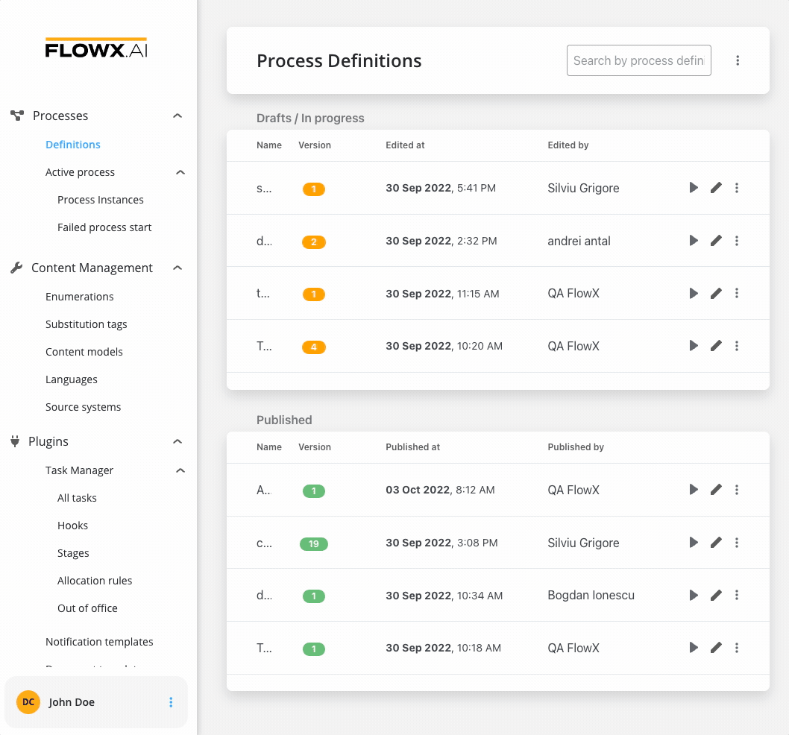
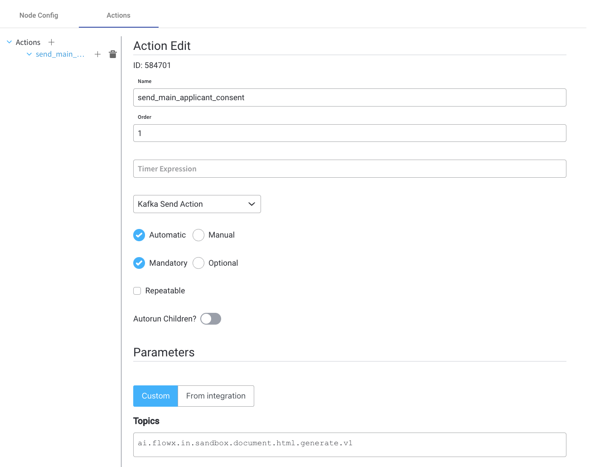
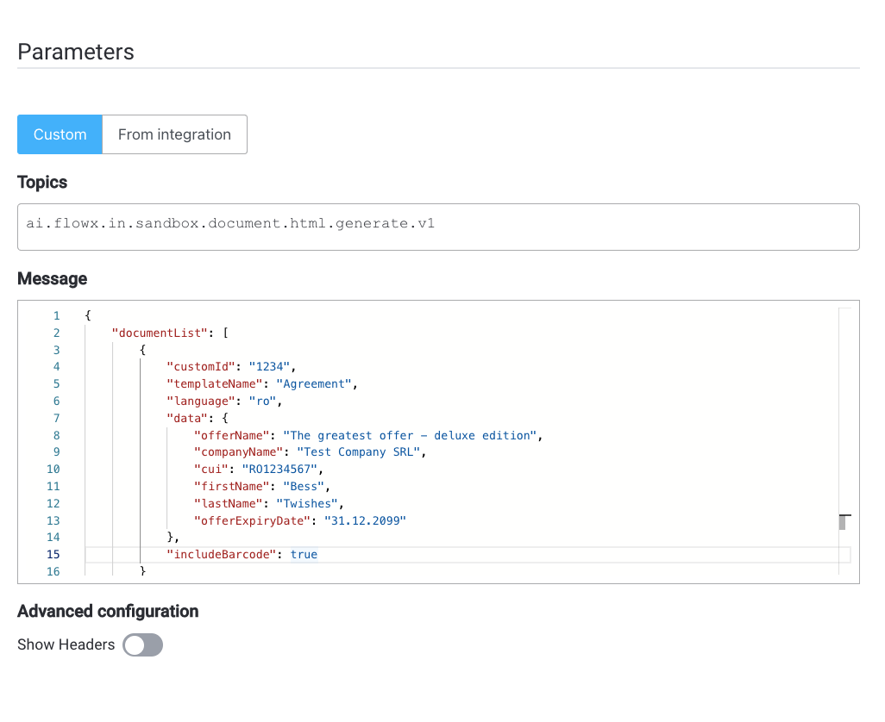
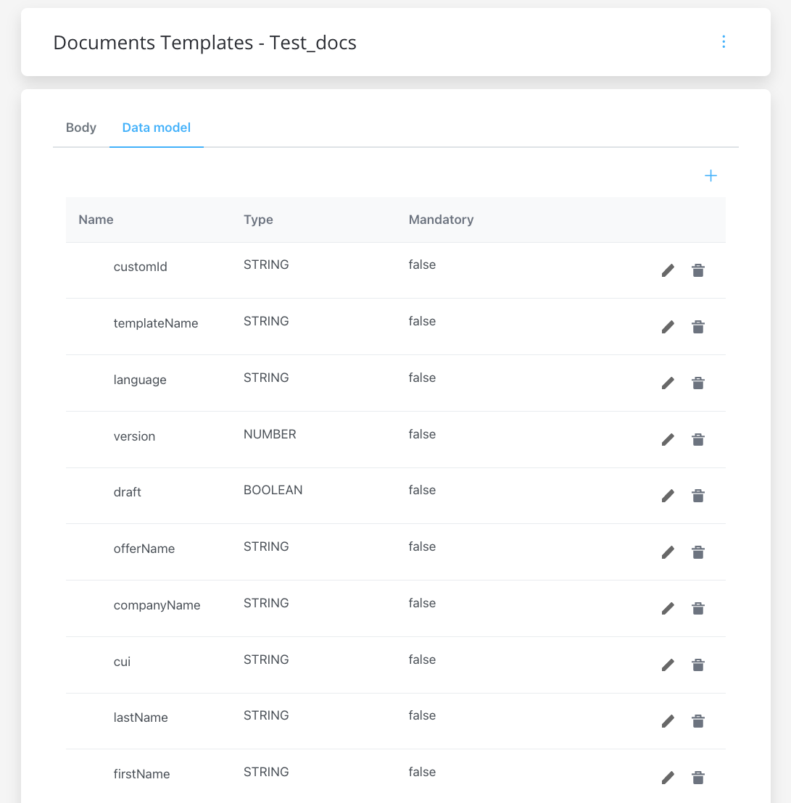
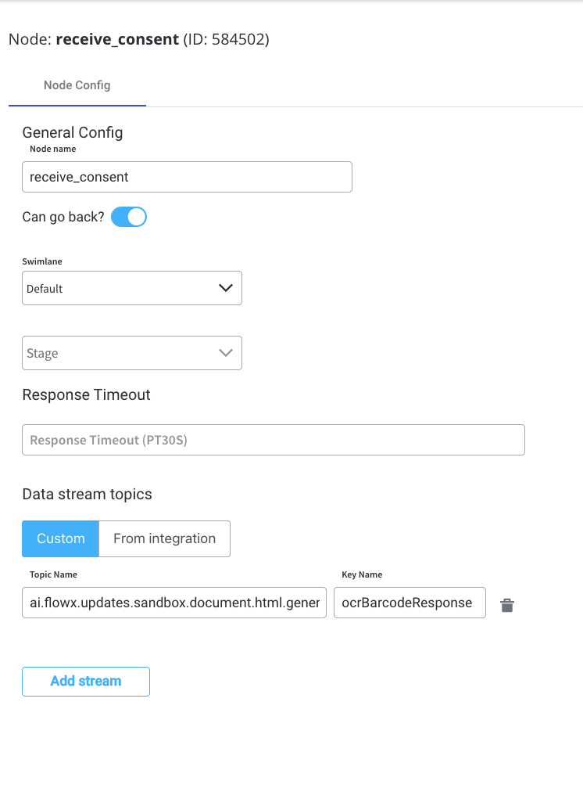
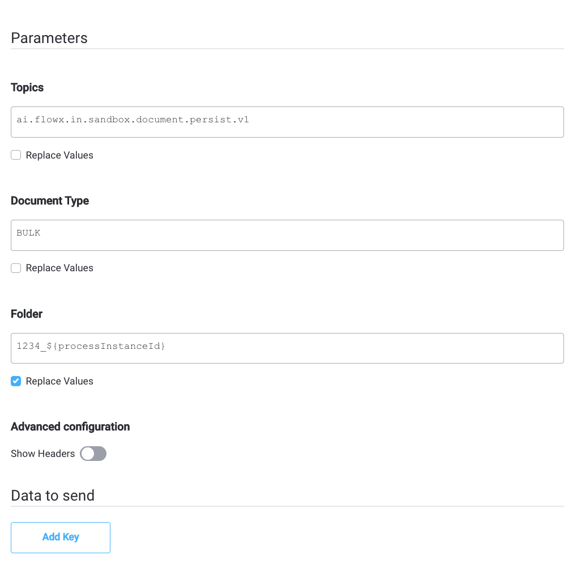

# 📦 OCR plugin

The OCR (Optical Character Recognition) plugin is a powerful tool that enables you to read barcodes and extract handwritten signatures from .pdf documents with ease.

Before using the OCR service for reading barcodes and extracting signatures, please note the following requirements:

:::caution
* All \*.pdf documents that are sent to the OCR service for reading barcodes and extracting handwritten signatures should be scanned at a minimum resolution of 200DPI (approximately 1654x2339 px for A4 pages)
* Barcode is searched on the top 15% of each image (scanned page)
* Signatures are detected on boxes with a border: 4px black solid
* Only two signatures per image (scanned page) are detected.
:::

* All *.pdf documents should be scanned at a minimum resolution of 200DPI (approximately 1654x2339 px for A4 pages).
* The barcode is searched in the top 15% of each scanned page.
* Signatures are detected within boxes with a 4px black solid border.
* The plugin detects up to two signatures per scanned page.
* Only two signatures per image (scanned page) are detected.

:::info
The plugin supports **1D Code 128** barcodes. For more information about this barcode type, please refer to the documentation [here](https://graphicore.github.io/librebarcode/documentation/code128.html).
:::

## Using the OCR plugin

You can utilize the OCR plugin to process generic document templates by either using a specific flow on FLOWX.AI (HTML template) or any other document editor.

:::info
Using a specific flow on FLOWX.AI offers several advantages:

* Centralized management of templates and flows within a single application.
* Access to template history and version control.
:::

### Use case

1. Prepare and print generic document templates.
2. End-users complete, sign, and scan the documents.
3. Upload the scanned documents to the flow.
4. FLOWX validates the template (barcode) and the signatures.

### Scenario for FLOWX.AI generated documents

1. Utilize the [**Documents plugin**](./documents-plugin) to create a [**document template**](./documents-plugin/using-documents-plugin/generate-docs-based-on-templates).

[Generating documents based on templates](./documents-plugin/using-documents-plugin/generate-docs-based-on-templates)

2. Create a process and add a [**Kafka Send Action**](../../../building-blocks/node/message-send-received-task-node.md#configuring-a-message-send-task-node) to a [**Message event send**](../../../building-blocks/node/message-send-received-task-node.md#message-send-task) node. Here you specify the [**kafka topic**](../../../platform-overview/frameworks-and-standards/event-driven-architecture-frameworks/intro-to-kafka-concepts.md#topics) (address) where the template will be generated.

:::info
The Kafka topic for generating the template must match the topic defined in the **`KAFKA_TOPIC_DOCUMENT_GENERATE_HTML_IN`** variable. Refer to the [**Kafka configuration guide**](../../../platform-setup-guides/flowx-engine-setup-guide/flowx-engine-setup-guide.md#configuring-kafka) for more details. For additional information, please see the [**Documents plugin setup guide**](../plugins-setup-guide/documents-plugin-setup).
:::

3. Fill in the **Message**. The request body should include the following values:

* **documentList** - a list of documents to be generated, including properties such as name and values to be replaced in the document templates
* **customId** - client ID
* **templateName** - the name of the template to be used
* **language**
* **includeBarcode** - true/false
* **data** - a map containing the values that should replace the placeholders in the document template, the keys used in the map should match those defined in the HTML template

:::info
The [**`data` parameters**](../wysiwyg.md) must be defined in the document template beforehand. For more information, check the [**WYSIWYG Editor**](../wysiwyg.md) section.

:::

4. Add a **barcode**.

:::info
* to include a **default barcode**, add the following parameter to the message body: `includeBarCode: true`.
* to include a **custom barcode**, set `includeBarCode: false` and provide the desired data in the `data` field
:::

5. Add a [**message received event**](../../../building-blocks/node/message-send-received-task-node.md#message-receive-task) node and specify the topic where you want to receive the response.

:::caution 
Ensure that the topic matches the one defined in the **`KAFKA_TOPIC_DOCUMENT_GENERATE_HTML_OUT`** variable. 
:::

6. Add a [**user task node**](../../../building-blocks/node/user-task-node) and configure an [**Upload file action**](../../../building-blocks/actions/upload-file-action.md) to send the file (defined by the **`KAFKA_TOPIC_DOCUMENT_PERSIST_IN`** variable) to the storage solution (for example, S3).

7. Next, the response will be sent back to the kafka topic defined by **`KAFKA_TOPIC_DOCUMENT_PERSIST_OUT`** environment variable through a callback action/subprocess.
8. Next, send the response to the OCR Kafka topic defined at **`KAFKA_TOPIC_OCR_IN`** variable (representing the path to the S3 file)
9. Display the result of the OCR validation on the kafka topic defined at **`KAFKA_TOPIC_OCR_OUT`**. 

### Setup guide

Refer to the OCR plugin setup guide for detailed instructions on setting up the OCR plugin:

[OCR plugin setup](../plugins-setup-guide/ocr-plugin-setup)
