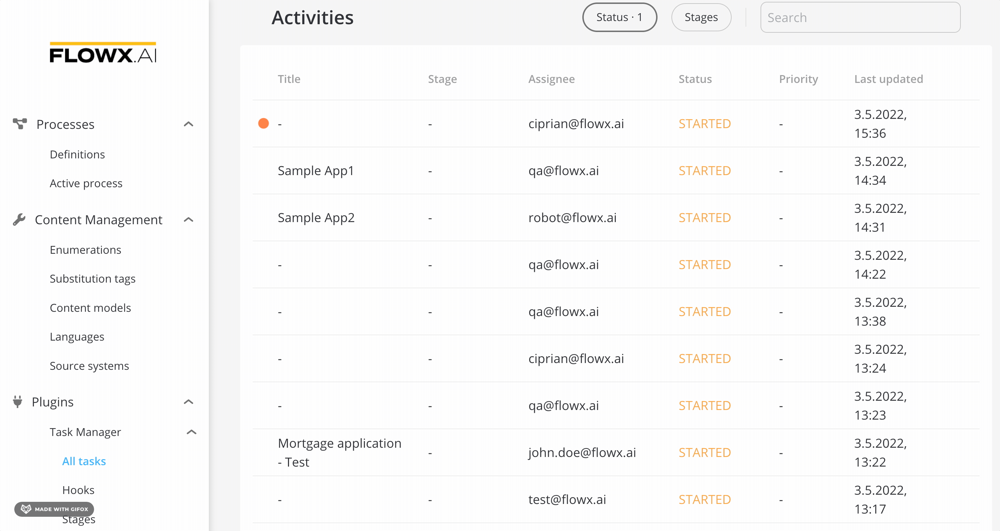
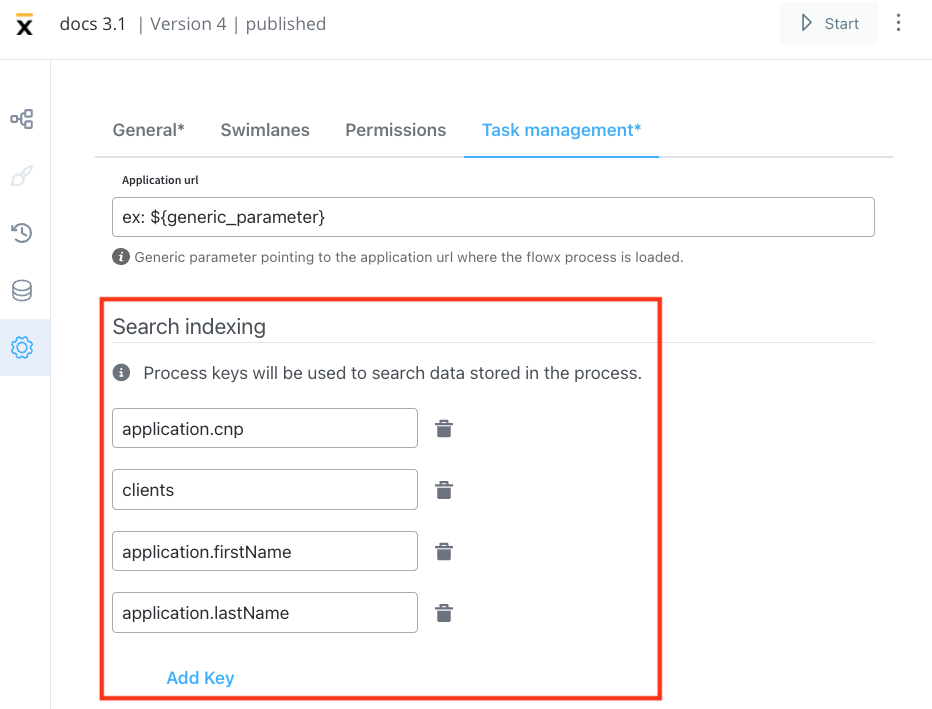
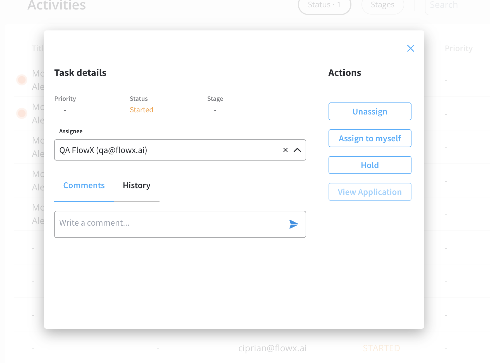
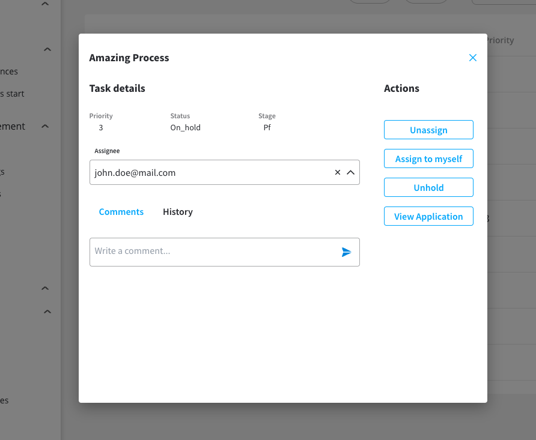
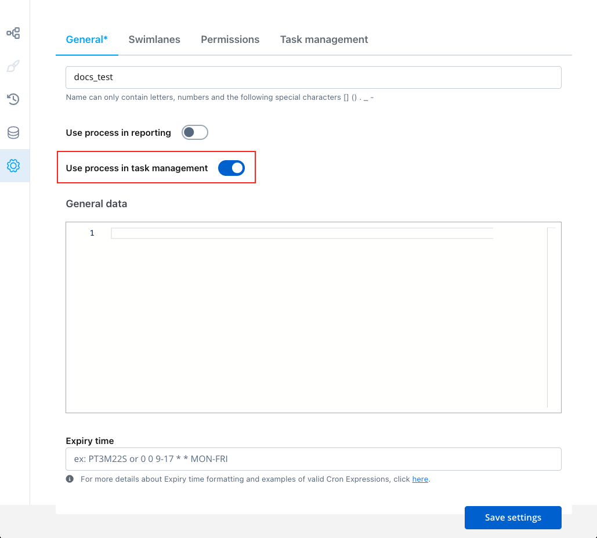
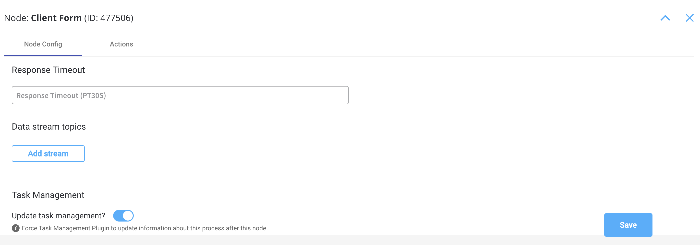

# 📦 Task management

### What is Task management plugin?

The Task Management plugin is a powerful plugin that enables back-officers and supervisors to efficiently track and assign tasks within a company. It provides a business-oriented view of a [**process**](../../../../terms/flowx-process) defined using [**FLOWX.AI Designer**](../../../../terms/flowx-ai-designer) and allows for seamless interactions at the assignment level.

### Activities

Inside the **Task Manager → All tasks** you can find the **Activities** tab which consists of the following items:

* **Title** - the title of the task
* **Stage** - the specific [stages](./using-stages.md) during the execution of a process
* **Assignee** - the assignee of the process
* **Status** - the status of the process, more details can be found [here](#process-status-updates)
* **Priority** - allows you to prioritize the tasks
* **Last updated** - timestamp for the latest updates
* **Search** - the search function is used to look for keys stored in the process

### Task Details

The **Task details** tab within the **Task Manager** displays key information about a process, including:

* **Priority** - enable prioritization of tasks
* **Status** - the current status of the process
* **Stage** - specific stages during the execution of a process
* **Comments** - comments left by the users
* **History** - information such as who created a task, when a task was created, or when the status changed

:::caution
Please note that specific roles must be defined in a process to utilize all the task management features. For more information on configuring access roles for processes, refer to the [<u>**Configuring access roles for processes**</u>](../../../../platform-setup-guides/flowx-engine-setup-guide/configuring-access-roles-for-processes.md).
:::

### Statuses & Definitions in Task Manager

Task Manager displays multiple statuses based on the state of the process.

#### Process status updates

| Status        | Definition                                                                                                                                                                                                                                                                                                                                                                                                                                                                                          |
| ------------- | --------------------------------------------------------------------------------------------------------------------------------------------------------------------------------------------------------------------------------------------------------------------------------------------------------------------------------------------------------------------------------------------------------------------------------------------------------------------------------------------------- |
| **Created**   | This status is visible only if there is an issue with the process creation. If the process is error-free in its configuration, you will see the **Started** status instead.                                                                                                                                                                                                                                                                                                                         |
| **Started**   | Indicates that the process is in progress and running.                                                                                                                                                                                                                                                                                                                                                                                                                                              |
| **Finished**  | The process has reached an end node and completed its execution.                                                                                                                                                                                                                                                                                                                                                                                                                                    |
| **Failed**    | This status is displayed when a [CronJob](https://kubernetes.io/docs/concepts/workloads/controllers/cron-jobs/) is configured and enabled within the [FLOWX engine](../../../core-components/flowx-engine/). For example, if a CronJob is triggered at a particular hour, and the instance is not finished by then, all the tasks will be moved to the `FAILED` status.                                                                                                                             |
| **Expired**   | 
This status is displayed when <code>expiryTime</code> field is defined within the process definition. To set up an <code>expiryTime</code> function, follow these steps
<ol><li>Go to <strong>FLOWX Designer > Processes > Definitions</strong>.</li><li>Select a process and click the "<strong>⋮</strong>" <strong></strong> button, then choose <strong>Settings.</strong></li><li>Inside the <strong>General</strong> tab, you can edit the <strong>Expiry time</strong> field.</li></ol> |
| **Aborted**   | This status is available for processes that also contain subprocesses. When a subprocess is running (and the [token is moved backward](https://docs.flowx.ai/flowx-designer/managing-a-process-flow/moving-a-token-backwards-in-a-process) to redo a series of previous actions) - the subprocess will be aborted.                                                                                                                                                                                  |
| **Dismissed** | This status is available for processes that contain subprocesses. It is displayed when a user stops a subprocess.                                                                                                                                                                                                                                                                                                                                                                                   |
| **On hold**   | The process cannot be edited anymore. A superuser can trigger this status to block actions on the process until further clarification or unfreeze.                                                                                                                                                                                                                                                                                                                                                  |

#### Swimlanes updates

| Status             | Definition                            |
| ------------------ | ------------------------------------- |
| **Swimlane enter** | When the token enters a new swimlane. |
| **Swimlane exit**  | When the token exits a swimlane.      |

#### Stages updates 

| Status          | Definition                         |
| --------------- | ---------------------------------- |
| **Stage enter** | When the token enters a new stage. |
| **Stage exit**  | When the token exits a stage.      |

### Using the plugin

The Task Manager plugin allows users to view a list of tasks and perform various actions based on their roles, including:

* Assigning/unassigning tasks
* Putting the process on hold
* Adding comments
* Viewing the application URL (could be also a generic parameter defined as a URL)

:::info
You can configure Task Manager to send information about your process by enabling the **Use process in task management** button at the node level. This allows the Task Manager plugin to send updates about the process.
:::

**To set up Task Management to send updates on your process, follow these steps:**

1. Go to **Flowx.AI Designer** and open the desired **process definition**.
2. From the left sidebar menu select the **Settings** tab.
4. Enable the **Use process in task management** toggle button.

:::caution
Please note that some actions may not be available based on user roles and access rights.
:::

**To set up Task Management to send extra updates on your process using only some specific areas of your process:**

1. Go to **Flowx.AI Designer** and open your process definition.
2. Click **Edit** button.
3. Select a node (the Task Manager will trigger the updates after reaching this node).
4. Enable the **Update task management?** switch.

:::info
You can set up this action for multiple nodes.
:::

For more detailed information on configuring the Task Manager plugin, refer to the [Task Management plugin setup](../../plugins-setup-guide/task-management-plugin-setup/) section.

[Task Management plugin setup](../../plugins-setup-guide/task-management-plugin-setup/task-management-plugin-setup.md)
